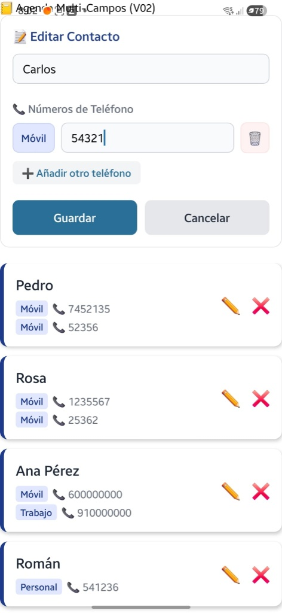
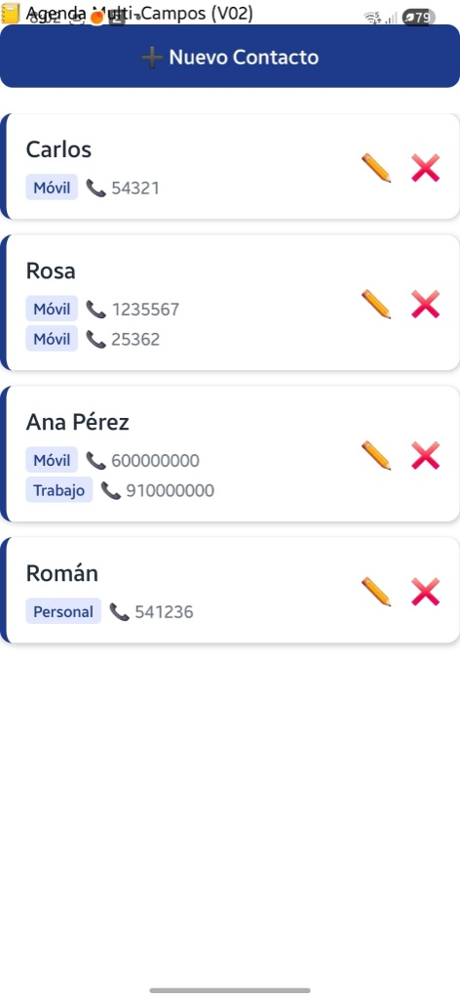

# PROBLEMAS EN LA PRIMERA CORRIDA

Elementos a resolver:

- El contenedor principal esta muy arriba...se monta en el statusbar.
  - Entiendo que habia algo como SafeAreaView que daba automaticamente los padding para evitar estos problemas pero aparentemente esta "deprecado" ( descontinuado....Tal vez hay otro similar y sino nos tocara con el padding normal).
    

- El otro problema, tal vez mas complicado es: La Modificacion, ✏️, no se activa en la primera pantalla y creando un contacto, si le damos al ✏️ de un contacto, mientras estamos creando un contacto se activa la modificacion y lo cambia.
  - La modificacion ( al presionar el lapiz) no se me activa en la pantalla principal ( image_e2599d.png ).

  - Las siguientes 2 capturas muestran tambien un problema: En la captura image_e25904.jpg , fijate que arriba dice que esta editando....para llegar a esa captura le di agregar nuevo contacto y arriba decia "Nuevo Contacto" ...me la abrio pero le di al lapiz del contacto de Pedro y cambio arriba indicando que estaba editando ....Total que si le damos a Guardar pues sustituye a Pedro por Carlos.

  Aqui la secuencia del problema...Estamos añadiendo a Carlos.
  

  Si mientras añadimos a Carlos, le damos al lapiz de Pedro, al guardar cambia a Pedro por Carlos.
  

# 🐛 Problema 1: El contenedor se monta en la barra de estado (Status Bar)

El safeAreaView no es una solucion para este problema porque el componente nativo clásico de React Native tenía limitaciones en Android y a menudo requería cálculos manuales de padding.

Hoy en día, la solución moderna y estándar en el ecosistema de Expo es utilizar la `librería expo-status-bar` combinada con una propiedad nativa de los estilos, `o importar un contenedor inteligente`.

Para resolverlo de la forma más limpia y definitiva directamente en el archivo de estilos globales, abrimos src/styles/globalStyles.js y modificamos el paddingTop del container aumentando el margen superior para que empuje la interfaz hacia abajo en tu Samsung A34:

---

```jsx
// En src/styles/globalStyles.js
export const globalStyles = {
  container: {
    flex: 1,
    backgroundColor: colores.fondo,
    paddingTop: 50,          // ◄--- Sube este valor a 50 o 55 para darle aire respecto a los iconos de batería y hora
    paddingHorizontal: 20,
  },
  // ... el resto se queda igual

```

---

PERO LO ANTERIOR NO ERA EL PROBLEMA: EL PROBLEMA FUE:

- No habia hecho la importacion correcta. Importé:
  - import { colores } from "../styles/globalStyles";
- Lo correcto era:
  - import { globalStyles, colores } from "../styles/globalStyles";
- No habia llamado el estilo correcto, que es este :
  - `<View style={globalStyles.container}>`
  - `<Text style={globalStyles.titulo}>📒 Agenda Multi-Campos (V02)</Text>`
- Habia dejado cimplemente el llamado a styles.container o styles.titulo, pero ni siquiera esos estaban definidos en el App_V02.js

🐛 Problema 2: El formulario no reacciona al cambiar de contacto en edición
Fíjate bien en lo que pasa en la captura image_e25904.jpg:

Le diste al botón de "Nuevo Contacto" y se abrió el formulario vacío (o con los datos iniciales).

Con el formulario ya abierto, fuiste a la lista de abajo y pulsaste el lápiz ✏️ de Pedro.

El título de arriba cambió correctamente a "Editar Contacto" porque el Padre (App_v02.js) actualizó el estado contactoAEditar.

¡Pero los campos de texto internos (Carlos y su teléfono) no cambiaron! Se quedaron congelados con lo que ya estaba escrito. Al darle a guardar, el código procesó el ID de Pedro pero con el nombre de Carlos, causando el desastre que ves en image_e258c6.jpg donde Pedro desaparece.

🧠 ¿Por qué pasa esto en React?
Esto ocurre porque cuando el componente ContactoForm ya está dibujado en pantalla (montado), la línea de inicialización del estado solo se ejecuta la primera vez:

```jsx
const [nombre, setNombre] = useState(
  contactoAEditar ? contactoAEditar.nombre : "",
);
```

---

Si cambias el contacto por fuera pulsando otro lápiz, el formulario no se entera de que tiene que borrar sus entradas de texto locales para cargar al nuevo contacto.

## 🛠️ La Solución de Arquitectura Limpia: Forzar el reinicio con una key

La forma más elegante, avanzada y con menos líneas de código para solucionar esto en React, es decirle al Padre que destruya el formulario viejo y cree uno completamente nuevo cada vez que el contacto cambie. Esto se logra pasándole una propiedad especial llamada `key`.

Abre tu archivo principal src/versionesApps/App_v02.js y busca la línea donde renderizas el formulario (cerca de la línea 85). Vamos a inyectarle la propiedad `key` enlazada al ID del contacto:

```jsx
{
  /* COMPONENTE FORMULARIO CONTENIDO EN UN ESTADO CONDICIONAL */
}
{
  mostrarFormulario && (
    <ContactoForm
      // 🔑 BUENA PRÁCTICA: Si cambia el ID del contacto en edición (o pasa de nuevo a editar),
      // React reiniciará el formulario con los datos limpios y correctos automáticamente.
      key={contactoAEditar ? contactoAEditar.id : "nuevo"}
      onGuardarContacto={guardarContactoGlobal}
      contactoAEditar={contactoAEditar}
      onCancelar={() => {
        setMostrarFormulario(false);
        setContactoAEditar(null);
      }}
    />
  );
}
```

🪜 Siguiente Paso
Aplica estos dos ajustes estratégicos:

Sube el paddingTop a 50 en src/styles/globalStyles.js.

Añade la propiedad key={contactoAEditar ? contactoAEditar.id : "nuevo"} dentro del bloque del formulario en src/versionesApps/App_v02.js.

Al aplicar lo antrior quedo solucionado.

# FALTA RESOLVER QUE SE ACTIVE LA MODIFICACION EN LA PANTALLA PRINCIPAL.

Mirando detenidamente tu código de App_V02.js, el problema por el cual el lápiz no abre el formulario cuando estás en la pantalla principal está en la línea del FlatList, `específicamente en cómo le pasas la función al componente ContactoCard`.

Vamos a ver dónde está el fallo y cómo solucionarlo.

🔍 El Diagnóstico del Fallo
En tu FlatList, tienes esta línea:

```jsx
onEditarSeleccion = { setContactoAEditar };
```

Al hacerlo así, cuando pulsas el lápiz, la tarjeta ejecuta setContactoAEditar(contacto). Eso guarda el contacto en la memoria correctamente... ¡Pero se te olvidó decirle a la pantalla que se abra el formulario!

## Cuando decimos onEditarSeleccion={setContactoAEditar} ejecuta el setContactoAEditar(contacto) , de donde sale contacto que se introduce en el setContactoAEditar?

Hay que entender exactamente cómo se pasan los datos entre los cables invisibles de la aplicación.

El parámetro contacto sale del componente hijo (ContactoCard.js). Cuando escribimos en el Padre `onEditarSeleccion={setContactoAEditar}`, le enviaste la función de regalo al Hijo, y el Hijo es quien decide cuándo ejecutarla y qué información meterle dentro.

Vamos a ver el mapa del viaje de ese dato paso a paso para entenderlo a la perfección:

🗺️ El Viaje del Dato (Paso a Paso)
Paso 1: El Padre le pasa la función al Hijo
En el FlatList de App_V02.js, React va recorriendo los contactos uno a uno. Cuando pasa por el objeto de Román, dibuja su tarjeta y le engancha la función en una propiedad (prop) que inventamos llamada onEditarSeleccion:

```jsx
// En el Padre (App_V02.js)
<ContactoCard
  contacto={item} // Aquí item es el objeto completo de Román
  onEditarSeleccion={setContactoAEditar} // Le pasa la función de cambiar estado
/>
```

Paso 2: El Hijo recibe la función y sabe a quién tiene agarrado
Ahora nos mudamos al archivo del Hijo (ContactoCard.js). Este componente recibe el objeto completo del contacto (Román) y la función.

En el botón del lápiz, tiene un evento onPress:

```jsx
// En el Hijo (ContactoCard.js)
export default function ContactoCard({
  contacto,
  onEditarSeleccion,
  onBorrarContacto,
}) {
  return (
    // ... interfaz de la tarjeta
    <TouchableOpacity onPress={() => onEditarSeleccion(contacto)}>
      <Text style={{ fontSize: 20 }}>✏️</Text>
    </TouchableOpacity>
  );
}
```

---

Fíjate bien en el `onPress: () => onEditarSeleccion(contacto)`.
Aquí es donde ocurre la magia. El Hijo dice: "Cuando el usuario toque este lápiz específico, yo voy a disparar la función onEditarSeleccion que me dio mi Padre, y le voy a meter entre los paréntesis el objeto del contacto que yo mismo estoy pintando (en este caso, Román)".

Paso 3: El Padre recibe el dato de vuelta
Como onEditarSeleccion en el Padre apunta directamente a setContactoAEditar, en el momento en que el Hijo hace el clic, en el Padre se ejecuta automáticamente esto tras bambalinas:

```jsx
setContactoAEditar(contacto); // ¡El parámetro llegó desde el Hijo!
```

---

🧠 El "Atajo" de JavaScript que causó la duda
Tu duda es de lo más normal porque JavaScript permite hacer un "atajo" visual que a veces confunde.

Escribir esto:

```jsx
onEditarSeleccion = { setContactoAEditar };
```

Es exactamente lo mismo que escribir esto de forma larga:

```jsx
onEditarSeleccion={(contacto) => setContactoAEditar(contacto)}
```

Al poner simplemente setContactoAEditar, JavaScript es tan inteligente que entiende: "Ok, cualquier parámetro que el Hijo me mande de vuelta cuando ejecute esta función, yo se lo meteré directamente dentro a setContactoAEditar".

Por eso, cuando hicimos la reparación para solucionar tu problema anterior, tuvimos que romper el atajo y escribirlo de forma larga, porque necesitábamos aprovechar el viaje para hacer dos cosas con el contacto que nos mandaba el Hijo:

```jsx
onEditarSeleccion={(contacto) => {
  setContactoAEditar(contacto); // 1. Guardamos el contacto que mandó el Hijo
  setMostarFormulario(true);    // 2. Abrimos la pantalla del formulario
}}
```

---

Entonces, la solucion pasa por poner `mostrarFormulario en true`
El estado mostrarFormulario se queda en false, por lo que el formulario sigue oculto y te da la impresión de que el botón no reacciona.

🛠️ La Solución
Para solucionarlo, necesitamos que al pulsar el lápiz ocurran dos cosas al mismo tiempo:

Guardar el contacto que se va a editar (setContactoAEditar).

Cambiar el estado de la interfaz para abrir el formulario (setMostarFormulario(true)).

Podemos crear una pequeña función intermedia o, de forma más directa y limpia, escribir una función de flecha directamente en la propiedad del FlatList.

Modifica el bloque de tu FlatList para que quede así:

JavaScript
{/_ LISTA DE CONTACTOS _/}
<FlatList
data={listaContactos}
keyExtractor={(item) => item.id}
renderItem={({ item }) => (
<ContactoCard
contacto={item}
onBorrarContacto={eliminarContactoGlobal}
// 🔄 ACTUALIZADO: Ahora guarda el contacto Y ADEMÁS abre el formulario
onEditarSeleccion={(contacto) => {
setContactoAEditar(contacto);
setMostarFormulario(true);
}}
/>
)}
contentContainerStyle={{ paddingBottom: 30 }}
// MANEJO DE ESTADO VACIO
ListEmptyComponent={
<View style={styles.contenedorVacio}>
<Text style={styles.textoVacio}>
✨ Tu agenda está vacía. ¡Toca el botón superior para empezar!
</Text>
</View>
}
/>
💡 Un detalle extra para prevenir otro bug latente
Ya que estamos revisando este bloque, encontré otra pequeña inconsistencia en la función de borrado seguro (eliminarContactoGlobal), en la línea 56:

JavaScript
// Cómo está ahora:
const estasEditandoEste = contactoAEditar && contactoAEditar === id;
Como contactoAEditar es un objeto completo (con nombre, id, teléfonos), si comparas el objeto entero directamente contra el id (que es un texto), la condición contactoAEditar === id siempre va a dar false. Por lo tanto, la alerta contextual nunca te avisaría si estás borrando el contacto que tienes abierto en pantalla.

Corrígelo rápidamente apuntando a la propiedad .id:

JavaScript
// Corrección en la línea 56 de tu App_V02.js:
const estasEditandoEste = contactoAEditar && contactoAEditar.id === id;

```

```
