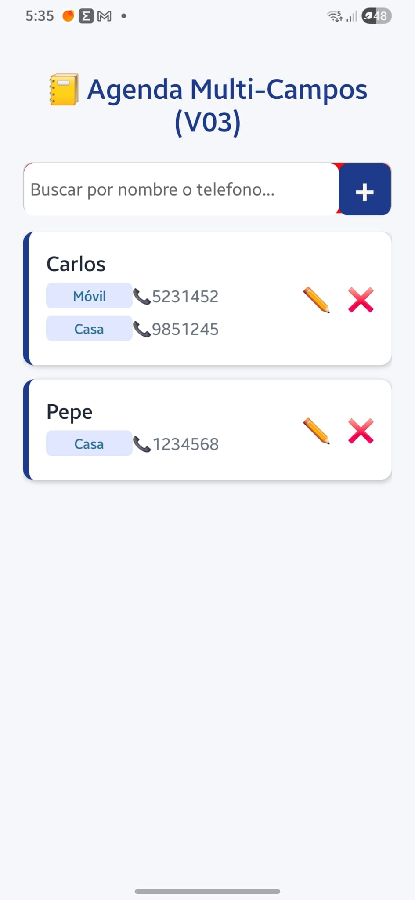
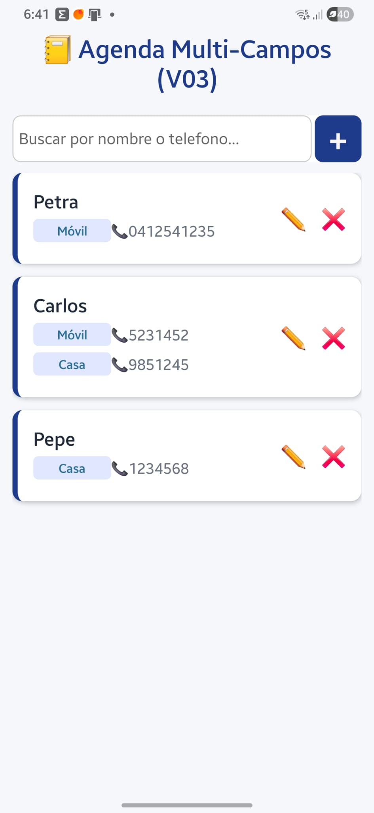

Asi inicio la situacion del ajuste del Input Text para la busqueda y el boton + para agregar.
Añadi un background color rojo al nuevo contenedor para ver el contendor como tal.



Los ajustes que hice :
El ➕ lo cambie por el + normal del teclado....sin embargo si le aumento el tamaño de letra se tiende a descentrar....baja.

Luego, al contenedor que contiene el input y el boton + , le coloque un color de fondo y no se porque, en la parte de arriba sobresale un poquito. Me gustaria que el input y boton, al ser del mismo alto que el contenedor , que quede enmarcado justo.....pues no deberia ( creo ).

Yo cambie un poco los estilos que tenias porque el boton + no quedaba en el extremo y al usar el simbolo ➕ el constraste contra el fondo azul era muy malo.

Estos son los stylos aplicados, para la iamge de arriba ( SOLO PARA EL INPUT TEXT DE BUSQUEDA Y EL BOTON +):

---

```jsx
contenedorCabeceraAcciones: {
    flexDirection: "row", // Para colocar el input busqueda y el + , en la linea
    height: 45,
    backgroundColor: "#fc0606",
    borderRadius: 8,
    paddingHorizontal: 0,
    fontSize: 15,
    borderWidth: 1,
    borderColor: "#ccc",
    justifyContent: "space-between",
    marginBottom: 15,
  },

  inputBusqueda: {
    flex: 1, // Ocupa todo el espacio que puede.
    height: 45,
    backgroundColor: "#fff",
    borderRadius: 8,
    paddingHorizontal: 5,
    justifyContent: "center",
    alignItems: "center",
    fontSize: 15,
    gap: 0,
    borderColor: "#1a0404",
  },

  btnAñadirCorto: {
    width: 45,
    height: 45,
    backgroundColor: colores.primario, // Mantener el azul original
    borderRadius: 8,
    alignItems: "center",
    justifyContent: "center",
  },

  textoBtnAñadir: {
    fontSize: 35,
    paddingLeft: 0,
    color: "#faf6f6",
    fontWeight: "bold",
  },


Vamos a analizar técnicamente, como lo haría un programador en su mesa de trabajo, por qué están ocurriendo esos dos detalles estéticos en tu Samsung y cómo corregirlos de forma limpia respetando tu código.

🕵️‍♂️ El Diagnóstico Técnico
¿Por qué sobresale el fondo rojo arriba (#fc0606)?
Tienes puesto height: 45 tanto en el contenedor padre como en los hijos (inputBusqueda y btnAñadirCorto). El problema es que el contenedor padre tiene un borde (borderWidth: 1). En desarrollo móvil, los bordes suman tamaño hacia afuera o pisan el contenido. Al medir exactamente lo mismo, el borde del contenedor empuja el fondo interno hacia arriba un píxel, haciendo que "asome" ese color rojo.

¿Por qué se descentra el signo + al subirlo a fontSize: 35?
El carácter + de los teclados estándar no es un cuadrado perfecto; tipográficamente está diseñado con más espacio vacío abajo que arriba. Al agrandar la letra a 35, ese desfase natural se multiplica y el motor de renderizado de Android lo empuja hacia abajo, perdiendo el centro geométrico del botón.

🛠️ La Solución Paso a Paso
Para solucionar esto sin romper nada y enmarcarlo todo al milímetro, el truco profesional consiste en quitarle la altura fija a los elementos internos y dejar que el contenedor padre gobierne el tamaño, usando alignItems: "stretch" para los hijos y corrigiendo el eje vertical del texto mediante un pequeño desplazamiento (lineHeight o paddingBottom).

Modifica tu bloque de estilos local en App_V04.js para dejarlo exactamente así:

JavaScript
  contenedorCabeceraAcciones: {
    flexDirection: "row", // Coloca input y botón en la misma línea
    height: 48,           // Un pelín más alto para que sea cómodo de pulsar con el dedo
    backgroundColor: colores.primario, // Cambiamos el rojo de pruebas por tu azul para fundir el botón
    borderRadius: 8,
    borderWidth: 1,
    borderColor: "#ccc",
    overflow: "hidden",   // 📐 EL TRUCO: Corta cualquier sobrante interno para que no sobresalga nada
    marginBottom: 15,
  },
  inputBusqueda: {
    flex: 1,
    height: "100%",       // 🚀 Toma el 100% de la altura del padre de forma exacta
    backgroundColor: "#fff",
    paddingHorizontal: 12,
    fontSize: 16,
  },
  btnAñadirCorto: {
    width: 48,            // Hacemos que el botón sea un cuadrado perfecto (48x48)
    height: "100%",       // 🚀 Toma el 100% de la altura del padre
    backgroundColor: colores.primario,
    alignItems: "center",
    justifyContent: "center",
  },
  textoBtnAñadir: {
    fontSize: 28,         // Un tamaño generoso pero controlado
    color: "#faf6f6",
    fontWeight: "bold",
    // 🎯 EL TRUCO DE ALINEACIÓN: En Android, subir el texto un pelín compensa el desfase tipográfico
    paddingBottom: 4,
  },
.....
```

---

## 🧠 ¿Qué hemos corregido aquí?

overflow: "hidden":
Esta propiedad actúa como una guillotina geométrica. Le dice al contenedor: "Cualquier cosa que intente salirse de mis 48 píxeles de alto o de mis esquinas redondeadas, se oculta". Adiós al borde rojo/azul que asomaba arriba.
`Es decir, el overflow oculta los hijos que no entren bien.`

height: "100%":
Al quitar el número fijo 45 de los componentes internos y heredar el del padre, garantizamos que el input y el botón terminen exactamente donde termina el marco.

paddingBottom: 4:
Al meterle una pequeña almohadilla abajo al texto del +, empujamos el símbolo verticalmente hacia arriba para obligarlo a quedar perfectamente centrado en el ojo humano.

### Al final deje los estilos asi:

---

```jsx
  // 🌟 Nuevos estios para la cabecera del inputText y + ( nuevo contacto )

  contenedorCabeceraAcciones: {
    flexDirection: "row", // Para colocar el input busqueda y el + , en la linea
    height: 45, //
    backgroundColor: "#fff",
    borderRadius: 8,
    paddingHorizontal: 0,
    fontSize: 15,
    justifyContent: "space-between",
    marginBottom: 10,
  },

  inputBusqueda: {
    flex: 1, // Ocupa todo el espacio que puede.
    height: "100%",
    backgroundColor: "#fff",
    borderRadius: 8,
    paddingHorizontal: 5,
    justifyContent: "center",
    alignItems: "center",
    fontSize: 15,
    borderWidth: 1,
    borderColor: "#ccc",
    marginRight: 3,
  },

  btnAñadirCorto: {
    width: 45,
    height: "100%",
    backgroundColor: colores.primario, // Mantener el azul original
    borderRadius: 8,
    alignItems: "center",
    justifyContent: "center",
  },

  textoBtnAñadir: {
    fontSize: 35,
    paddingTop: 0,
    color: "#faf6f6",
    fontWeight: "bold",
  },
});
```

---



Siempre me da curiosidad el centrado del + .

Con 35 se ve como en la captura pero al ponerle mas se empieza a desplazar hacia abajo... y en la siguiente captura es con fontSize:40,

Asi se ve al ponerle 40


## La explicacion rapida de porque se desplaza hacia abajo:

La linea base de las fuentes esta en la parte de arriba porque hay letras que "cuelgan" como la g, j y p.
Cuando tenemos ,pr ejemplo A + B vemos que hay un espacio entre la linea superior y donde comienza el +. Al incrementar el tamaño de fuente ese espacio se hace mas grande y empuja el + hacia abajo.

## 🧠 EXPLICACION FORMALEl Misterio Resuelto: ¿Por qué se desplaza el "+" al agrandarlo?

Es completamente normal extrañarse porque intuitivamente uno piensa: "Si el contenedor tiene justifyContent: 'center' y alignItems: 'center', todo lo que meta dentro debería quedarse en el centro perfecto sin importar el tamaño".

En el caso del texto, la realidad matemática y de diseño dentro del motor de Android (y la tipografía digital en general) es diferente. No se calcula en base al dibujo de la cruz +, sino en base a una caja invisible llamada Caja de Fuente (`Font Baseline Box`).

La línea base (Baseline):
Las tipografías se diseñan pensando en letras que cuelgan (como la g, la p o la y) y letras altas (como la A o el +). El símbolo + se dibuja flotando en la mitad superior de esa caja invisible para que quede alineado visualmente cuando escribes algo como A + B.

El efecto lupa:
Cuando ponemos fontSize: 35, la caja invisible se agranda. Como el + está anclado a la parte superior de su línea base tipográfica, el espacio vacío que tiene "por debajo" crece el doble de rápido. Al llegar a fontSize: 40 (como la última captura), ese espacio inferior invisible se vuelve tan gigante que empuja el dibujo real del + hacia abajo, desalineándolo del centro real del botón azul.

Los diseñadores e ingenieros de interfaces corrigen este desfase usando márgenes internos negativos o empujando el elemento hacia arriba con un paddingBottom o un lineHeight específico cuando usan fuentes sobredimensionadas. La solución con fontSize: 35 encontró el equilibrio perfecto para el ojo humano.


