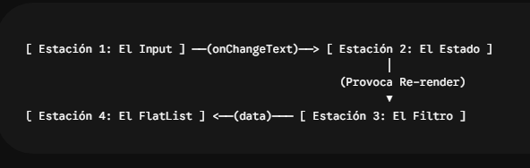

# 🪜 El Algoritmo de Filtrado de Contacto en el FlatList en Tiempo Real

La idea es programar la busqueda y en funcion de ella se filtren los contactos.

Ahora que la maquetación visual es un éxito, vamos a programar la lógica del buscador :

- Escribiendo el filtro dinámico `sin alterar la base de datos persistente`.

Vamos justo arriba del return de App_V04.js.
Vamos a crear la variable computada contactosFiltrados. Este bloque evaluará en cada milisegundo si lo que el usuario escribe coincide con el Nombre del contacto O con alguno de los números de teléfono que tiene guardados dentro de su array.

Buscamos en el archivo App_V04.js la zona que está justo encima del return ( e inyectamos este fragmento de lógica:

JavaScript

---

```jsx
// 🔍 FILTRADO DINÁMICO: Evaluamos la búsqueda antes de pintar la lista
const contactosFiltrados = listaContactos.filter((contacto) => {
  // Si la barra está vacía, pasa el contacto directo sin filtrar
  if (filtroBusqueda.trim() === "") return true;

  const textoUsuario = filtroBusqueda.toLowerCase().trim();
  const nombreContacto = contacto.nombre.toLowerCase();

  // Regla 1: ¿El nombre contiene el texto buscado?
  const coincideNombre = nombreContacto.includes(textoUsuario);

  // Regla 2: ¿Alguno de sus números de teléfono contiene el texto buscado?
  // Usamos .some() que devuelve true en cuanto uno de los elementos cumpla la condición
  const coincideTelefono = contacto.telefonos.some((tel) =>
    tel.numero.includes(textoUsuario),
  );

  // Si coincide el nombre O coincide el teléfono, el contacto se queda en la lista filtrada
  return coincideNombre || coincideTelefono;
});
```

---

## 🛠️ Paso 6: Conectar la FlatList a la Nueva Lista Filtrada

El último paso lógico es cambiar el suministro de datos de tu pantalla. Actualmente tu lista de lectura lee de la base completa: data={listaContactos}.

Busca tu componente `<FlatList` dentro del retorno de App_V04.js y actualiza la propiedad data para que apunte a nuestro nuevo filtro:

---

```jsx
{
  /* LISTADO DE CONTACTOS */
}
<FlatList
  data={contactosFiltrados} // ◄--- Cambiado de 'listaContactos' a 'contactosFiltrados'
  keyExtractor={(item) => item.id}
  renderItem={({ item }) => (
    <ContactoCard
      contacto={item}
      onEliminar={eliminarContactoGlobal}
      onEditar={(c) => {
        setContactoAEditar(c);
        setMostarFormulario(true);
      }}
    />
  )}
  // ... si tienes ListEmptyComponent se mantiene exactamente igual ...
/>;
```

---

## 🧠 ¿Por qué este enfoque es seguro y eficiente?

Inmutabilidad:

- listaContactos (el estado conectado al AsyncStorage) nunca se modifica mientras escribes. Tus contactos están 100% a salvo de borrados accidentales en disco.

Búsqueda Multi-campo:

- Al usar .some(), el motor de JavaScript entra a inspeccionar el sub-array de teléfonos de cada persona. Si buscas "523", la app detectará que Carlos tiene el número 5231452 y lo mantendrá en pantalla instantáneamente.

# PRUEBA DE FILTRADO : SEGUIMIENTO DE LO QUE HACE EL PROGRAMA PASO A PASO.

### 🧠 Los Estados Involucrados (La Memoria Base)

Antes de mover un dedo en la pantalla, la memoria de App_V04.js mantiene bajo control tres estados clave:

- listaContactos: El array con todos los objetos de tu agenda (ej: Petra, Carlos, Pepe).
  Recuperado del almacenamiento local.
- filtroBusqueda: Un simple texto que inicialmente está vacío "".
- mostrarFormulario: Un booleano en false.

### 🔍 Caso Escenario 1: El usuario escribe "et" en la barra de busqueda.

( En la base de datos tenemos solo 3 contacto: Petra, Pepe y Carlos)
Vamos a desglosar el viaje del procesador milisegundo a milisegundo.

- Paso A: El usuario pulsa el teclado y escribe la primera letra: "e"
  - Disparo de Evento: El TextInput de la barra de búsqueda detecta la pulsación y dispara su propiedad `onChangeText={(texto) => setFiltroBusqueda(texto)}`.
- Mutación de Memoria: La función modificadora cambia el estado de la memoria:
  - filtroBusqueda pasa de "" a "e".

- El Ciclo de Renderizado: Al cambiar un estado (useState), React Native recibe una orden de re-renderizar. El componente App_V04 vuelve a ejecutarse de arriba a abajo como una cascada de agua limpia.

- Paso B: El Algoritmo entra en acción (Para la letra "e")
  - Antes de llegar al retorno visual (return), el procesador se detiene en tu función calculada .filter() sobre la listaContactos:

- Revisión de Petra:
  - Pasa el texto del usuario a minúsculas y limpia espacios: "e".
  - Pasa el nombre de Petra a minúsculas: "petra".
  - coincideNombre: Evalúa "petra".includes("e"). Como la letra "e" existe dentro de Petra, esto devuelve true.
  - Resultado: Al dar true, Petra se mete en el saco de contactosFiltrados. El procesador no necesita mirar sus teléfonos porque la primera regla ya se cumplió.

- Revisión de Carlos:
  - Evalúa "carlos".includes("e"). Da false.
  - Va a la segunda regla (.some()): Revisa sus números (5231452 y 9851245). Ninguno contiene la letra "e". Da false.
  - Resultado: Carlos se queda fuera del saco.

Revisión de Pepe:
_ Evalúa "pepe".includes("e"). Da true.
_ Resultado: Pepe se mete en el saco. \* En este milisegundo, la FlatList recibe data={["Petra", "Pepe"]} y redibuja la pantalla del movil eliminando a Carlos.

- Paso C: El usuario escribe la segunda letra: "t" (Filtro acumulado "et")
  - onChangeText se activa otra vez. El estado filtroBusqueda ahora vale "et".

Se dispara `el segundo ciclo de re-renderizado`. La cascada vuelve a caer y el filtro procesa de nuevo a toda la base de datos:

Revisión de Petra:

- Texto del usuario: "et". Nombre del contacto: "petra".
- coincideNombre: Evalúa "petra".includes("et"). Como las letras "et" están juntas y consecutivas dentro de Petra, devuelve true.
- Resultado: Petra se queda en el saco de contactosFiltrados.

Revisión de Pepe:

- Texto del usuario: "et". Nombre del contacto: "pepe".
- coincideNombre: Evalúa "pepe".includes("et"). Da false (Pepe tiene una "e" y una "p", no una "t").
- coincideTelefono: Entra a mirar su número (1234568). No contiene las letras "et". Da false.
- Resultado: Pepe es expulsado del saco de filtrados.

El Clímax del Escenario 1:
La FlatList recibe únicamente data={["Petra"]}. El usuario ve en su pantalla de inmediato que solo queda la tarjeta de Petra. ¡Fluido y en tiempo real!

### 🔢 Caso Escenario 2: El usuario borra todo y escribe "6"

Vamos a ver qué ocurre en el circuito lógico cuando buscamos por un número telefónico.

- Mutación: El usuario escribe "6" en la barra de búsqueda. El estado filtroBusqueda pasa a ser "6".
- Re-renderizado: La función App_V04 se ejecuta de nuevo y el .filter() arranca:
  - `const contactosFiltrados = listaContactos.filter((contacto) => {...}`
    \*Tenemos la construccion de contactosFiltrados por un filtro dinamico y dentro del mismo esta filtroBusqueda que es lo que proviene del TextInput.

Revisión de Petra:

- coincideNombre: Evalúa "petra".includes("6"). Da false.
- coincideTelefono: Entra a inspeccionar su array de teléfonos con .some(). Su teléfono es 0412541235. Evalúa si contiene un "6". Da false.
- Resultado: Petra queda descartada.

Revisión de Carlos:

- coincideNombre: "carlos".includes("6") ➡️ false.
- coincideTelefono: El bucle .some() revisa su primer teléfono: 5231452. ¿Tiene un "6"? No. Revisa el segundo teléfono: 9851245. ¿Tiene un "6"? Tampoco.
- Resultado: Carlos queda descartado.

Revisión de Pepe:
*coincideNombre: "pepe".includes("6") ➡️ false.
*coincideTelefono: El método .some() abre el sub-array de Pepe e inspecciona su número: 1234568. Evalúa si incluye la cadena "6". ¡Bingo! En la posición penúltima hay un 6 (1234568), por lo tanto, la condición interna devuelve true.

- Como .some() encontró al menos una fila verdadera, le responde al filtro principal con un true rotundo.
- Resultado: Pepe es admitido con honores en el saco de contactosFiltrados.

`El Clímap del Escenario 2:`
La FlatList lee data={["Pepe"]}. En la pantalla del móvil, todas las tarjetas desaparecen excepto la de Pepe. El usuario ha encontrado a su contacto buscando únicamente por un fragmento de su número de teléfono.

💡 La Gran Conclusión del Programador
Lo más maravilloso de este recorrido es que la base de datos real (listaContactos) jamás sufrió un rasguño. El disco duro (AsyncStorage) no trabajó de más ni se desgastó escribiendo archivos. Todo el filtrado ocurrió en la memoria RAM a la velocidad de la luz, garantizando un rendimiento óptimo y una experiencia premium en el dispositivo.

- En la explicacion anterior nos falto, para ver como se conecta todo, indicar que por un lado tenemos el filtroBusqueda , que su valor se asigna en TextInput , en el onChangeText y luego sigue renderizando hasta llegar al FlatList , donde el FlatList se alimenta de contactosFiltrados , que es la funcion dinamica porque recibe lo que esta en filtroBusqueda y contactosFiltrados se encarga de revisar cada nombre de contacto o telefono , para ver si el filtroBusqueda esta incluido en los contacto......

`Es una de las piezas conceptuales más importantes en el desarrollo con React Native: `
_entender cómo un cambio en la interfaz viaja por el estado, procesa la lógica en memoria y termina modificando lo que la FlatList dibuja en la pantalla._

Para cerrar esta etapa de búsqueda con un mapa mental perfecto de cómo se conectan todos los cables que hemos instalado, vamos a trazar la ruta exacta que sigue la información como si fuera un circuito eléctrico.

### 🗺️ El Circuito de la Información en la V04

El viaje completo ocurre en 4 estaciones perfectamente sincronizadas:



Aqui lo mismo que en la grafica pero visto en columna:  
[ Estación 1: El Input ]

>         ▼
>
> (onChangeText)

>         ▼

> [ Estación 2: El Estado ]

>         ▼
>
> Estación 3: El Filtro ]

>         ▼

    ──(data)───

>         ▼
>
> (Provoca Re-render)

          ▼

[ Estación 4: El FlatList ]

>         ▼
>
> (LUEGO EL PROCESO SE REPITE---VUELVE A ESTACION 1)

#### 📦 Estación 1: La Captura (TextInput)

Todo arranca cuando tu dedo digita caracteres en la pantalla. El componente `<TextInput>` no guarda la información por sí mismo. Su única misión es escuchar lo que tecleas y, mediante el evento `onChangeText={setFiltroBusqueda}`, despachar el texto directamente hacia la central de memoria.

#### 🧠 Estación 2: La Central de Memoria (filtroBusqueda)

La función setFiltroBusqueda recibe esos caracteres y actualiza el estado filtroBusqueda. En el mismo milisegundo en que el estado cambia, React Native levanta una bandera de "Re-renderizar".
El componente entero App_V04() se vuelve a ejecutar desde arriba.

#### ⚙️ Estación 3: La Maquinaria de Procesamiento (contactosFiltrados)

Durante esa nueva ejecución, antes de pintar nada visual, el procesador se topa con la constante `contactosFiltrados`. <u>Como es una función dinámica basada en .filter(), se ejecuta al vuelo:</u>

1. Toma la base de datos limpia (listaContactos).
2. Lee el valor fresquito que acaba de llegar a `filtroBusqueda`.
3. Inspecciona cada objeto, comparando si el texto está metido en el .nombre o, mediante el .some(), dentro de las filas de su sub-array de .telefonos.
4. El resultado es un array temporal e intermedio que solo contiene los contactos que pasaron la prueba.

#### 🎨 Estación 4: El Dibujado en Pantalla (FlatList)

Finalmente, la ejecución llega al bloque visual del return y entra en la `<FlatList>`. Como le cambiamos el suministro de datos a `data={contactosFiltrados}`, la lista no lee toda tu agenda, sino únicamente ese "saco temporal" que procesó la Estación 3. La FlatList se limpia, recorre los elementos filtrados y redibuja las tarjetas (ContactoCard) correspondientes.

#### 🚀 ¿Por qué este recorrido es tan brillante?

Porque es un bucle cerrado y predecible. Si escribes, el estado cambia, la lógica filtra y la lista se actualiza. Si borras el texto del input, el estado vuelve a "", la maquinaria del filtro decide dejar pasar a todos los contactos sin restricción, y la FlatList vuelve a mostrarte la agenda completa al instante.
