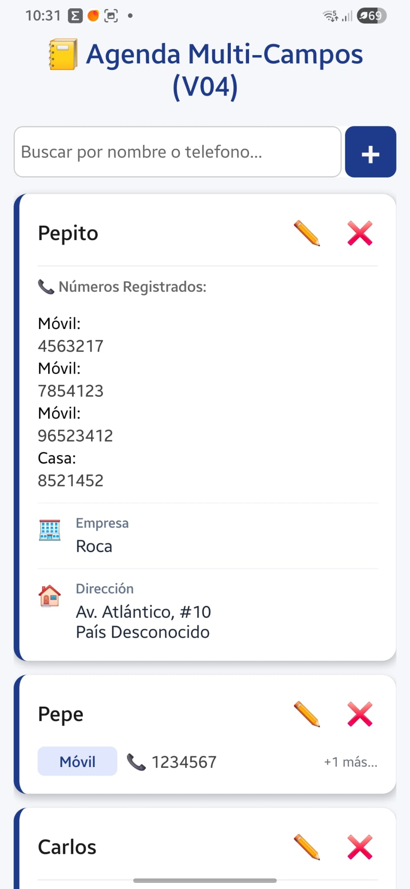
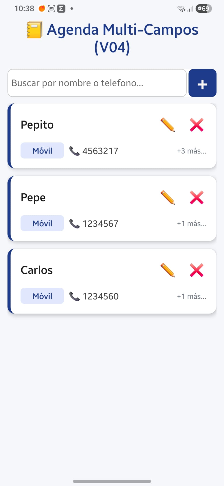

# MOSTRAR TODOS LOS CAMPOS DE UN CONTACTO AL EXPANDIR LA TARJETA

## 🧠 El Planteamiento Lógico de la Tarjeta (Filtro de Vacíos)

En tu ContactoCard.js, ya tienes un estado local (seguramente llamado desplegado o algo similar) que se activa con un useState(false) y cambia a true cuando el usuario pulsa la tarjeta.

Dentro del bloque que se despliega, vamos a crear un pequeño "módulo visual" para cada campo nuevo. Para cumplir con tu regla de "mostrar solo los campos que no estén vacíos", usaremos la evaluación condicional de JavaScript (&&).

Por ejemplo, para la empresa evaluaremos:
contacto.empresa && contacto.empresa.trim() !== "" && ( ... pintar el diseño ... )

## 🛠️ Paso 1: Diseñar los Bloques Visuales en el return de ContactoCard.js

Abre tu archivo src/components/ContactoCard.js. Busca el bloque que se renderiza condicionalmente cuando la tarjeta está expandida (justo donde recorres la lista de teléfonos con un .map).

Abajo de la sección de los teléfonos, vamos a inyectar de forma independiente cada uno de los nuevos campos con un emoji representativo y un diseño limpio:

---

```jsx
{
  /* 🔓 CONTENIDO DESPLEGABLE (Esto ya se activa si desplegado es true) */
}
{
  desplegado && (
    <View style={styles.contenedorDetalles}>
      {/* 📞 SECCIÓN DE TELÉFONOS (Esto ya lo tienes) */}
      {contacto.telefonos.map((tel) => (
        <View key={tel.id} style={styles.filaTelefono}>
          <Text style={styles.etiqueta}>{tel.etiqueta}:</Text>
          <Text style={styles.numero}>{tel.numero}</Text>
        </View>
      ))}

      {/* 🏢 SECCIÓN: EMPRESA (Solo si existe y no está vacía) */}
      {contacto.empresa && contacto.empresa.trim() !== "" && (
        <View style={styles.filaDatoExtra}>
          <Text style={styles.iconoExtra}>🏢</Text>
          <View>
            <Text style={styles.labelExtra}>Empresa</Text>
            <Text style={styles.textoExtra}>{contacto.empresa}</Text>
          </View>
        </View>
      )}

      {/* ✉️ SECCIÓN: CORREO (Solo si existe y no está vacío) */}
      {contacto.correo && contacto.correo.trim() !== "" && (
        <View style={styles.filaDatoExtra}>
          <Text style={styles.iconoExtra}>✉️</Text>
          <View>
            <Text style={styles.labelExtra}>Correo Electrónico</Text>
            <Text style={styles.textoExtra}>{contacto.correo}</Text>
          </View>
        </View>
      )}

      {/* 🏠 SECCIÓN: DIRECCIÓN (Solo si existe y no está vacía) */}
      {contacto.direccion && contacto.direccion.trim() !== "" && (
        <View style={styles.filaDatoExtra}>
          <Text style={styles.iconoExtra}>🏠</Text>
          <View style={styles.contenedorTextoLargo}>
            <Text style={styles.labelExtra}>Dirección</Text>
            <Text style={styles.textoExtra}>{contacto.direccion}</Text>
          </View>
        </View>
      )}

      {/* 📝 SECCIÓN: NOTAS (Solo si existe y no está vacía) */}
      {contacto.notas && contacto.notas.trim() !== "" && (
        <View style={styles.filaDatoExtra}>
          <Text style={styles.iconoExtra}>📝</Text>
          <View style={styles.contenedorTextoLargo}>
            <Text style={styles.labelExtra}>Notas</Text>
            <Text style={styles.textoExtra}>{contacto.notas}</Text>
          </View>
        </View>
      )}
    </View>
  );
}
```

---

## 🎨 Paso 2: Estilos Elegantes para los Datos Extras

Para que estos nuevos campos no se mezclen de forma caótica con los teléfonos y se vean con una jerarquía visual muy ejecutiva, añade estas reglas en el StyleSheet.create de tu ContactoCard.js:

---

```jsx
  // 🌟 ESTILOS PARA LOS CAMPOS EXTRA DE LA V05:
  filaDatoExtra: {
    flexDirection: "row",
    alignItems: "flex-start",
    marginTop: 10,
    paddingTop: 8,
    borderTopWidth: 1,
    borderTopColor: "#f1f5f9", // Una línea divisoria muy sutil entre datos
  },
  iconoExtra: {
    fontSize: 18,
    marginRight: 12,
    marginTop: 2, // Alinea un poco el emoji con el título
  },
  labelExtra: {
    fontSize: 12,
    color: "#64748b", // Gris azulado elegante para el título del campo
    fontWeight: "600",
  },
  textoExtra: {
    fontSize: 15,
    color: "#1e293b", // Negro suave para el contenido real
    marginTop: 2,
  },
  contenedorTextoLargo: {
    flex: 1, // 🚀 OBLIGATORIO: Evita que si la dirección o nota son muy largas, se salgan de la tarjeta
  },
```

---

## ⏱️ Parada de Control y Prueba de Oro Final de la V05

Prueba A (Campos Opcionales Vacíos):
Abre la app y toca un contacto viejo de la V04. Al desplegarse, deberías ver únicamente sus teléfonos, tal como antes. No debe verse ningún recuadro feo ni espacios en blanco para Empresa o Correo.

Prueba B (Campos Rellenos):
Crea un contacto nuevo o edita a uno existente. Rellena el Correo y las Notas, pero deja la Empresa vacía. Guarda.

Toca la tarjeta de ese contacto para desplegarla. Debe aparecer los bloques con sus emojis correspondientes para el Correo y las Notas, mientras que la Empresa permanece invisible?

La corrida resulto asi:



Los telefonos no estaban en la misma linea y el archivo de renderizado tiene que hacer una mejora.

Asi debe verse:

Así sale.

Hay que mejorar el estilos para que los teléfonos y su etiqueta salgan en la misma linea y la etiqueta sea azulita como se ve en la 2da captura.

De paso revisa el codigo para adaptarlo.

El condicional de expandido solo deberiamos aplicaro cuando sea true? Por defecto estara colapsado solo con los numeros de telefono y nombre.

---

```jsx

 return (
    // 🔘 Toda la tarjeta ahora es un botón que conmuta el estado expandido
    <TouchableOpacity
      style={styles.tarjeta}
      onPress={() => setExpandido(!expandido)}
      activeOpacity={0.8} // Evita que parpadee demasiado al pulsar
    >
      {/* LÍNEA SUPERIOR: Nombre y Botones de Acción */}
      <View style={styles.filaSuperior}>
        <Text style={styles.nombre}>{contacto.nombre}</Text>

        {/* Botonera lateral (Detenemos la propagación para que al pulsar el lápiz o la X no se cierre la tarjeta) */}
        <View style={styles.botoneraLateral}>
          <TouchableOpacity
            onPress={() => editarContactoSeleccionado(contacto)} // Lo lanza para la funcion del padre editarConactoSeleccionado
            style={styles.btnAccion}
          >
            <Text style={{ fontSize: 20 }}>✏️</Text>
          </TouchableOpacity>
          <TouchableOpacity
            onPress={() => eliminarContactoGlobal(contacto.id, contacto.nombre)}
            style={styles.btnAccion}
          >
            <Text style={{ fontSize: 20 }}>❌</Text>
          </TouchableOpacity>
        </View>
      </View>

      {/* 🔽 SECCIÓN INFERIOR DINÁMICA (Cuerpo de la tarjeta) */}
      <View style={styles.cuerpoTarjeta}>
        {!expandido ? (
          // 🔸 VISTA COMPACTA: Muestra solo el primer teléfono
          primerTelefono && (
            <View style={styles.filaTelefonoCompacta}>
              <View style={styles.badgeEtiqueta}>
                <Text style={styles.textoBadge}>{primerTelefono.etiqueta}</Text>
              </View>
              <Text style={styles.numero}>📞 {primerTelefono.numero}</Text>

              {/* Indicador visual de que hay más teléfonos dentro */}
              {tieneMasTelefonos && (
                <Text style={styles.indicadorMas}>
                  +{contacto.telefonos.length - 1} más...
                </Text>
              )}
            </View>
          )

        ) : (

          // 🔹 VISTA EXPANDIDA: Muestra TODOS los teléfonos en una lista limpia
          <View style={styles.contenedorExpandido}>
            <Text style={styles.subtituloSeccion}>📞 Números Registrados:</Text>

            {/* {contacto.telefonos.map((tel) => (
              <View key={tel.id} style={styles.filaTelefonoExpandida}>
                <View style={styles.badgeEtiqueta}>
                  <Text style={styles.textoBadge}>{tel.etiqueta}</Text>
                </View>
                <Text style={styles.numero}>📞 {tel.numero}</Text>
              </View>
            ))} */}

            {/* 🔓 CONTENIDO DESPLEGABLE (Esto ya se activa si expandido es true)
            {expandido && ( */}
            <View style={styles.contenedorDetalles}>
              {/* 📞 SECCIÓN DE TELÉFONOS (Esto ya lo tienes) */}
              {contacto.telefonos.map((tel) => (
                <View key={tel.id} style={styles.filaTelefono}>
                  <Text style={styles.etiqueta}>{tel.etiqueta}:</Text>
                  <Text style={styles.numero}>{tel.numero}</Text>
                </View>
              ))}


              {/* 🏢 SECCIÓN: EMPRESA (Solo si existe y no está vacía) */}
              {contacto.empresa && contacto.empresa.trim() !== "" && (
                <View style={styles.filaDatoExtra}>
                  <Text style={styles.iconoExtra}>🏢</Text>
                  <View>
                    <Text style={styles.labelExtra}>Empresa</Text>
                    <Text style={styles.textoExtra}>{contacto.empresa}</Text>
                  </View>
                </View>
              )}

              {/* ✉️ SECCIÓN: CORREO (Solo si existe y no está vacío) */}
              {contacto.correo && contacto.correo.trim() !== "" && (
                <View style={styles.filaDatoExtra}>
                  <Text style={styles.iconoExtra}>✉️</Text>
                  <View>
                    <Text style={styles.labelExtra}>Correo Electrónico</Text>
                    <Text style={styles.textoExtra}>{contacto.correo}</Text>
                  </View>
                </View>
              )}

              {/* 🏠 SECCIÓN: DIRECCIÓN (Solo si existe y no está vacía) */}
              {contacto.direccion && contacto.direccion.trim() !== "" && (
                <View style={styles.filaDatoExtra}>
                  <Text style={styles.iconoExtra}>🏠</Text>
                  <View style={styles.contenedorTextoLargo}>
                    <Text style={styles.labelExtra}>Dirección</Text>
                    <Text style={styles.textoExtra}>{contacto.direccion}</Text>
                  </View>
                </View>
              )}

              {/* 📝 SECCIÓN: NOTAS (Solo si existe y no está vacía) */}
              {contacto.notas && contacto.notas.trim() !== "" && (
                <View style={styles.filaDatoExtra}>
                  <Text style={styles.iconoExtra}>📝</Text>
                  <View style={styles.contenedorTextoLargo}>
                    <Text style={styles.labelExtra}>Notas</Text>
                    <Text style={styles.textoExtra}>{contacto.notas}</Text>
                  </View>
                </View>
              )}

            </View>
            {/* ) */}
            {/* } */}

          </View>
        )}

      </View>
    </TouchableOpacity>
  );
}


const styles = StyleSheet.create({
  tarjeta: {
    backgroundColor: "#fff",
    borderRadius: 12,
    padding: 16,
    marginBottom: 12,
    // Sombra suave para Android
    elevation: 3,
    // Línea decorativa lateral izquierda (fiel a tu diseño original)
    borderLeftWidth: 5,
    borderLeftColor: colores.primario,
  },

  filaSuperior: {
    flexDirection: "row",
    justifyContent: "space-between",
    alignItems: "center",
    marginBottom: 8,
  },

  nombre: {
    fontSize: 18,
    fontWeight: "bold",
    color: "#1a1a1a",
    flex: 1, // Permite que el nombre ocupe su espacio sin empujar los botones
  },

  botoneraLateral: {
    flexDirection: "row",
    gap: 15,
  },

  btnAccion: {
    padding: 4,
  },

  cuerpoTarjeta: {
    marginTop: 4,
  },

  // Estilos Vista Compacta
  filaTelefonoCompacta: {
    flexDirection: "row",
    alignItems: "center",
    gap: 8,
  },

  indicadorMas: {
    fontSize: 12,
    color: colores.textoMutado,
    fontStyle: "italic",
    marginLeft: "auto", // Lo empuja al extremo derecho de la tarjeta
  },

  // Estilos Vista Expandida

  contenedorExpandido: {
    paddingTop: 8,
    borderTopWidth: 1,
    borderTopColor: "#eee", // Una línea sutil de separación interna
    gap: 10,
  },

  subtituloSeccion: {
    fontSize: 13,
    fontWeight: "600",
    color: "#666",
    marginBottom: 4,
  },

  filaTelefonoExpandida: {
    flexDirection: "row",
    alignItems: "center",
    gap: 8,
    paddingVertical: 2,
  },

  // Badges y textos (fieles a tu geometría original)

  badgeEtiqueta: {
    backgroundColor: "#e1e7fc",
    paddingHorizontal: 10,
    paddingVertical: 4,
    borderRadius: 6,
    minWidth: 70,
    alignItems: "center",
  },

  textoBadge: {
    color: colores.primario,
    fontSize: 13,
    fontWeight: "600",
  },

  numero: {
    fontSize: 15,
    color: "#444",
  },

  // 🌟 ESTILOS PARA LOS CAMPOS EXTRA DE LA V05:
  filaDatoExtra: {
    flexDirection: "row",
    alignItems: "flex-start",
    marginTop: 10,
    paddingTop: 8,
    borderTopWidth: 1,
    borderTopColor: "#f1f5f9", // Una línea divisoria muy sutil entre datos
  },

  iconoExtra: {
    fontSize: 18,
    marginRight: 12,
    marginTop: 2, // Alinea un poco el emoji con el título
  },

  labelExtra: {
    fontSize: 12,
    color: "#64748b", // Gris azulado elegante para el título del campo
    fontWeight: "600",
  },

  textoExtra: {
    fontSize: 15,
    color: "#1e293b", // Negro suave para el contenido real
    marginTop: 2,
  },

  contenedorTextoLargo: {
    flex: 1, // 🚀 OBLIGATORIO: Evita que si la dirección o nota son muy largas, se salgan de la tarjeta
  },

});
```

---

Al meter el mapa de los teléfonos dentro de `<View style="{styles.contenedorDetalles}">`, se perdieron los estilos de fila y de badge azulito que ya tenías diseñados originalmente en la V04. El texto se rompió hacia abajo, quedando la etiqueta arriba y el número suelto abajo.

Vamos a solucionar esto con mentalidad de programador real:

La Condición: La doble envoltura condicional {expandido && ...} , del ejemplo anterior está duplicada e incompleta. Como ya estamos dentro del bloque else de !expandido, sabemos con certeza matemática que expandido es true. No hace falta volver a preguntarlo.

Los Teléfonos en Fila: Reutilizaremos tu estructura original (styles.filaTelefonoExpandida y styles.badgeEtiqueta) para que los números queden perfectamente alineados en horizontal y con el fondo azul claro.

## 🛠️ El Ajuste Quirúrgico en el return de tu ContactoCard.js

Buscamos la sección del else (después de los dos puntos del operador ternario) y reemplaza todo el bloque del contenedorExpandido por esta versión corregida y estilizada:

---

```jsx
        ) : (
          // 🔹 VISTA EXPANDIDA: Muestra TODOS los teléfonos y campos adicionales de forma impecable
          <View style={styles.contenedorExpandido}>
            <Text style={styles.subtituloSeccion}>📞 Números Registrados:</Text>

            {/* 📞 SECCIÓN DE TELÉFONOS REALINEADA EN FILA */}
            {contacto.telefonos.map((tel) => (
              <View key={tel.id} style={styles.filaTelefonoExpandida}>
                <View style={styles.badgeEtiqueta}>
                  <Text style={styles.textoBadge}>{tel.etiqueta}</Text>
                </View>
                <Text style={styles.numero}>📞 {tel.numero}</Text>
              </View>
            ))}

            {/* 🏢 SECCIÓN: EMPRESA (Solo si existe y no está vacía) */}
            {contacto.empresa && contacto.empresa.trim() !== "" && (
              <View style={styles.filaDatoExtra}>
                <Text style={styles.iconoExtra}>🏢</Text>
                <View>
                  <Text style={styles.labelExtra}>Empresa</Text>
                  <Text style={styles.textoExtra}>{contacto.empresa}</Text>
                </View>
              </View>
            )}

            {/* ✉️ SECCIÓN: CORREO (Solo si existe y no está vacío) */}
            {contacto.correo && contacto.correo.trim() !== "" && (
              <View style={styles.filaDatoExtra}>
                <Text style={styles.iconoExtra}>✉️</Text>
                <View>
                  <Text style={styles.labelExtra}>Correo Electrónico</Text>
                  <Text style={styles.textoExtra}>{contacto.correo}</Text>
                </View>
              </View>
            )}

            {/* 🏠 SECCIÓN: DIRECCIÓN (Solo si existe y no está vacía) */}
            {contacto.direccion && contacto.direccion.trim() !== "" && (
              <View style={styles.filaDatoExtra}>
                <Text style={styles.iconoExtra}>🏠</Text>
                <View style={styles.contenedorTextoLargo}>
                  <Text style={styles.labelExtra}>Dirección</Text>
                  <Text style={styles.textoExtra}>{contacto.direccion}</Text>
                </View>
              </View>
            )}

            {/* 📝 SECCIÓN: NOTAS (Solo si existe y no está vacía) */}
            {contacto.notas && contacto.notas.trim() !== "" && (
              <View style={styles.filaDatoExtra}>
                <Text style={styles.iconoExtra}>📝</Text>
                <View style={styles.contenedorTextoLargo}>
                  <Text style={styles.labelExtra}>Notas</Text>
                  <Text style={styles.textoExtra}>{contacto.notas}</Text>
                </View>
              </View>
            )}
          </View>
        )}
```

---

## ⏱️ Parada de Control y Verificación Visual

Eliminamos por completo la etiqueta intermedia `<View style="{styles.contenedorDetalles}">` y la condición huérfana que rompía la maquetación. En su lugar, conectamos los teléfonos directamente a styles.filaTelefonoExpandida.

Guardamos los cambios y revisamos Dirección, etc. que deben estar bien distribuidos.
