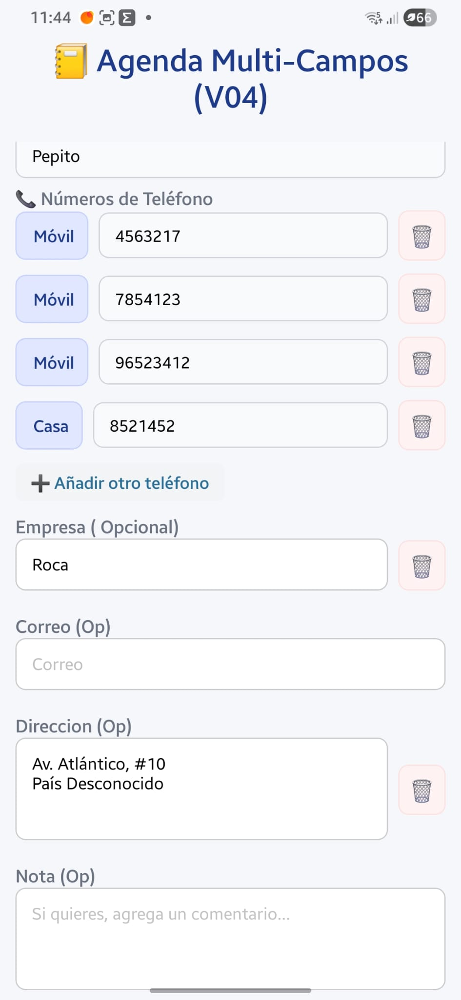

# PLANTEAMIENTO : CUANDO EDITAMOS UN CONTACTO EN EL FORMULARIO SE VEN TODOS LOS CAMPOS ( VACIOS Y LLENOS)

En la imagen el "problema": Los campos vacios, abiertos, distraen.


La experiencia de usuario (UX) puede ser mucho mejor porque ahora a medida que añadimos campos (Empresa, Correo, Dirección, Notas), el formulario se vuelve muy largo de forma vertical. Si el usuario solo quiere editar un teléfono, tiene que hacer mucho scroll y ver un montón de cajas vacías que generan "ruido visual".

Ocultar los campos vacíos en un acordeón con un botón + o un icono para abrirlos es una solución brillante. Vamos a estructurar cómo lo haría un programador.

## 🧠 El Planteamiento Lógico para el Formulario Dinámico

Para lograr esto de forma elegante en ContactoForm.js, no necesitamos crear cinco estados booleanos nuevos para controlar qué está abierto y qué está cerrado. Podemos usar un truco de lógica limpia en React:

Campos que ya tienen datos:

- Si estamos editando a Pepito y ya tiene guardada la Empresa "Roca" y la Dirección, esos inputs deben mostrarse abiertos automáticamente. Sería molesto para el usuario tener que abrirlos para ver qué hay dentro.

Campos vacíos:

- Si el campo está vacío al entrar, lo mostramos colapsado en una fila simple con un botón discreto (como un ➕ o un texto azul).

El Control Visual:

- Podemos crear estados locales rápidos en el formulario (por ejemplo, const [mostrarInputEmpresa, setMostrarInputEmpresa] = useState(empresa !== "");). Si el estado es true, pintamos el input; si es false, pintamos el botón para añadirlo.

## 🛠️ Paso 1: Crear los Estados de Visibilidad Dinámica

Ve a la sección de estados arriba en tu ContactoForm.js. Vamos a inicializar la visibilidad de cada bloque opcional basándonos en si ya traen información de la base de datos o no:

---

```jsx
// ... (Tus estados de valor existentes: nombre, empresa, correo, direccion, notas)

// 👁️ Estados de control visual para abrir/cerrar las cajas vacías
const [verEmpresa, setVerEmpresa] = useState(empresa.trim() !== "");
const [verCorreo, setVerCorreo] = useState(correo.trim() !== "");
const [verDireccion, setVerDireccion] = useState(direccion.trim() !== "");
const [verNotas, setVerNotas] = useState(notas.trim() !== "");
```

---

## 📐 Paso 2: Aplicar la Condición en el return

Vamos a modificar cómo se renderizan estos cuatro bloques en tu interfaz. Si el estado es falso, mostraremos una barrita limpia con el icono para "añadir". Si es verdadero, se despliega el input con su cesta que ya programaste.

Busca la sección de los campos opcionales en el return y estructúrala de esta manera:

---

```jsx
{
  /* 🏢 EMPRESA */
}
{
  !verEmpresa ? (
    <TouchableOpacity
      style={styles.btnAñadirSeccionExtra}
      onPress={() => setVerEmpresa(true)}
    >
      <Text style={styles.textoBtnExtra}>➕ Añadir Empresa</Text>
    </TouchableOpacity>
  ) : (
    <View style={styles.bloqueCampoAbierto}>
      <Text style={styles.label}>Empresa (Opcional):</Text>
      <View style={styles.contenedorInputAccion}>
        <TextInput
          style={styles.inputFlexible}
          placeholder="Ej: Roca, Google..."
          placeholderTextColor="#999"
          value={empresa}
          onChangeText={setEmpresa}
        />
        {/* 🎯 CONDICIÓN: Solo se muestra si el campo NO está vacío */}
        {empresa.trim() !== "" && (
          <TouchableOpacity
            style={styles.btnEliminarFila}
            onPress={() => {
              setEmpresa("");
              setVerEmpresa(false);
            }}
          >
            <Text style={{ fontSize: 16 }}>🗑️</Text>
          </TouchableOpacity>
        )}
      </View>
    </View>
  );
}

{
  /* ✉️ CORREO ELECTRÓNICO */
}
{
  !verCorreo ? (
    <TouchableOpacity
      style={styles.btnAñadirSeccionExtra}
      onPress={() => setVerCorreo(true)}
    >
      <Text style={styles.textoBtnExtra}>➕ Añadir Correo Electrónico</Text>
    </TouchableOpacity>
  ) : (
    <View style={styles.bloqueCampoAbierto}>
      <Text style={styles.label}>Correo (Opcional):</Text>
      <View style={styles.contenedorInputAccion}>
        <TextInput
          style={styles.inputFlexible}
          placeholder="Ej: pepito@correo.com"
          placeholderTextColor="#999"
          value={correo}
          onChangeText={setCorreo}
          keyboardType="email-address"
          autoCapitalize="none"
        />
        {/* 🎯 CONDICIÓN: Solo se muestra si el campo NO está vacío */}
        {correo.trim() !== "" && (
          <TouchableOpacity
            style={styles.btnEliminarFila}
            onPress={() => {
              setCorreo("");
              setVerCorreo(false);
            }}
          >
            <Text style={{ fontSize: 16 }}>🗑️</Text>
          </TouchableOpacity>
        )}
      </View>
    </View>
  );
}

{
  /* 🏠 DIRECCIÓN */
}
{
  !verDireccion ? (
    <TouchableOpacity
      style={styles.btnAñadirSeccionExtra}
      onPress={() => setVerDireccion(true)}
    >
      <Text style={styles.textoBtnExtra}>➕ Añadir Dirección</Text>
    </TouchableOpacity>
  ) : (
    <View style={styles.bloqueCampoAbierto}>
      <Text style={styles.label}>Dirección (Opcional):</Text>
      <View style={styles.contenedorInputAccion}>
        <TextInput
          style={[styles.inputFlexible, styles.inputMultiline]}
          placeholder="Ej: Av. Atlántico, #10..."
          placeholderTextColor="#999"
          value={direccion}
          onChangeText={setDireccion}
          multiline={true}
          numberOfLines={3}
          textAlignVertical="top"
        />
        {/* 🎯 CONDICIÓN: Solo se muestra si el campo NO está vacío */}
        {direccion.trim() !== "" && (
          <TouchableOpacity
            style={styles.btnEliminarFila}
            onPress={() => {
              setDireccion("");
              setVerDireccion(false);
            }}
          >
            <Text style={{ fontSize: 16 }}>🗑️</Text>
          </TouchableOpacity>
        )}
      </View>
    </View>
  );
}

{
  /* 📝 NOTA */
}
{
  !verNota ? (
    <TouchableOpacity
      style={styles.btnAñadirSeccionExtra}
      onPress={() => setVerNota(true)}
    >
      <Text style={styles.textoBtnExtra}>➕ Añadir Nota</Text>
    </TouchableOpacity>
  ) : (
    <View style={styles.bloqueCampoAbierto}>
      <Text style={styles.label}>Nota (Opcional):</Text>
      <View style={styles.contenedorInputAccion}>
        <TextInput
          style={[styles.inputFlexible, styles.inputMultiline]}
          placeholder="Si quieres, agrega un comentario..."
          placeholderTextColor="#999"
          value={nota}
          onChangeText={setNota}
          multiline={true}
          numberOfLines={3}
          textAlignVertical="top"
        />
        {/* 🎯 CONDICIÓN: Solo se muestra si el campo NO está vacío */}
        {nota.trim() !== "" && (
          <TouchableOpacity
            style={styles.btnEliminarFila}
            onPress={() => {
              setNota("");
              setVerNota(false);
            }}
          >
            <Text style={{ fontSize: 16 }}>🗑️</Text>
          </TouchableOpacity>
        )}
      </View>
    </View>
  );
}
```

---

## 🔍 ¿Qué pasa si el usuario quiere cerrar el campo vacío?

Al aplicar este cambio, si el usuario le da al botón ➕ Añadir Nota, se abre la caja pero la cesta no aparece porque está vacía. Si el usuario se arrepiente y quiere "cerrar" ese campo vacío para que vuelva a ser un botón, no tiene una cesta a la que darle.

Para que la experiencia sea perfecta, tienes dos opciones de diseño:

Opción A (Dejar la cesta visible si el campo está vacío): Eliminar la envoltura que acabamos de hacer y permitir que la cesta salga siempre para que funcione como botón de "cancelar/cerrar" el campo.

Opción B (La más elegante): Dejar la condición para que no haya ruido visual, pero añadir un botón de "Cancelar" o una pequeña X discreta en la esquina del campo abierto para poder colapsarlo de nuevo si está vacío.

🎨 Paso 3: Los Estilos para los Botones Expandibles
Añade estas tres reglas en el StyleSheet.create de tu ContactoForm.js para que los botones de "Añadir" se vean discretos, limpios y no saturen visualmente la pantalla:

---

```jsx
btnAñadirSeccionExtra: {
backgroundColor: "#f8fafc", // Fondo grisáceo muy suave
paddingVertical: 10,
paddingHorizontal: 12,
borderRadius: 8,
borderWidth: 1,
borderColor: "#e2e8f0",
borderStyle: "dashed", // 🚀 Efecto punteado clásico de "añadir elemento opcional"
alignItems: "center",
marginVertical: 6,
},
textoBtnExtra: {
color: "#3b82f6", // Azul bonito institucional
fontSize: 14,
fontWeight: "600",
},
bloqueCampoAbierto: {
marginVertical: 6,
},
```

---

## ⏱️ Parada de Control y Prueba de UX Completa

Vamos a ver cómo se comporta esta genialidad de diseño en tu Samsung A34:

Caso Nuevo Contacto: Dale al botón + para crear un contacto de cero. Verás que debajo de los teléfonos el formulario se ve cortito y súper limpio: solo aparecen cuatro botones punteados elegantes: ➕ Añadir Empresa, ➕ Añadir Correo, etc.

Toca ➕ Añadir Correo. ¿Ves cómo se abre suavemente el input listo para escribir?

Si te arrepientes y pulsas la cesta 🗑️ de ese correo vacío, ¿el input se cierra y vuelve a transformarse en el botón punteado?

Caso Edición (Como Pepito): Ve a editar a Pepito (que ya tiene Empresa y Dirección). Al abrirse el formulario, el campo de Empresa y Dirección ya deben aparecer abiertos y rellenos, mientras que Correo y Notas aparecerán cerrados esperando acción.
