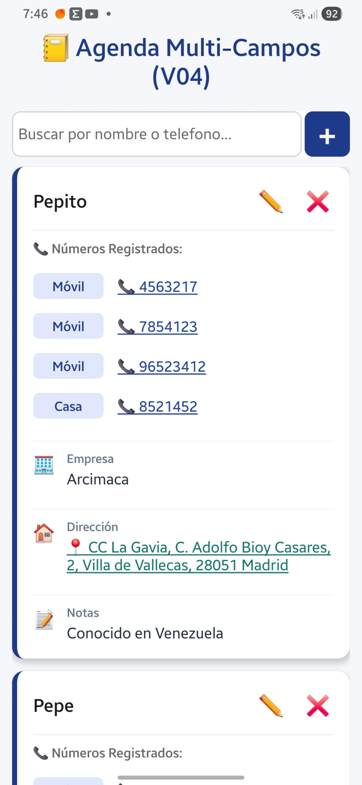
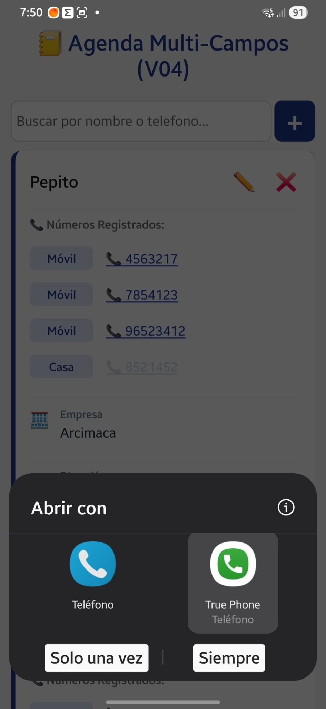
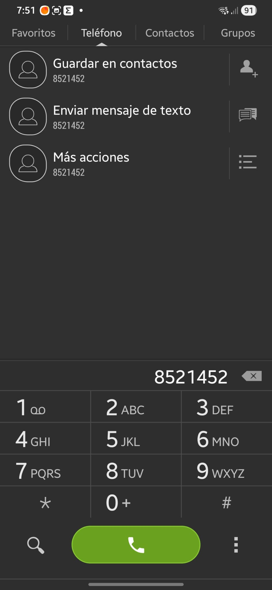
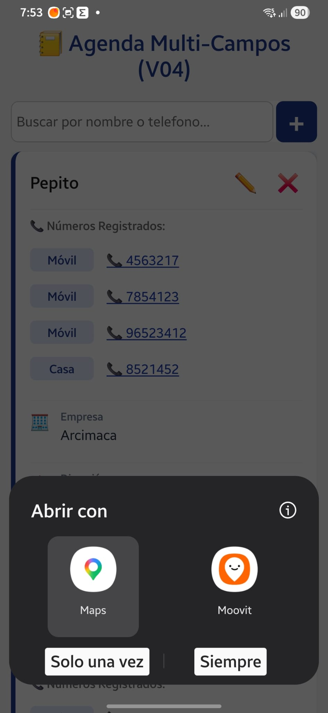
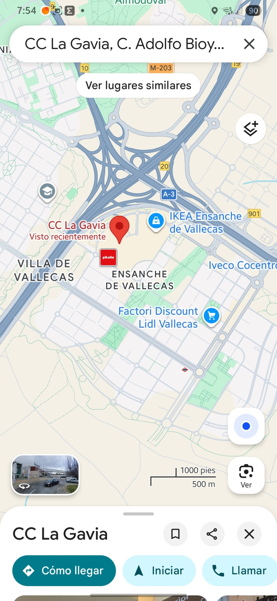

El reto de activar llamadas telefónicas o abrir ubicaciones en Google Maps con un solo toque es uno de los pasos más emocionantes en el desarrollo móvil. Es el momento exacto en el que tu aplicación deja de ser un simple formulario de datos y pasa a integrarse profundamente con el sistema operativo de tu Samsung.


[Resultado que puedes lograr](#resultado-logrado)

Para lograr esto en React Native, el estándar de la industria es utilizar una:

- API nativa súper potente llamada Linking.

## 🧠 ¿Cómo funciona Linking?

El sistema operativo (Android) utiliza algo llamado Deep Linking (Enlaces Profundos). Funciona igual que los enlaces de internet (https://), pero con esquemas especiales que despiertan a otras apps:

- Si le mandas a Android un enlace que empieza por tel:123456789, el móvil sabe que tiene que abrir la App de Teléfono con ese número marcado.
- Si le mandas un enlace que empieza por geo:0,0?q=Direccion, el móvil despierta automáticamente a Google Maps para buscar esa dirección.

Vamos a implementar este increíble bloque de funciones en tu componente `ContactoTarjeta.js` (o donde renderices la tarjeta que se despliega).

# MODULARIZAR LA FUNCION DE LLAMAR Y UBICACION

si la funcion de hacer llamada y la de ubicacion la colocamos en un archivo aparte, servira irva como modulo para otras aplicaciones.

[Crear modulos para llamar por telefono y ubicacion](#como-crear-modulo-para-llamar-y-ubicacion)

## 🛠️ Paso 1: Importar Linking y Alert

Ve a la parte superior de tu archivo de tarjetas y asegúrate de importar estos dos módulos nativos desde react-native:

---

```jsx
import { Linking, Alert, ... } from 'react-native';
```

---

## 🧮 Paso 2: Crear las Funciones de Acción Nativa

Dentro de tu componente de la tarjeta, antes del return, vamos a programar las dos funciones encargadas de hablar con el sistema operativo. Añadiremos una pequeña capa de seguridad con Alert por si ocurre algún fallo (por ejemplo, si un número de teléfono tiene caracteres extraños):

---

```jsx
// 📞 Función para realizar la llamada directa
const iniciarLlamada = (numero) => {
  // Limpiamos el número de espacios por seguridad
  const numeroLimpio = numero.replace(/\s+/g, "");
  const url = `tel:${numeroLimpio}`;

  Linking.canOpenURL(url)
    .then((supported) => {
      if (!supported) {
        Alert.alert(
          "Error",
          "Este dispositivo no soporta realizar llamadas telefónicas.",
        );
      } else {
        return Linking.openURL(url);
      }
    })
    .catch((err) => console.error("Error al abrir la app de teléfono", err));
};

// 🗺️ Función para abrir la dirección en Google Maps
const abrirEnMaps = (direccion) => {
  // Codificamos la dirección para que los espacios y caracteres especiales viajen de forma segura en la URL
  const url = `geo:0,0?q=${encodeURIComponent(direccion)}`;

  Linking.canOpenURL(url)
    .then((supported) => {
      if (!supported) {
        Alert.alert("Error", "No se puede abrir el mapa en este dispositivo.");
      } else {
        return Linking.openURL(url);
      }
    })
    .catch((err) => console.error("Error al abrir mapas", err));
};
```

---

## 📐 Paso 3: Conectar los Botones en la Interfaz (UI)

Ahora vamos a transformar el diseño visual para que el usuario sepa que puede interactuar con ellos.

### A) En la sección donde pintas los Teléfonos: ( Sesion Compacta y expandida)

Como la app se desarrollo para mostrar solo el primer numero en una vista compacta y luego ampliarlo si hay mas numeros entonces por ese el codigo se aplica de la siguiente forma:

Tenemos un dilema de comportamiento táctil:

Cuando la tarjeta está comprimida: Toda la tarjeta es un botón (TouchableOpacity) que abre el acordeón. Si el usuario pulsa el número con la tarjeta cerrada, ¿quiere expandir la tarjeta o quiere llamar de inmediato? La convención de diseño dice que con la tarjeta cerrada el toque expande, pero `si quieres que al tocar específicamente el número llame directamente, tenemos que interceptar el evento.`

Cuando la tarjeta está expandida: Aquí es perfecto. Cada fila de teléfono se convierte en un botón independiente para llamar a ese número en concreto.

Vamos a ver cómo estructurar la lógica para resolver ambos casos de forma limpia.

##### 🧠 El Concepto Clave: Detener la Propagación (e.stopPropagation())

En el código actual, toda la tarjeta está envuelta en un TouchableOpacity que conmuta setExpandido(!expandido). Si pones otro `<TouchableOpacity>` para el teléfono dentro de la vista compacta, al pulsarlo ocurrirá un fenómeno llamado Event Bubbling (Burbujeo de eventos): se disparará la llamada, pero también se disparará la expansión de la tarjeta.

Para evitar que la app se vuelva loca abriéndose mientras llama, u`samos el parámetro del evento (e) y ejecutamos e.stopPropagation()`.

---

```jsx
{/* 🔽 SECCIÓN INFERIOR DINÁMICA (Cuerpo de la tarjeta) */}
      <View style={styles.cuerpoTarjeta}>
        {!expandido ? (
          // 🔸 VISTA COMPACTA: Muestra solo el primer teléfono (Interactiva)
          primerTelefono && (
            <View style={styles.filaTelefonoCompacta}>
              <View style={styles.badgeEtiqueta}>
                <Text style={styles.textoBadge}>{primerTelefono.etiqueta}</Text>
              </View>

              {/* 🎯 LOGICA: Al tocar el número llama directamente SIN expandir la tarjeta */}
              <TouchableOpacity
                onPress={(e) => {
                  e.stopPropagation(); // 🛑 ¡Freno de mano! Evita que la tarjeta se expanda al llamar
                  iniciarLlamada(primerTelefono.numero);
                }}
                style={styles.btnLinkLlamada}
              >
                <Text style={styles.textoTelefonoInteractivo}>📞 {primerTelefono.numero}</Text>
              </TouchableOpacity>

              {/* Indicador visual de que hay más teléfonos dentro */}
              {tieneMasTelefonos && (
                <Text style={styles.indicadorMas}>
                  +{contacto.telefonos.length - 1} más...
                </Text>
              )}
            </View>
          )
        ) : (
          // 🔹 VISTA EXPANDIDA: Muestra TODOS los teléfonos y cada uno puede llamar de forma independiente
          <View style={styles.contenedorExpandido}>
            <Text style={styles.subtituloSeccion}>📞 Números Registrados:</Text>

            {/* 📞 SECCIÓN DE TELÉFONOS REALINEADA EN FILA INTERACTIVA */}
            {contacto.telefonos.map((tel) => (
              <View key={tel.id} style={styles.filaTelefonoExpandida}>
                <View style={styles.badgeEtiqueta}>
                  <Text style={styles.textoBadge}>{tel.etiqueta}</Text>
                </View>

                {/* 🎯 LOGICA: Cada teléfono de la lista es un gatillo de llamada individual */}
                <TouchableOpacity
                  onPress={(e) => {
                    e.stopPropagation(); // Por seguridad, también detenemos la propagación aquí
                    iniciarLlamada(tel.numero);
                  }}
                  style={styles.btnLinkLlamada}
                >
                  <Text style={styles.textoTelefonoInteractivo}>📞 {tel.numero}</Text>
                </TouchableOpacity>
              </View>
            ))}

            {/* ... (Aquí abajo siguen tus bloques de Empresa, Correo, Dirección y Nota) ... */}
```

---

### B) En la sección de la Dirección:

Busca el bloque donde renderizas la dirección (que se muestra de forma condicional) y haz exactamente lo mismo:
Aqui tambien hemos considerado que al hacer clic sobre la direccion la card expandida no se cierre , porque entra en Maps, localizando la direccion.

---

```
{/* 🏠 SECCIÓN: DIRECCIÓN (Solo si existe y no está vacía) */}
            {contacto.direccion && contacto.direccion.trim() !== "" && (
              <View style={styles.filaDatoExtra}>
                <Text style={styles.iconoExtra}>🏠</Text>
                <View style={styles.contenedorTextoLargo}>
                  <Text style={styles.labelExtra}>Dirección</Text>

                  {/* 🎯 Convertimos solo el texto de la dirección en un enlace interactivo a Maps */}
                  <TouchableOpacity
                    onPress={(e) => {
                      e.stopPropagation(); // 🛑 Evita que la tarjeta se colapse al abrir el mapa
                      abrirEnMaps(contacto.direccion);
                    }}
                    activeOpacity={0.7}
                  >
                    {/* Combinamos tu estilo original con el nuevo estilo interactivo */}
                    <Text style={[styles.textoExtra, styles.textoDireccionLink]}>
                      📍 {contacto.direccion}
                    </Text>
                  </TouchableOpacity>
                </View>
              </View>
            )}
```

---

### 🎨 Paso 4: Darle un Look Interactivo (Estilos)

## No necesitas tocar ninguno de tus estilos actuales (filaDatoExtra, iconoExtra, contenedorTextoLargo, etc.) porque ya funcionan a la perfección. Solo vamos a añadir una pequeña regla al final de tu StyleSheet.create para darle ese look interactivo de ubicación al texto de la dirección:

```jsx
 // Mantiene tus fuentes y colores, pero le da el comportamiento visual de un enlace
  textoDireccionLink: {
    color: "#0f766e", // Un tono verde azulado/teal elegante muy usado para mapas/geolocalización
    textDecorationLine: "underline", // Línea inferior para dar la pista de que es clickeable
  },

```

---

(Nota: Si prefieres mantener tu color negro suave original #1e293b por estética, puedes quitar la propiedad color de textoDireccionLink y dejar solo el textDecorationLine, así se verá idéntico pero subrayado).

### prueba

Ten en cuenta dos pequeños detalles para cuando hagas las pruebas:

En el simulador vs. Dispositivo real:
Si usas el móvil físico conectado por Expo, la llamada intentará abrir el marcador nativo de inmediato. Lo hará en vivo!

Direcciones claras:
Para que Google Maps no se vuelva loco con la búsqueda, asegúrate de probar con direcciones que tengan un formato reconocible (por ejemplo, "Av. de la Constitución 4, Sevilla" o simplemente el nombre de un local/monumento conocido). El motor de Google se encarga del resto.

🧪 ¡El Gran Test en tu Samsung!
Guarda los cambios y haz la prueba de fuego:

Abre la tarjeta de Carlos o Pepito.

Toca encima del número de teléfono. Si todo está bien cableado, verás cómo tu aplicación pasa instantáneamente a segundo plano y se abre la app nativa de llamadas de tu Samsung con el número listo en el marcador.

Toca sobre la dirección. Debería saltar una transición fluida que abra Google Maps localizando directamente la dirección que escribiste.

# COMO CREAR MODULO PARA LLAMAR Y UBICACION

Al crear un módulo de utilidades independiente (lo que en el mundo de JavaScript y React se conoce comúnmente como un archivo de utils o helpers), ganas tres ventajas brutales:

- Reutilización:
  Si mañana creas una app de reparto, una de reservas de veterinaria o cualquier otro proyecto, solo tienes que copiar y pegar este archivo.

- Componentes más limpios:
  Tu archivo ContactoCard.js se reducirá un montón, centrándose únicamente en pintar la tarjeta y no en cómo hablar con el sistema operativo.

- Mantenimiento centralizado:
  Si el día de mañana Android cambia la forma de gestionar los enlaces geográficos (geo:), solo tendrás que corregir el código en un único archivo y no revisar componente por componente.

Vamos a encapsular este módulo de una manera súper limpia.

# RESULTADO LOGRADO

Presentacion de los links de Telefono y ubicacion:
* Veremos , aplocando los correspondientes estilos, tanto los numeros de telefono como la direccion tendran un link para llamar la atencion del usuario.


* Si hacemos clic en el telefono te pedira seleccionar la aplicacion de movil por la cual llamaremos. 


* Al seleccionar la aplicacion colocará el numero directamente en el teclado de marcado:


Y solo falta darle llamar con e boton verde de la aplicacion.

Ubicacion 
* Al hacer clic en el link te pedira elegir la aplicacion de ubicacion a usar. 

* Al seleccionar la aplicacion , mostrará la direccion en el mapa.



## 📁 Paso 1: Crear el Módulo Independiente (src/utils/linkingHelper.js)

Dentro de tu carpeta de proyecto, te sugiero crear una carpeta llamada utils (o helpers) dentro de src, y dentro un archivo llamado linkingHelper.js.

Moveremos allí toda la lógica nativa importando únicamente lo necesario de React Native:

---

```JSX
import { Linking, Alert } from 'react-native';

/**
 * Abre el marcador telefónico nativo con el número provisto.
 * @param {string} numero - Número de teléfono a marcar.
 */
export const iniciarLlamada = (numero) => {
  if (!numero) return;

  // Limpiamos espacios en blanco o guiones por seguridad
  const numeroLimpio = numero.replace(/[\s-]/g, '');
  const url = `tel:${numeroLimpio}`;

  Linking.canOpenURL(url)
    .then((supported) => {
      if (!supported) {
        Alert.alert("Error", "Este dispositivo no soporta realizar llamadas telefónicas.");
      } else {
        return Linking.openURL(url);
      }
    })
    .catch((err) => console.error("Error al abrir la app de teléfono:", err));
};

/**
 * Abre la aplicación de mapas nativa (Google Maps) con la dirección provista.
 * @param {string} direccion - Dirección o coordenadas a buscar.
 */
export const abrirEnMaps = (direccion) => {
  if (!direccion || direccion.trim() === "") return;

  // Codificamos los caracteres especiales para que viaje seguro en la URL
  const url = `geo:0,0?q=${encodeURIComponent(direccion.trim())}`;

  Linking.canOpenURL(url)
    .then((supported) => {
      if (!supported) {
        Alert.alert("Error", "No se puede abrir el mapa en este dispositivo.");
      } else {
        return Linking.openURL(url);
      }
    })
    .catch((err) => console.error("Error al abrir mapas:", err));
};

```

---

## 🔌 Paso 2: Importar y Usar el Módulo en ContactoCard.js

Ahora que tus funciones están exportadas de forma independiente `(export const ...)`, usarlas en tu tarjeta de contactos es tan fácil como `llamarlas con un import destructurado.`

Abre src/components/ContactoCard.js, limpia las funciones viejas si las tenías allí, y añade la importación arriba del todo:

---

```jsx
// 📦 Importamos nuestro módulo de utilidades independiente
import { iniciarLlamada, abrirEnMaps } from "../utils/linkingHelper";
```

---

(Nota: Asegúrate de ajustar la ruta ../utils/linkingHelper dependiendo de dónde esté guardado tu archivo respecto a los componentes).

A partir de este momento, tus botones en el return siguen funcionando exactamente igual, porque invocan a las mismas funciones con los mismos parámetros:

---

```jsx
<TouchableOpacity onPress={() => iniciarLlamada(tel.numero)}>
  <Text style={styles.textoTelefonoInteractivo}>📞 {tel.numero}</Text>
</TouchableOpacity>
```

---

🧠 ¿Esto es brillante para tus futuros proyectos?
Acabamos de crear una Librería de Utilidades Nativa propia. Si en el futuro queremos añadir soporte para abrir el cliente de correo (mailto:pepe@correo.com) o abrir un sitio web en el navegador (https://...), simplemente agregamos la función dentro de este archivo linkingHelper.js, la exportas, y listo.


# AQUI TODO EL ARCHIVO CONTACTOCARD.JS DONDE SE APLICA LLAMADA LA LLAMADA Y LOCALIZACION.

En el archivo marcare pasos para LLAMAR y UBICACION.
Claro, hay puntos criticos para implementar la llamada o la ubicacion y otros se mezclan con la logica de renderizar.


* Archivo: ContactoCard.js
  * Por qué en este archivo: La aplicacion renderiza cada contacto dentro de una card que esta creada en ContactoCard.js

---
```jsx
// Esta en realidad es la Version 01
// src/components/ContactoCard.js
import React, { useState } from "react"; // ◄--- Importamos useState para el acordeón
import { View, Text, StyleSheet, TouchableOpacity } from "react-native";
import { colores } from "../styles/globalStyles";

// PASO 1: LLAMADA Y UBICACION: IMPORTACION DE LAS FUNCIONES UBICADAS EN  ../utils/linkingHelper" , en archivo linkingHelper.
import { iniciarLlamada, abrirEnMaps } from "../utils/linkingHelper"; // Importamos los modulos para llamar y ubicacion en maps

export default function ContactoCard({
  contacto,
  eliminarContactoGlobal,
  editarContactoSeleccionado,
}) {
  // 🔑 ESTADO LOCAL: Controla si esta tarjeta específica está abierta o cerrada
  const [expandido, setExpandido] = useState(false);

  // Tomamos el primer teléfono de la lista para la vista compacta
  const primerTelefono = contacto.telefonos[0];
  // Averiguamos si tiene más de un teléfono guardado
  const tieneMasTelefonos = contacto.telefonos.length > 1;

  return (
    // 🔘 Toda la tarjeta ahora es un botón que conmuta el estado expandido
    <TouchableOpacity
      style={styles.tarjeta}
      onPress={() => setExpandido(!expandido)}
      activeOpacity={0.8} // Evita que parpadee demasiado al pulsar
    >
      {/* LÍNEA SUPERIOR: Nombre y Botones de Acción */}
      <View style={styles.filaSuperior}>
        <Text style={styles.nombre}>{contacto.nombre}</Text>

        {/* Botonera lateral (Detenemos la propagación para que al pulsar el lápiz o la X no se cierre la tarjeta) */}
        <View style={styles.botoneraLateral}>
          <TouchableOpacity
            onPress={() => editarContactoSeleccionado(contacto)} // Lo lanza para la funcion del padre editarConactoSeleccionado
            style={styles.btnAccion}
          >
            <Text style={{ fontSize: 20 }}>✏️</Text>
          </TouchableOpacity>
          <TouchableOpacity
            onPress={() => eliminarContactoGlobal(contacto.id, contacto.nombre)}
            style={styles.btnAccion}
          >
            <Text style={{ fontSize: 20 }}>❌</Text>
          </TouchableOpacity>
        </View>
      </View>

      {/* 🔽 SECCIÓN INFERIOR DINÁMICA (Cuerpo de la tarjeta) */}
      <View style={styles.cuerpoTarjeta}>
        {!expandido ? (
          // 🔸 VISTA COMPACTA: Muestra solo el primer teléfono (Interactiva)
          primerTelefono && (
            <View style={styles.filaTelefonoCompacta}>
              <View style={styles.badgeEtiqueta}>
                <Text style={styles.textoBadge}>{primerTelefono.etiqueta}</Text>
              </View>

              {/* 🎯 LOGICA: Al tocar el número llama directamente SIN expandir la tarjeta */}
              <TouchableOpacity
                onPress={(e) => {
 //PASO 2 PREVIO: DETENEMOS LA EXPANSION DEL FORMUALRIO SI PRESIONAMOS EL NUMERO DEL TELEFONO                 
                  e.stopPropagation(); // 🛑 ¡Freno de mano! Evita que la tarjeta se expanda al llamar
// PASO 2: INICIAR LLAMADA
                    iniciarLlamada(primerTelefono.numero);                                              
                }}
                style={styles.btnLinkLlamada}
              >
                <Text style={styles.textoTelefonoInteractivo}>
                  📞 {primerTelefono.numero}
                </Text>
              </TouchableOpacity>

              {/* Indicador visual de que hay más teléfonos dentro */}
              {tieneMasTelefonos && (
                <Text style={styles.indicadorMas}>
                  +{contacto.telefonos.length - 1} más...
                </Text>
              )}
            </View>
          )
        ) : (
          // 🔹 VISTA EXPANDIDA: Muestra TODOS los teléfonos y cada uno puede llamar de forma independiente
          <View style={styles.contenedorExpandido}>
            <Text style={styles.subtituloSeccion}>📞 Números Registrados:</Text>

            {/* 📞 SECCIÓN DE TELÉFONOS REALINEADA EN FILA INTERACTIVA */}
            {contacto.telefonos.map((tel) => (
              <View key={tel.id} style={styles.filaTelefonoExpandida}>
                <View style={styles.badgeEtiqueta}>
                  <Text style={styles.textoBadge}>{tel.etiqueta}</Text>
                </View>

                {/* 🎯 LOGICA: Cada teléfono de la lista es un gatillo de llamada individual */}
                <TouchableOpacity
                  onPress={(e) => {
   //PASO 2 DE LLAMADA:PREVIO: DETENEMOS LA EXPANSION DEL FORMUALRIO SI PRESIONAMOS EL NUMERO DEL TELEFONO  ( AQUI YA ESTA EXPANDIDO EL FORMULARIO PERO LA IDEA ES QUE SI DAN CLIC AL NUMERO HAGA LA LLAMADA)
                    e.stopPropagation(); // Por seguridad, también detenemos la propagación aquí
    // pASO 2 DE LLAMADA: HACEMOS LA LLAMADA AL NUMERO EN LA FILA
                    iniciarLlamada(tel.numero);
                  }}

    // PASO 3: APLICAMOS ESTILOS AL BOTON
                  style={styles.btnLinkLlamada}
                >

    {/* PASO 3. APLICAMOS LOS ESTILOS AL NUMERO DE TELEFONO  */}
                  <Text style={styles.textoTelefonoInteractivo}>
                    📞 {tel.numero}
                  </Text>
                </TouchableOpacity>
              </View>
            ))}

            {/* 🏢 SECCIÓN: EMPRESA (Solo si existe y no está vacía) */}
            {contacto.empresa && contacto.empresa.trim() !== "" && (
              <View style={styles.filaDatoExtra}>
                <Text style={styles.iconoExtra}>🏢</Text>
                <View>
                  <Text style={styles.labelExtra}>Empresa</Text>
                  <Text style={styles.textoExtra}>{contacto.empresa}</Text>
                </View>
              </View>
            )}

            {/* ✉️ SECCIÓN: CORREO (Solo si existe y no está vacío) */}
            {contacto.correo && contacto.correo.trim() !== "" && (
              <View style={styles.filaDatoExtra}>
                <Text style={styles.iconoExtra}>✉️</Text>
                <View>
                  <Text style={styles.labelExtra}>Correo Electrónico</Text>
                  <Text style={styles.textoExtra}>{contacto.correo}</Text>
                </View>
              </View>
            )}

            {/* 🏠 SECCIÓN: DIRECCIÓN (Solo si existe y no está vacía) */}
            {contacto.direccion && contacto.direccion.trim() !== "" && (
              <View style={styles.filaDatoExtra}>
                <Text style={styles.iconoExtra}>🏠</Text>
                <View style={styles.contenedorTextoLargo}>
                  <Text style={styles.labelExtra}>Dirección</Text>

                  {/* 🎯 Convertimos solo el texto de la dirección en un enlace interactivo a Maps */}
                  <TouchableOpacity
                    onPress={(e) => {
  // PASO 2 DE UBICACION: SI HACEMOS CLIC EN LA UBICACION , PARAMOS EL EVENTO PORQUE UBICARÁ LA DIRECCION.
                      e.stopPropagation(); // 🛑 Evita que la tarjeta se colapse al abrir el mapa
  // PASO 2 DE UBICACION: ABRIMOS LA UBICACION 
                      abrirEnMaps(contacto.direccion);
                    }}
                    activeOpacity={0.7}
                  >
                    {/* Combinamos tu estilo original con el nuevo estilo interactivo */}
                    <Text
   // aPLICAMOS ESTILOS AL TEXTO DEL LINK                 
                      style={[styles.textoExtra, styles.textoDireccionLink]}
                    >
                      📍 {contacto.direccion}
                    </Text>
                  </TouchableOpacity>
                </View>
              </View>
            )}

            {/* 📝 SECCIÓN: NOTAS (Solo si existe y no está vacía) */}
            {contacto.nota && contacto.nota.trim() !== "" && (
              <View style={styles.filaDatoExtra}>
                <Text style={styles.iconoExtra}>📝</Text>
                <View style={styles.contenedorTextoLargo}>
                  <Text style={styles.labelExtra}>Notas</Text>
                  <Text style={styles.textoExtra}>{contacto.nota}</Text>
                </View>
              </View>
            )}
          </View>
        )}
      </View>
    </TouchableOpacity>
  );
}

const styles = StyleSheet.create({
  tarjeta: {
    backgroundColor: "#fff",
    borderRadius: 12,
    padding: 16,
    marginBottom: 12,
    // Sombra suave para Android
    elevation: 3,
    // Línea decorativa lateral izquierda (fiel a tu diseño original)
    borderLeftWidth: 5,
    borderLeftColor: colores.primario,
  },
  filaSuperior: {
    flexDirection: "row",
    justifyContent: "space-between",
    alignItems: "center",
    marginBottom: 8,
  },
  nombre: {
    fontSize: 18,
    fontWeight: "bold",
    color: "#1a1a1a",
    flex: 1, // Permite que el nombre ocupe su espacio sin empujar los botones
  },
  botoneraLateral: {
    flexDirection: "row",
    gap: 15,
  },
  btnAccion: {
    padding: 4,
  },
  cuerpoTarjeta: {
    marginTop: 4,
  },
  // Estilos Vista Compacta
  filaTelefonoCompacta: {
    flexDirection: "row",
    alignItems: "center",
    gap: 8,
  },
  indicadorMas: {
    fontSize: 12,
    color: colores.textoMutado,
    fontStyle: "italic",
    marginLeft: "auto", // Lo empuja al extremo derecho de la tarjeta
  },
  // Estilos Vista Expandida
  contenedorExpandido: {
    paddingTop: 8,
    borderTopWidth: 1,
    borderTopColor: "#eee", // Una línea sutil de separación interna
    gap: 10,
  },
  subtituloSeccion: {
    fontSize: 13,
    fontWeight: "600",
    color: "#666",
    marginBottom: 4,
  },
  filaTelefonoExpandida: {
    flexDirection: "row",
    alignItems: "center",
    gap: 8,
    paddingVertical: 2,
  },
  // Badges y textos (fieles a tu geometría original)
  badgeEtiqueta: {
    backgroundColor: "#e1e7fc",
    paddingHorizontal: 10,
    paddingVertical: 4,
    borderRadius: 6,
    minWidth: 70,
    alignItems: "center",
  },
  textoBadge: {
    color: colores.primario,
    fontSize: 13,
    fontWeight: "600",
  },
  numero: {
    fontSize: 15,
    color: "#444",
  },
  // 🌟 ESTILOS PARA LOS CAMPOS EXTRA DE LA V05:
  filaDatoExtra: {
    flexDirection: "row",
    alignItems: "flex-start",
    marginTop: 10,
    paddingTop: 8,
    borderTopWidth: 1,
    borderTopColor: "#f1f5f9", // Una línea divisoria muy sutil entre datos
  },
  iconoExtra: {
    fontSize: 18,
    marginRight: 12,
    marginTop: 2, // Alinea un poco el emoji con el título
  },
  labelExtra: {
    fontSize: 12,
    color: "#64748b", // Gris azulado elegante para el título del campo
    fontWeight: "600",
  },
  textoExtra: {
    fontSize: 15,
    color: "#1e293b", // Negro suave para el contenido real
    marginTop: 2,
  },
  contenedorTextoLargo: {
    flex: 1, // 🚀 OBLIGATORIO: Evita que si la dirección o nota son muy largas, se salgan de la tarjeta
  },

  // Para las llamadas telefonicas.
  btnLinkLlamada: {
    paddingVertical: 2,
    paddingHorizontal: 6,
    borderRadius: 4,
  },
  textoTelefonoInteractivo: {
    fontSize: 15,
    color: "#1e40af", // Azul elegante que denota que es un enlace interactivo
    textDecorationLine: "underline", // Raya abajo clásica para dar pista de interacción
    fontWeight: "500",
  },
  // Mantiene tus fuentes y colores, pero le da el comportamiento visual de un enlace
  textoDireccionLink: {
    color: "#0f766e", // Un tono verde azulado/teal elegante muy usado para mapas/geolocalización
    textDecorationLine: "underline", // Línea inferior para dar la pista de que es clickeable
  },
});
```
---


# FORZAR A QUE NO PREGUNTE CUAL APP USARA ( TRUEFHONE, TELEFONO) O ( MOOVIE , MAPS )

Con respecto a tu pregunta de si se puede preseleccionar o forzar por código la aplicación que se debe usar (por ejemplo, saltarse el menú de "Abrir con" e ir directo a Google Maps o a la app de Teléfono por defecto), la respuesta corta es sí, pero con matices que dependen del sistema operativo (Android).

Vamos a analizar cómo funciona y cómo podrías forzarlo en tu código si así lo quisieras.

### 🧠 ¿Por qué aparece el cartel de "Abrir con"?
Android muestra esa ventana emergente porque tu teléfono detecta que tienes más de una aplicación capaz de entender el enlace que le has enviado:

Para los teléfonos (tel:), tienes la app nativa de Teléfono y True Phone.

Para los mapas (geo:), tienes Google Maps y Moovit.

Si el usuario pulsa en el botón "Siempre" en esa ventana, Android recordará la elección para el futuro y nunca más volverá a preguntar; irá directo.

### 🛠️ Cómo forzar una aplicación específica por código
Si no quieres depender de que el usuario pulse "Siempre" y quieres obligar a Android a abrir Google Maps directamente, tenemos que cambiar el protocolo genérico geo: por el enlace profundo (Deep Link) específico de los paquetes de Google.

Podemos modificar tu módulo independiente linkingHelper.js para intentar abrir directamente la aplicación concreta.

🗺️ Opción 1: Forzar Google Maps directamente
Google Maps en Android responde a un esquema específico (https://www.google.com/maps/search/?api=1&query=...). Si lo mandamos así, Android buscará directamente la app de Maps:

---
```JSX
export const abrirEnMaps = (direccion) => {
  if (!direccion || direccion.trim() === "") return;

  // 🎯 En lugar de 'geo:', usamos el Deep Link oficial de Google Maps
  const url = `https://www.google.com/maps/search/?api=1&query=${encodeURIComponent(direccion.trim())}`;

  Linking.canOpenURL(url)
    .then((supported) => {
      if (!supported) {
        Alert.alert("Error", "No se puede abrir el mapa en este dispositivo.");
      } else {
        return Linking.openURL(url);
      }
    })
    .catch((err) => console.error("Error al abrir mapas:", err));
};
Al usar la URL de Google Maps, el sistema operativo le dará prioridad absoluta a la aplicación oficial de Maps instalada en tu Samsung, ignorando a Moovit.

📞 Opción 2: El caso del Teléfono
Con el marcador telefónico es un poco diferente. El protocolo tel: es el estándar mundial. Obligar a abrir una app específica (como la de Samsung en lugar de True Phone) requiere meterse con los nombres de paquete internos de Android (com.android.phone), lo cual no es muy recomendable porque si cambias de teléfono o el sistema se actualiza, el código podría romperse.

Para el teléfono, la mejor práctica de la industria es mantener tel: y dejar que el usuario elija su app preferida una sola vez (pulsando "Siempre"), ya que cada usuario tiene gustos muy personales sobre qué marcador prefiere usar en su día a día.

🏁 Conclusión: ¿Vale la pena forzarlo?
Para los mapas, cambiar a la URL de Google Maps es una práctica excelente porque asegura que la navegación por satélite funcione siempre en la app de mapas por defecto.

Si te apetece probarlo, cambia la línea del geo:0,0?q= por la de https://www.google.com/maps/... en tu linkingHelper.js y verás cómo tu Samsung abre Google Maps de un solo golpe sin preguntar nada. ¡Ya me contarás qué tal la experiencia!


