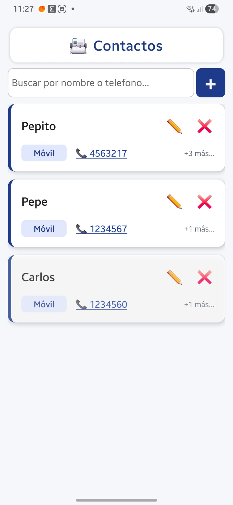

# REDISEÑO DE TITULO PRINCIPAL Y AÑADIR LA FIRMA Y CORREO DE CONTACTO

## 1. 🔲 Rediseño del Título: Buscando la Simetría Perfecta

Para que se integre con tus patrones visuales, vamos a hacer que el recuadro tenga exactamente el mismo ancho que la barra de búsqueda. Cambiaremos el estilo del contenedor para que use un ancho porcentual o márgenes idénticos a los de tus tarjetas.

Prueba a cambiar las reglas de tu CSS por estas:

---

```JSX
contenedorHeaderPrincipal: {
  width: '100%',
  paddingHorizontal: 16, // Usa exactamente el mismo padding que tengan tus tarjetas o la barra de búsqueda
  marginTop: 16,
  marginBottom: 8,
},
recuadroTituloModerno: {
  flexDirection: 'row',
  alignItems: 'center',
  justifyContent: 'center', // Centra el texto dentro de la barra larga
  backgroundColor: '#ffffff',
  paddingVertical: 12,
  borderRadius: 12, // Alineado al radio de curvatura de tus inputs
  borderWidth: 1,
  borderColor: '#e2e8f0',
  // Sombra sutil uniforme
  shadowColor: '#0f172a',
  shadowOffset: { width: 0, height: 2 },
  shadowOpacity: 0.04,
  shadowRadius: 8,
  elevation: 2,
},
```

---

Al estirarse horizontalmente de lado a lado del bloque de la app, tu cerebro dejará de notar esa diferencia de dimensiones y se integrará como un "Header" unificado.

## ✍️ Tu Firma de Autor: El "Easter Egg" en el Título

Es una costumbre hermosísima entre desarrolladores dejar un "Huevo de Pascua". Al ser una app privada (de momento), colocar un botón de créditos clásico en el pie de página puede quitar espacio útil. ¡La idea de hacer clic en el título para que salte tu firma es brillante y muy elegante!

Para implementarlo, simplemente envolvemos nuestro recuadro del título en un `<TouchableOpacity>` y disparamos un Alert que, además, ofrezca un botón directo para escribirte un correo.

Primero, asegúrate de `importar iniciarCorreo` desde nuestro módulo de utilidades (src/utils/linkingHelper.js) (que programaremos en el paso 3):

---

```jsx
import { iniciarCorreo } from "../utils/linkingHelper"; // Ajusta la ruta según tu proyecto
```

---

Y en tu JSX, ( App_V05.js) el título quedaría estructurado así:

---

```jsx
<View style={styles.contenedorHeaderPrincipal}>
  <TouchableOpacity
    activeOpacity={0.8}
    onPress={() => {
      Alert.alert(
        "Acerca de esta App",
        "Desarrollado con ❤️ por [Tu Nombre / Tu Firma]\n\nVersión 05 (Estable)\nSi tienes sugerencias o quieres contactarme, hazlo directamente.",
        [
          { text: "Cerrar", style: "cancel" },
          {
            text: "📧 Contactar",
            onPress: () =>
              iniciarCorreo(
                "barbusano3@gmail.com",
                "Soporte - Agenda Multi-Campos",
              ),
          },
        ],
      );
    }}
  >
    <View style={styles.recuadroTituloModerno}>
      <Text style={styles.emojisTitulo}>📇</Text>
      <Text style={styles.textoTituloPrincipal}>Contactos</Text>
    </View>
  </TouchableOpacity>
</View>
```

---

3. 📧 Completando el Módulo Nativo: Correo Electrónico
   Para que el botón de tu firma funcione, y para que también puedas añadir la interactividad en la tarjeta cuando pintes el correo de tus contactos, vamos a expandir tu archivo linkingHelper.js.

Abre tu archivo de utilidades ( src/utils/linkingHelper.js) y añade esta nueva función exportada:

---

```jsx
/**

- Abre el cliente de correo nativo (como Gmail) listo para redactar.
- @param {string} email - Destinatario del correo.
- @param {string} asunto - Asunto predefinido (opcional).
*/
export const iniciarCorreo = (email, asunto = "") => {
  if (!email || email.trim() === "") return;

  // Construimos la URL usando el protocolo estándar mailto
  const url = `mailto:${email.trim()}?subject=${encodeURIComponent(asunto)}`;

  Linking.canOpenURL(url)
    .then((supported) => {
      if (!supported) {
        Alert.alert(
          "Error",
          "No se encontró ninguna aplicación de correo configurada en este dispositivo.",
        );
      } else {
        return Linking.openURL(url);
      }
    })
    .catch((err) => console.error("Error al abrir la app de correo:", err));
};
```

---

📝 Resumen del Siguiente Paso
Cuando apliques esto:

El título "Contactos" se estirará de forma simétrica respetando las líneas de diseño de tu app.

Al mantener pulsado o tocar el título, saltará tu ventana de créditos.

Al tocar "Contactos" en el cuadro de diálogo, tu Samsung abrirá la app de correo directo hacia ti.

¡Ajusta ese ancho del Header y pruébalo con tu dedo! Me cuentas si ahora sí te hace ese "clic" visual que buscabas. En cuanto lo domines, si quieres, me pasas tu StyleSheet para corregir las alineaciones de los números.

# RESULTADO : LE FALTA VIDA



Al estirar el recuadro y dejar tanto fondo blanco con el texto centrado, la cabecera se siente un poco "institucional" o plana. Le falta ese contraste, dinamismo y profundidad visual que separa a una aplicación amateur de una de nivel comercial.

Para inyectarle esa vitalidad que buscas sin recargar la pantalla, podemos trabajar sobre tres pilares de diseño UI: un degradado moderno, profundidad en las sombras y micro-espaciados.

## 🎨 Propuesta de Rediseño Avanzado para el Header
En lugar de un recuadro con fondo blanco y borde gris, vamos a convertir la cabecera en una pieza de diseño tecnológico utilizando un gradiente sutil (pasando del azul corporativo que ya usas a un tono ligeramente más eléctrico o violeta) y refinando la tipografía.

Si estás usando la librería estándar de Expo para gradientes (expo-linear-gradient), tu estructura JSX se transformaría en algo así de limpio:

Antes de importar Linear Gradiente hay que instalar el modulo:

---
```bash
npx expo install expo-linear-gradient
```
---


---
```jsx
import { LinearGradient } from 'expo-linear-gradient';

// ... Dentro de tu return principal:
<View style={styles.contenedorHeaderPrincipal}>
<TouchableOpacity
activeOpacity={0.85}
onPress={() => mostrarFirmaCreditos()} // Tu huevo de pascua

>

    {/* Cambiamos el View plano por un contenedor con degradado vivo */}
    <LinearGradient
      colors={['#1e3a8a', '#3b82f6']} // De azul profundo a azul eléctrico vivo
      start={{ x: 0, y: 0 }}
      end={{ x: 1, y: 0 }} // Gradiente horizontal elegante
      style={styles.recuadroTituloModerno}
    >
      <Text style={styles.emojisTitulo}>📇</Text>
      <Text style={styles.textoTituloPrincipal}>Contactos</Text>
    </LinearGradient>

  </TouchableOpacity>
</View>
```
---


📐 Ajustando las Reglas de Estilo para Darle "Vida"
Para acompañar ese gradiente, el texto debe pasar a ser blanco puro para generar un contraste alto y limpio, y la sombra debe ganar un poco de color para que el bloque parezca flotar de verdad sobre el fondo grisáceo de la app.

JavaScript
contenedorHeaderPrincipal: {
width: '100%',
paddingHorizontal: 16,
marginTop: 20, // Un poco más de aire superior respecto a la barra de estado
marginBottom: 12,
},
recuadroTituloModerno: {
flexDirection: 'row',
alignItems: 'center',
justifyContent: 'center',
paddingVertical: 14, // Más cuerpo vertical para que respire el texto
borderRadius: 14, // Bordes pulidos en armonía con las tarjetas

    // 🌤️ Sombra "Glow" avanzada para Android/iOS
    shadowColor: '#3b82f6', // La sombra tiene el tono del azul vivo
    shadowOffset: { width: 0, height: 4 },
    shadowOpacity: 0.3, // Sombra más marcada pero difusa
    shadowRadius: 10,
    elevation: 6,

},
emojisTitulo: {
fontSize: 24,
marginRight: 12,
},
textoTituloPrincipal: {
fontSize: 22,
fontWeight: '900', // Máxima fuerza a la tipografía
color: '#ffffff', // Blanco puro sobre el fondo de color vivo
letterSpacing: 1.2, // Estilo premium espaciado
textTransform: 'uppercase', // Opcional: si quieres un look más deportivo/moderno
},
🧼 El Próximo Paso: Limpieza de la Tarjeta
Hacer este ajuste en el encabezado va a hacer que la parte superior de la app "explote" de color y personalidad. Una vez que lo veas montado en tu Samsung, el siguiente paso natural para quitar la sensación monolítica es el que mencionaste: reducir el tamaño de los lápices ✏️ y las cruces ❌, y pasarme tus estilos actuales para alinear al milímetro las filas de números expandidos.

¿Qué te parece la idea de meterle el fondo degradado en azul vivo al recuadro para romper el exceso de blanco?
