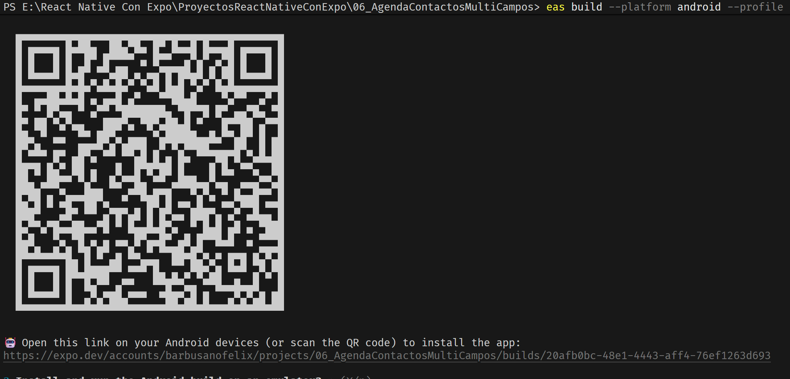

# 🧹 FASE 1: Limpieza y Puesta a Punto del Proyecto

## Eliminar el commutador de versiones:

El App.js, importaba la version como por ejemplo App_V07.js ( Claro, las importaciones estan direccionadas para la carpetas src/versionesApps ) asi que hay que eliminarlo y convertir la ultima version en App.js.

Es el movimiento correcto por tres grandes razones:

Limpieza arquitectónica:
El conmutador era un andamio para construir la casa. Ahora que la casa está terminada, el andamio estorba. App.js debe ser el reflejo de la aplicación definitiva.

Evitar despistes:
Si dejamos el conmutador y compilamos, Expo arrastrará código muerto y configuraciones que no necesitas. Al dejar el archivo definitivo en la raíz, te aseguras de que EAS Build compile exactamente lo que ves en pantalla.

Buenas prácticas profesionales:
En el mundo real, la versión de producción siempre toma el control del archivo principal.

Hacer este cambio es como mudar el motor definitivo al capó del coche. Vamos a ver cómo hacerlo paso a paso para que no se rompa ninguna ruta de importación.

## 🛠️ Procedimiento para "Mudar" tu código definitivo a App.js

No tienes que mover archivos de carpetas en Windows, solo vamos a copiar el contenido para que el historial de tus versiones previas quede intacto y a salvo dentro de src/versionesApps/.

Paso 1: Vaciar y reemplazar el App.js raíz
Abre tu archivo App_V07.js (o la que sea tu versión final y definitiva) dentro de src/versionesApps/.

Selecciona todo el código (Ctrl + A) y cópialo (Ctrl + C).

Abre el archivo App.js que está en la raíz del proyecto (el que actualmente funciona como conmutador).

Borra todo lo que tiene, pega el código copiado (Ctrl + V) y guarda el archivo.

Paso 2: El ajuste clave (Corregir las rutas de las imágenes)
Como acabas de mover el código un nivel hacia afuera (ya no está dentro de src/versionesApps/, sino en la raíz del proyecto), las rutas que corregimos ayer con dos saltos hacia atrás (../../) ahora están "perdidas" en el espacio.

Tenemos que quitarle un nivel de salto a todos los require de tus iconos en este nuevo App.js. Busca las líneas de tus imágenes y cámbialas de ../../assets/... a ./assets/...:

---

```jsx
// ❌ ANTES (En versionesApps): require("../../assets/ordenar.png")
// ¡AHORA (En la raíz App.js)!:
source={require("./assets/ordenar.png")}

source={require("./assets/address-book.png")}

source={require("./assets/contacto.png")}

source={require("./assets/ayuda.png")}
```

---

Paso 3: Revisar otras importaciones internas (Si las tienes)
Si tu código final importa componentes desde la carpeta src/components/, src/styles/ o src/utils/, también debes quitarles un punto y una barra.

Lo que antes se importaba como: import ... from "../components/MiComponente"

Ahora en la raíz se importará como: import ... from "./src/components/MiComponente"

Antes de compilar, tenemos que asegurarnos de que Expo solo empaquete el código limpio y los recursos reales.

1. ¿Qué hacemos con las carpetas de versiones (src/versionesApps)?
   No es obligatorio borrarlas de tu disco: Expo es inteligente. Cuando genera la APK, entra por tu archivo index.js / App.js y sigue el árbol de importaciones (import). Todo archivo que no esté importado en tu flujo actual (como tus borradores App_V05.js, App_CR_D_NoPersistencia, etc.) no se incluirá dentro del código final de la APK.

Recomendación profesional: Aunque no sumen peso a la APK, para mantener tu Git y tu espacio de trabajo limpio, puedes mover esa carpeta versionesApps fuera del proyecto (a tu escritorio, por ejemplo) o dejarla comprimida en un .zip si quieres conservar el histórico de tu evolución.

2. Limpieza de imágenes muertas en assets
   En tu última captura vi que tenías iconV1.png, iconV2.png, icon_copia.png, adaptive-icon.png, etc. Aquí sí hay que borrar. Cualquier imagen que esté suelta en la carpeta assets, aunque no la uses, Expo podría arrastrarla al paquete final, aumentando los megabytes de la APK.

Deja únicamente los iconos que use tu interfaz (ayuda.png, ordenar.png, etc.) y tu logo oficial (icon.png).

3. Verificación final de tu app.json
   Asegúrate de que tu archivo de configuración luzca exactamente así de limpio (sin los warnings antiguos y apuntando a tu icono verde o al que hayas elegido):

JSON
{
"expo": {
"name": "Contactos",
"slug": "06_AgendaContactosMultiCampos",
"version": "1.0.0",
"orientation": "portrait",
"icon": "./assets/icon.png",
"userInterfaceStyle": "light",
"android": {
"package": "com.felixlopez.contactos", // ◄--- ¡CRUCIAL! Añade esto (Tu DNI de la app)
"adaptiveIcon": {
"foregroundImage": "./assets/icon.png",
"backgroundColor": "#ffffff"
}
}
}
}
⚠️ Nota muy importante: Fíjate que dentro de "android" he añadido una línea clave: "package": "com.felixlopez.contactos". Esto se llama Bundle Identifier. Es el identificador único que usa el sistema operativo Android para saber que la app es tuya y diferenciarla de cualquier otra app de contactos del mundo. Ponlo con tu nombre en minúsculas, tal como te muestro.

📦 FASE 2: Procedimiento para generar la APK con EAS Build
Hoy en día, Expo utiliza EAS (Expo Application Services) para compilar las aplicaciones en la nube, lo que significa que no necesitas instalar Android Studio ni configurar pesadas variables de entorno en tu Windows. Los servidores de Expo hacen todo el trabajo duro.

Sigue estos pasos en la terminal de VS Code con el servidor Metro apagado (Ctrl + C):

Paso 1: Instalar la herramienta EAS globalmente
Si es la primera vez que lo haces, necesitas instalar el comando de compilación en tu computadora:

Bash
npm install -g eas-cli
Paso 2: Iniciar sesión en tu cuenta de Expo
Necesitas vincular tu terminal con tu cuenta gratuita de Expo (la misma que usas en la app Expo Go de tu móvil):

Bash
eas login
(Te pedirá tu correo/usuario y tu contraseña).

## √ Email or username ... barbusanofelix

## √ Password `@1234567nN`

Paso 3: Configurar el proyecto de compilación
Ejecuta el siguiente comando para que Expo cree automáticamente un archivo de configuración de producción llamado eas.json:

Bash
eas build:configure
Te preguntará: "Which platforms would you like to configure?". Selecciona Android (muévete con las flechas del teclado y pulsa Enter).

Paso 4: Modificar el eas.json para obtener una APK directa
Por defecto, Expo compila en formato .aab (el archivo que pide Google Play Store). Como nosotros queremos una APK directa para instalarla en tu propio teléfono Samsung o pasársela a tus familiares por WhatsApp, tenemos que decirle que genere un formato de previsualización (preview).

Abre el archivo eas.json que se acaba de crear en la raíz de tu proyecto y asegúrate de añadir la línea "developmentClient": false y "distribution": "internal" dentro de preview. Debe quedar así:

JSON
{
"cli": {
"version": ">= 10.0.0"
},
"build": {
"development": {
"developmentClient": true,
"distribution": "internal"
},
"preview": {
"distribution": "internal",
"android": {
"buildType": "apk" // ◄--- ¡ESTA ES LA MAGIA! Fuerza a Expo a generar un archivo .apk
}
},
"production": {}
}
}
Paso 5: ¡Disparar la compilación! 🚀
Ya está todo listo. Ejecuta el comando definitivo para mandar tu app a los servidores de compilación:

Bash
eas build --platform android --profile preview
⏳ ¿Qué pasará ahora?
La terminal te preguntará si deseas generar una nueva Keystore (llave de seguridad de Android). Dile que SÍ a todo lo que te pregunte automáticamente (Expo gestionará las llaves de encriptación por ti de forma segura).

Tu proyecto se subirá a la nube de Expo y entrarás en una cola de espera.

En la terminal verás un enlace web y una barra de carga. Puedes hacer clic en ese enlace para ver el progreso en tiempo real desde tu navegador.

Tras unos 5-10 minutos, la terminal se pondrá en verde y te dará un código QR y un enlace de descarga directa.

¡Solo tendrás que escanear ese QR con la cámara de tu Samsung, descargar el archivo .apk, instalarlo (aceptando el permiso de "Orígenes desconocidos") y disfrutar de tu Agenda corriendo de forma 100% nativa e independiente, sin depender de Expo Go! ¿Preparado para dar el gran paso?

Corrio y genero este QR


https://expo.dev/accounts/barbusanofelix/projects/06_AgendaContactosMultiCampos/builds/20afb0bc-48e1-4443-aff4-76ef1263d693
