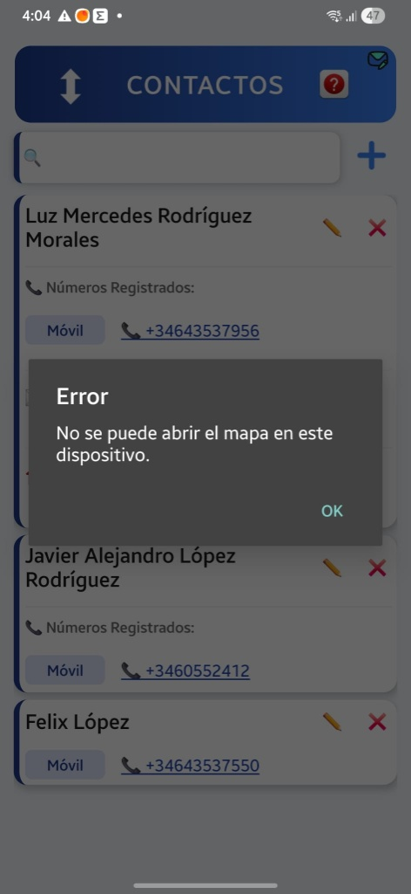
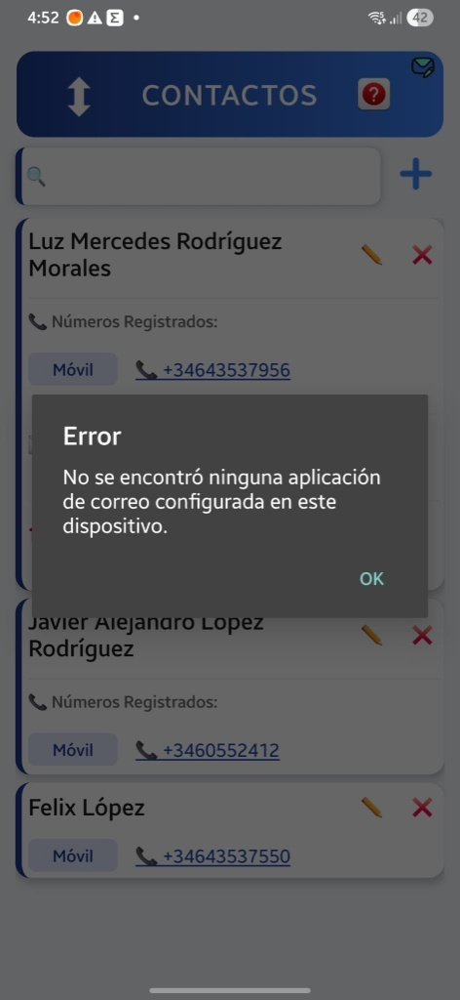

# ERROR AL TRATAR DE ABRIR UN MAIL O DIRECCION EN LA APK CONTACTOS, INSTALADA EN EL MOVIL.

En las imagenes los errores:




Me encontre con esta sorpresas, al hacer clic en correo o en la dirección. El telefono si abre...pide que selecione la aplicacion que lo gestiona....

En la PC si abre ambos: Correo y direccion ( abre Maps).

¿por qué fallan los mapas y los correos al compilar la APK?

La respuesta está en cómo gestiona Android los enlaces externos (Intentos o Linking) y las restricciones de seguridad que se aplican a los archivos APK independientes. Vamos a revisar por qué ocurre y cómo dejarlo bien.

## 🔍 ¿Por qué pasa esto en el móvil y no en la PC?

### 1. El misterio del Correo

El mensaje "No se encontró ninguna aplicación de correo configurada en este dispositivo" ocurre por un tecnicismo de cómo dispara React Native el protocolo mailto:.

Si estás usando una librería como expo-linking o Linking.openURL('mailto:ejemplo@correo.com'), Android busca una app que responda estrictamente y de forma primaria a ese comando.

Si en tu teléfono Samsung usas la app de Gmail o de Outlook pero no está configurada como la aplicación predeterminada del sistema para gestionar correos en los ajustes globales, Android se rinde y dice que "no hay ninguna". En la PC no pasa porque Windows siempre tiene Mail u Outlook enlazado por defecto a nivel de sistema.

### 2. El misterio del Mapa (image_518c09.jpg)

El aviso "No se puede abrir el mapa en este dispositivo" suele deberse a la estructura de la URL que le estás enviando.

En la PC, los navegadores web son muy listos: si les pasas una dirección de texto cruda o una coordenada, abren la web de Google Maps y lo resuelven.

En una APK de Android nativa, necesitas usar los prefijos exactos que entiende el sistema operativo (llamados esquemas de geo-localización). Si le pasas una URL web normal o un texto plano sin el formato que espera la app de Maps, Android rechaza el enlace por seguridad.

### 🔍 Entonces, ¿por qué fallaba en la APK si el código estaba bien?

Al estar el código correcto, el verdadero motivo por el que Android te mostró el cartel de "No se puede abrir el mapa en este dispositivo" dentro de la APK compilada es por un cambio de seguridad estricto que introduce Android a partir de sus versiones más recientes (Android 11 en adelante).

Cuando empaquetas una aplicación en una APK independiente, Android aplica una política llamada Visibilidad de Paquetes (Package Visibility).

- En Expo Go:
  Como Expo Go es una app gigante con todos los permisos del mundo ya aprobados por Google, el sistema operativo le permite abrir cualquier enlace (geo:, mailto:, etc.) sin protestar.

- En tu APK compilada:
  Al ser una app nueva e independiente, Android desconfía por defecto. Cuando tu código ejecuta Linking.canOpenURL(url), el sistema operativo, por pura privacidad, le responde un false automático a tu aplicación diciendo que "no sabe si hay aplicaciones de mapas", bloqueando el intento y disparando tu cartel de error personalizado.

## 🛠️ ¿Cómo asegurar que funcione en la nueva APK?

Para que no te vuelva a fallar en la próxima compilación, la clave es eliminar el filtro de seguridad previo (Linking.canOpenURL) y lanzar la acción directamente.

Aquí tienes tu bloque de código limpio de comentarios innecesarios y estructurado de la forma más directa posible:

---

```jsx
import { Linking, Alert } from "react-native";

export const iniciarLlamada = (numero) => {
  if (!numero) return;
  const numeroLimpio = numero.replace(/[\s-]/g, "");
  const url = `tel:${numeroLimpio}`;

  // Lanzamos la llamada directamente
  Linking.openURL(url).catch((err) => {
    console.error("Error en llamada:", err);
    Alert.alert("Error", "Este dispositivo no soporta realizar llamadas.");
  });
};

export const abrirEnMaps = (direccion) => {
  if (!direccion || direccion.trim() === "") return;

  const direccionCodificada = encodeURIComponent(direccion.trim());

  // 🎯 URL UNIVERSAL OFICIAL: Funciona en PC, Android, Navegadores y APKs nativas
  const url = `https://www.google.com/maps/search/?api=1&query=${direccionCodificada}`;

  // Disparamos directamente para saltar las restricciones de privacidad de la APK
  Linking.openURL(url).catch((err) => {
    console.error("Error al abrir mapas:", err);
    Alert.alert("Error", "No se pudo abrir la aplicación de mapas.");
  });
};

export const inic iarCorreo = (email, asunto = "") => {
  if (!email || email.trim() === "") return;

  const url = `mailto:${email.trim()}?subject=${encodeURIComponent(asunto)}`;

  // Saltamos el filtro de privacidad y forzamos a Android a mostrar las apps de correo
  Linking.openURL(url).catch((err) => {
    console.error("Error al abrir correo:", err);
    Alert.alert("Aviso", `No se pudo abrir la app de correo.\n\nDirección: ${email.trim()}`);
  });
};
```

---

## 💡 Conclusión de la revisión:

- ¿Había un error en tu código?
  No, tu código original estaba perfecto. Mi lectura fue la errónea.

- ¿Qué causó el fallo?
  El método Linking.canOpenURL(), que se vuelve demasiado restrictivo dentro de las APKs de Android.

- ¿Hay que borrar los comentarios?
  Sí, en este código limpio que te acabo de pasar he eliminado los comentarios antiguos y las líneas descartadas para que el archivo quede completamente legible y directo.

Con esta estructura directa sin el filtro asustadizo de Android, tu próxima APK resolverá las rutas al instante.
