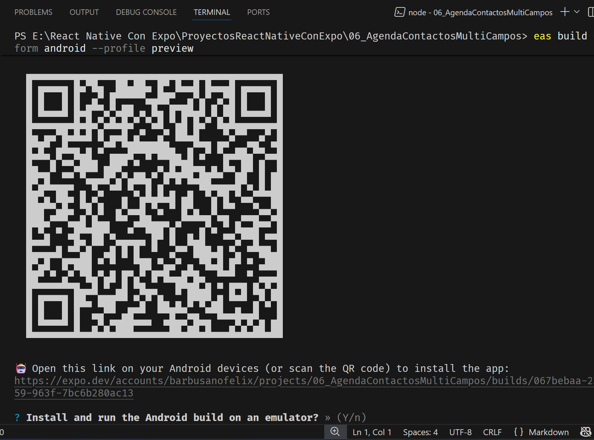
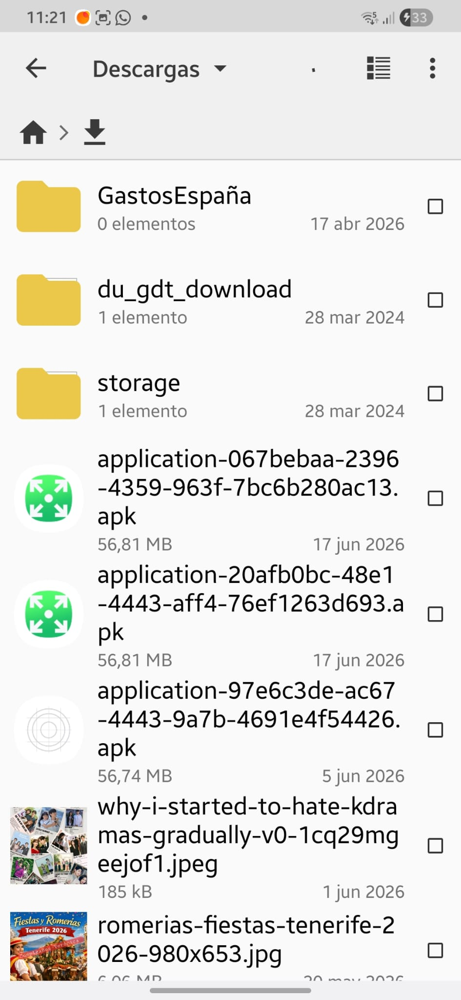
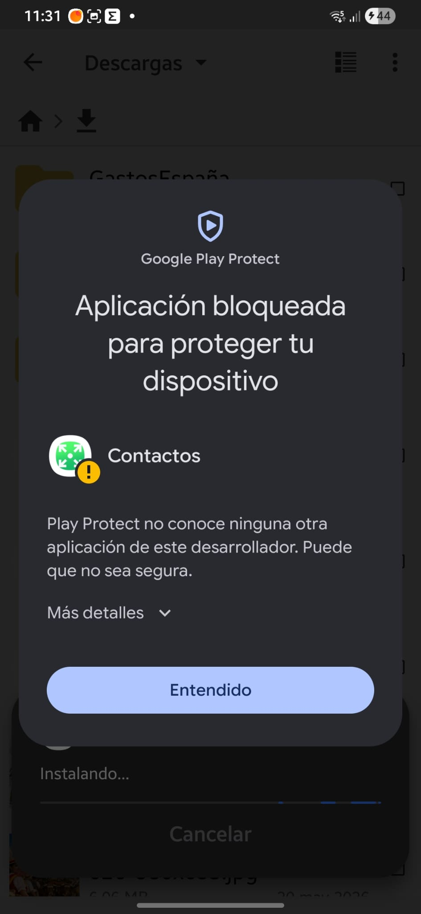

# INSTALAR LA APK COMPILADA POR EXPO

Al compilar la APK en expo:

- obtendremos un QR o un link debajo.
  .

- Leemos el QR con la cámara del Móvil.
  - Se abrirá una App de expo.
    

- Hacemos clic en Install ( boton blanco) . Espera un poco y comenzará una descarga.
- Vamos a la carpeta de descargas => Usando por ejemplo `Cx Explorador` ( una app que se descarga de Play Store)  
  
- Clic en el nombre descargado ( la de arriba que tiene el icono verde).
  - Como ya la tenia me indica que si la actualizo...Le decimos que si.
  - EAndroid bloquara la aplicacion:
    
  - En la pantalla anterior, sobre `Entendido` , hay un despleglable que dice : `Mas detalles`. Hacemos clic sobre él.
  - Sobre el boton `Entendido` veremos que dice: `Instalar de todas formas`.
    - Le damos clic y la instalarà.
