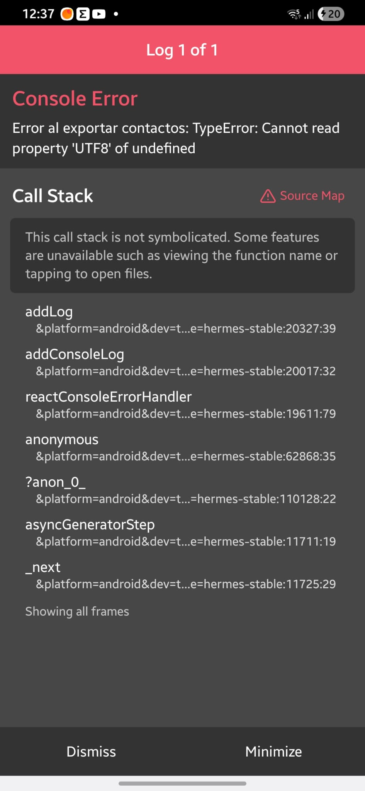
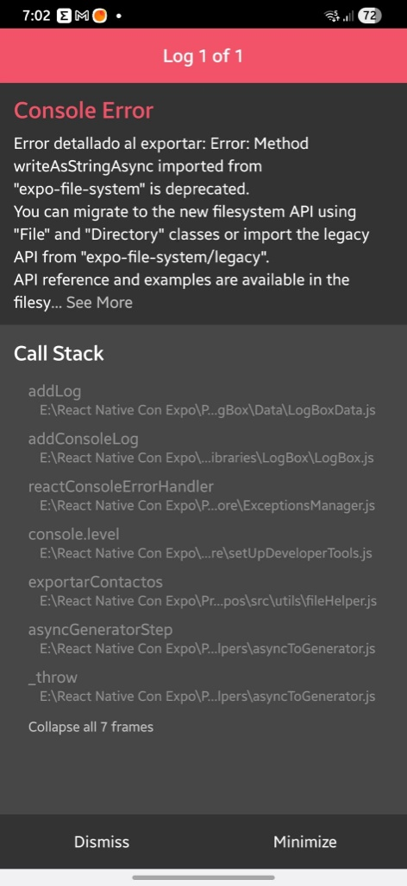
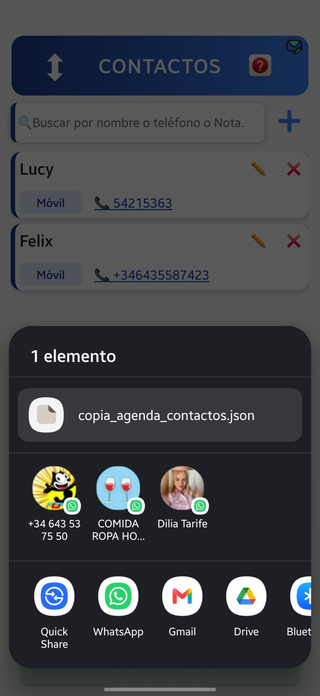
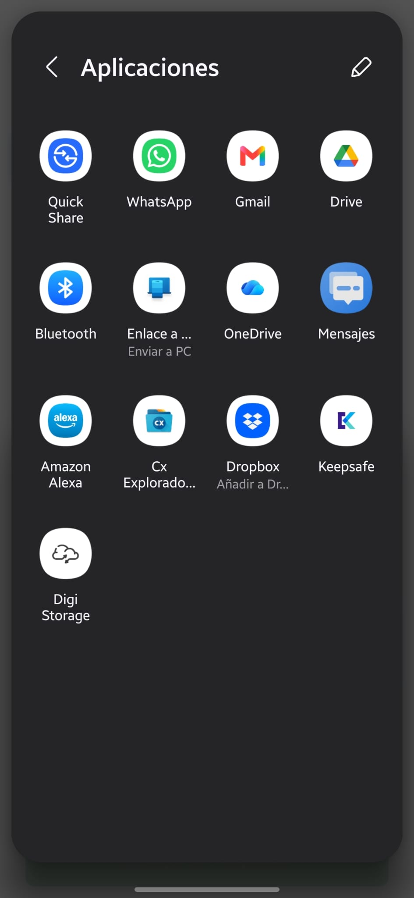
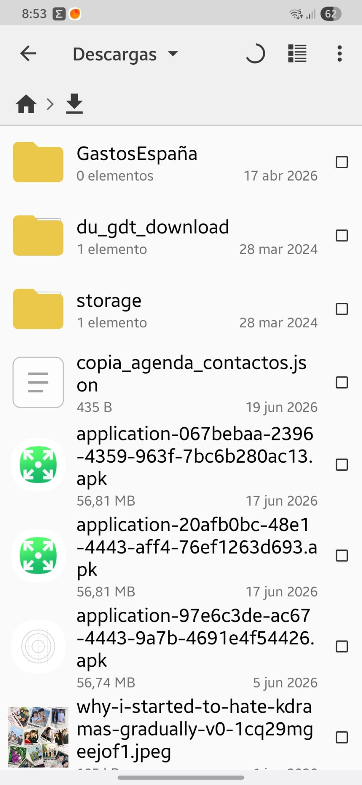
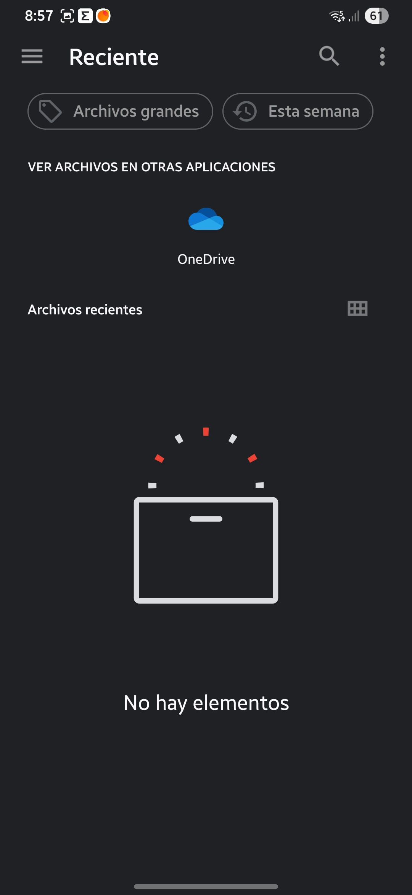
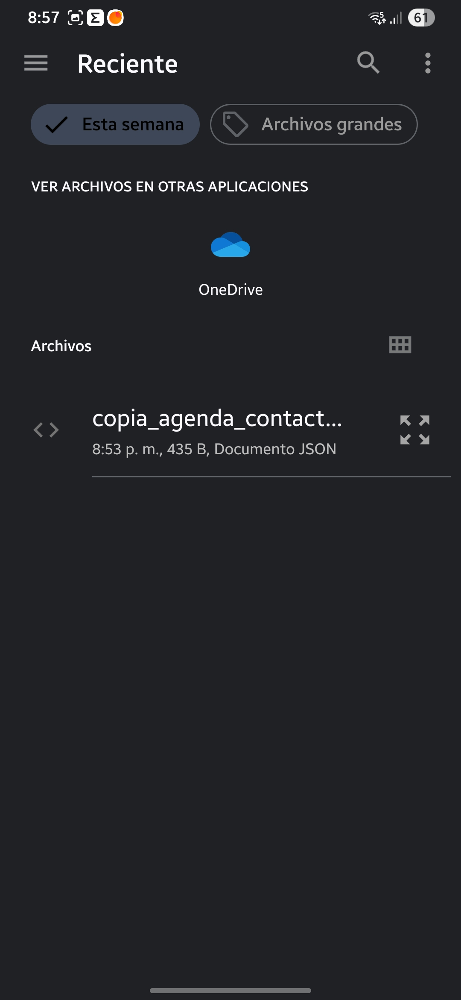
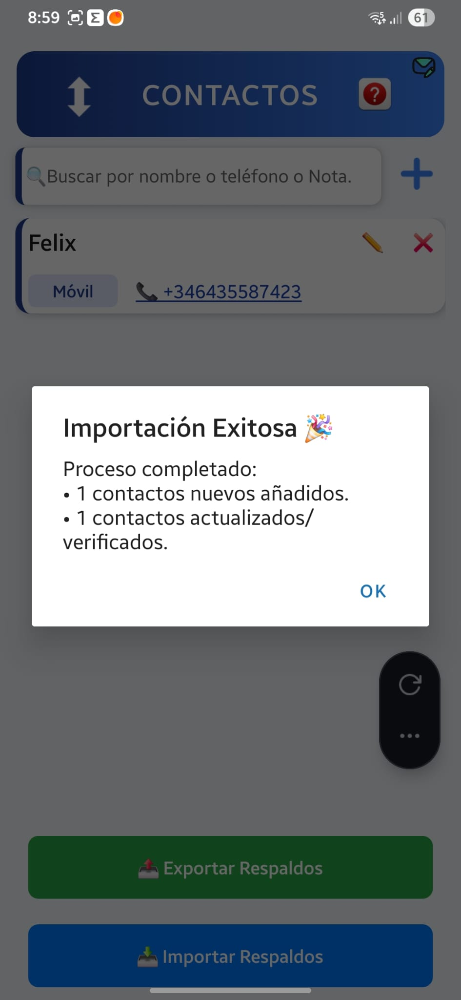

# como intercambiar fácilmente los contactos.

Creo que es la evolución natural y el broche de oro perfecto para el proyecto es hacer una importacion/Exportacion de contactos.
Ir a buscar el archivo oculto en las carpetas del sistema de Android (/data/data/...) es un dolor de cabeza e imposible en teléfonos normales sin hackearlos (root). Por lo tanto, crear la función de Importar y Exportar dentro de tu propia aplicación es la solución más elegante, profesional y útil.

Hacer esto va a aportar tres cosas fantásticas:

1. ¿Cómo funcionaría en tu app? (La lógica)
   Añadiríamos dos botones sencillos (por ejemplo, dentro de tu ventana de ayuda o en una mini-sección de "Ajustes"):

📤 Botón "Exportar Datos":
Al pulsar de forma interna, tu código agarra todo el bloque de contactos que tienes en AsyncStorage, lo convierte en un texto plano con formato JSON o CSV (compatible con Excel) y usando una librería nativa de Expo (expo-sharing o expo-file-system), abre el menú del teléfono para que lo puedas enviar directamente por WhatsApp, Gmail o guardarlo en la carpeta Descargas.

📥 Botón "Importar Datos":
En el teléfono de tu esposa, ella pulsa este botón, se abre el selector de archivos nativo del móvil, elige el archivo que le pasaste, y la aplicación lee ese texto, lo procesa y ¡pum!, llena su base de datos local al instante con tus contactos.

2. Muy buen aprendizaje:
   A nivel de aprendizaje, esto es un salto de nivel brutal porque vas a aprender a:

Gestionar el sistema de archivos del teléfono (leer y escribir archivos reales en el almacenamiento).

Utilizar las funciones nativas de compartir de Android.

Dominar la conversión de datos (de objetos de JavaScript a archivos descargables).

3. ¿Qué necesitamos para empezar?
   Para implementar esto necesitaremos instalar dos librerías oficiales de Expo muy ligeras que se encargan de hablar con el disco duro del móvil:

```Bash
npx expo install expo-file-system expo-sharing
```

---

podemos empezar a diseñar cómo estructurar esos dos botones y el código para que puedas traspasarle tus contactos a alguien mas.

Cuando los datos viajan de un dispositivo a otro, confiar ciegamente en el id (que suele ser un timestamp como 1718712000000 o un autoincremental) no es suficiente.

Para manejar estos casos como un profesional, se aplican varias estrategias combinadas. Te explico cómo se resuelven ambas situaciones:

Situación 1: El mismo ID, pero exportación acumulada (por ejemplon 10 viejos + 10 nuevos)
Este es el escenario más fácil de controlar si conservamos los IDs originales en la exportación. Cuando la otra persona importe el archivo de 20 contactos, el código no debe hacer un simple .push() o añadir todo a ciegas.

Se aplica una lógica llamada "Upsert" (Update + Insert):

El código toma un contacto del archivo y mira su id.

Busca en el AsyncStorage de tu esposa si ya existe un contacto con ese mismo ID.

¿Ya existe? En lugar de duplicarlo, lo actualiza (por si acaso tú corregiste un número de teléfono o un correo en tu teléfono antes de exportar). Así se evita el duplicado y se mantiene al día.

¿No existe? Lo inserta como un contacto completamente nuevo.

Situación 2: El contacto se borró, se recreó y generó un ID distinto
Aquí es donde se pone interesante. Si borraste a "Juan Pérez" y lo volviste a crear, su ID cambió por completo. Si se lo pasas a tu esposa, la lógica del ID fallará y se duplicará porque para la máquina son dos personas distintas.

Para solucionar esto, los desarrolladores creamos una Clave Única de Negocio (o Composite Key), que consiste en comparar campos humanos inalterables. En una agenda de contactos, el campo rey para esto es el número de teléfono o el correo electrónico.

La lógica de importación inteligente sube de nivel haciendo esto:

Si el id no coincide con nada, antes de darlo por nuevo, el código hace una segunda revisión.

Busca en la base de datos si ya existe algún contacto donde el nombre coincida exactamente AND al menos uno de los teléfonos sea idéntico.

Si encuentra una coincidencia total de Teléfono + Nombre: El código entiende que es el mismo "Juan Pérez" humano, aunque tenga un ID de máquina diferente. Entonces, fusiona los datos (o adopta el nuevo ID) para evitar que a tu esposa le salgan dos tarjetas idénticas de la misma persona.

🛡️ ¿Cómo se maneja esto en el mundo real? (La Solución Estándar)
Si quieres diseñar un sistema de importación robusto para tu app, lo ideal es estructurar la función de importación con tres pasos consecutivos de validación por cada contacto del archivo:

```txt
¿Existe el ID en la base de datos local?
    ├── SÍ ──> Actualiza los datos (Evita duplicado).
    └── NO ──> ¿Existe coincidencia exacta de Nombre + Teléfono principal?
                  ├── SÍ ──> Vincula/Actualiza (Detecta que se recreó con otro ID).
                  └── NO ──> Inserta como contacto 100% Nuevo.

```

---

Implementar este "árbol de decisiones" en JavaScript es divertidísimo porque se usan métodos de arrays como .find() o .some() que ya has estado practicando en tus filtros de búsqueda.


Para llevar este sistema de Exportación e Importación Inteligente (Anti-duplicados) a tu realidad, el desarrollo se divide en 4 grandes fases.

# 🗺️ El Mapa de Ruta Detallado
### Fase 1: Instalar las herramientas del disco duro
React Native por sí solo vive en su burbuja. Para que pueda escribir un archivo físico en el almacenamiento del Samsung y luego compartirlo, necesitamos instalar las dos librerías oficiales de Expo.
En la terminal (con el servidor Metro apagado Expo Go), el primer paso será ejecutar:

---
```jsx
npx expo install expo-file-system expo-sharing
```
---

### Fase 2: Construir la "Máquina de Exportar" (Salida)
En tu archivo de utilidades o directamente en tu lógica, crearemos la función ``exportarContactos``. El paso a paso interno de esta función será:

Leer la base de datos: 
Trae todos los contactos actuales desde tu AsyncStorage.

Convertir a texto (JSON): 
Como AsyncStorage devuelve un objeto/array de JavaScript, lo convertiremos en una cadena de texto plana usando JSON.stringify(contactos). 
Esto genera un texto con una estructura limpia que cualquier computadora entiende.

Crear el archivo temporal: 
Usando ``FileSystem.writeAsStringAsync``, le diremos al teléfono: 
"Crea un archivo llamado ``copia_contactos.json`` y escribe este texto dentro".

Disparar el menú nativo: 
Usando Sharing.shareAsync, obligamos a Android a levantar su cortina inferior para que elijas si quieres enviar ese archivo por WhatsApp, guardarlo en Google Drive o mandarlo por Gmail.

### Fase 3: Diseñar el "Cerebro de Importación" (El filtro inteligente)
Esta es la fase más divertida y donde ocurre la de-duplicación que pensaste. Cuando tu esposa reciba el archivo y le dé al botón "Importar", la función hará lo siguiente por cada contacto del archivo:

* Paso A: 
Leer el archivo entrante mediante un selector de archivos y transformarlo de texto de vuelta a un array de JavaScript (JSON.parse).

* Paso B: 
El bucle de validación. Haremos un recorrido (un forEach o map) de los contactos que vienen en el archivo y los compararemos con los que ella ya tiene guardados en su teléfono:

* Filtro 1 (Por ID):
 ¿El id del archivo coincide con algún id local? Si es así, actualiza los campos del contacto local por si hubo cambios y salta al siguiente.

* Filtro 2 (Por Humano - Nombre + Teléfono): 
Si el ID no coincide, el cerebro limpia los espacios del teléfono entrante y busca: ¿Tengo ya a alguien con este mismo nombre y este mismo número de teléfono registrado? Si el resultado es afirmativo, fusiona o actualiza para evitar el clon.

* Filtro 3 (El nuevo): 
Si no pasa ninguno de los filtros anteriores, significa que es un contacto que tu esposa no tiene en absoluto. Se genera un .push() al array para insertarlo como nuevo.

Paso C: Guardar en bloque. Una vez procesados todos, se hace un único AsyncStorage.setItem con la lista final limpia y sin duplicados.

Fase 4: La Interfaz de Usuario (Ventana de Ayuda o Ajustes)
Para que esto sea usable, añadiremos dos botones visuales bien presentados dentro de tu aplicación (puede ser abajo del todo en tu Modal de Ayuda o creando una sección pequeña de herramientas).

Un botón con un icono 📤 Exportar Agenda

Un botón con un icono 📥 Importar Agenda

🛠️ ¿Cómo quieres que empecemos?
Para ir sobre seguro y que no se vuelva un caos, vayamos fase por fase.

 El primer paso real es que vayas a la terminal de VS Code, instales las dos librerías con el comando 
 
 ---
 ```jsx
 npx expo install expo-file-system expo-sharing 
```
---


Opción A: El método rápido y directo (Copia manual limpia)
Si no quieres complicarte con carpetas de versiones, haz esto directamente en VS Code:

Ve a tu archivo App.js actual (el que funciona perfecto).

Hazle Clic derecho -> Copiar y luego Pegar en la misma raíz.

Windows/VS Code te creará un archivo llamado App - copia.js (o similar).

Cámbiale el nombre a algo muy claro, por ejemplo: App.estable.funcional.js.

¿Por qué esto es seguro? Porque si mientras escribes el código de exportación/importación la app empieza a romperse o a tirar errores raros, solo tienes que borrar el App.js ruidoso, renombrar tu App.estable.funcional.js de vuelta a App.js y en un segundo vuelves a tener tu APK estable corriendo como si nada hubiera pasado.

Opción B: La alternativa profesional (Un archivo helper separado)
Para no engordar el archivo App.js con cientos de líneas nuevas de lógica de archivos, lo ideal es crear un archivo nuevo en tu raíz llamado fileHelper.js (en minúsculas, como ya aprendimos 😉).

En fileHelper.js escribiremos las funciones de exportar e importar.

En tu App.js solo importaremos esas funciones y las meteremos en los botones.

Así, tu código principal apenas cambia y toda la "grasa" del manejo de archivos se queda aislada en su propio laboratorio. Si algo falla, el error estará encerrado en ese archivo helper.

🚀 Mi recomendación para hoy:
Haz una copia manual de tu App.js actual (Opción A) para tener tu salvavidas de emergencia a mano, e instalemos las librerías.

Cuando tengas tu copia de seguridad hecha y el servidor Metro apagado, ejecuta en tu terminal el comando de instalación:

```Bash
npx expo install expo-file-system expo-sharing
```
---

Vamos directos a la Fase 2: Construir la "Máquina de Exportar". Como acordamos que es mejor mantener el código ordenado y no saturar el App.js, vamos a crear un archivo asistente específico para el manejo de archivos.

🛠️ Paso 1: Crea el archivo fileHelper.js
Crea un archivo nuevo en la carpeta src/utils del proyecto llamado fileHelper.js (en minúsculas) y pega dentro el siguiente código. Este módulo se encargará de leer tus contactos de AsyncStorage, transformarlos en un archivo físico .json y abrir el menú nativo del móvil para compartirlo.

---
```jsx
import AsyncStorage from "@react-native-async-storage/async-storage";
import * as FileSystem from "expo-file-system";
import * as Sharing from "expo-sharing";
import { Alert } from "react-native";

/**
 * Exporta los contactos de AsyncStorage a un archivo JSON y abre el menú compartir.
 */
export const exportarContactos = async () => {
  try {
    // 1. Leer los datos actuales de la agenda
    const datosLocales = await AsyncStorage.getItem("@contactos");
    
    // Si no hay contactos o está vacío, avisamos al usuario
    if (!datosLocales || JSON.parse(datosLocales).length === 0) {
      Alert.alert("Aviso", "No tienes ningún contacto en tu agenda para exportar.");
      return;
    }

    // 2. Definir la ruta temporal del archivo en el teléfono
    // Guardaremos el archivo con un nombre limpio: 'copia_agenda_contactos.json'
    const rutaArchivo = `${FileSystem.documentDirectory}copia_agenda_contactos.json`;

    // 3. Escribir el archivo físico en el disco del teléfono
    // Tomamos el string crudo que ya teníamos en AsyncStorage y lo grabamos
    await FileSystem.writeAsStringAsync(rutaArchivo, datosLocales, {
      encoding: FileSystem.EncodingType.UTF8,
    });

    // 4. Comprobar si el dispositivo permite compartir archivos
    const sePuedeCompartir = await Sharing.isAvailableAsync();

    if (sePuedeCompartir) {
      // Abre el menú nativo (WhatsApp, Gmail, Guardar en carpeta, etc.)
      await Sharing.shareAsync(rutaArchivo, {
        dialogTitle: "Exportar mi Agenda de Contactos",
        mimeType: "application/json", // Le dice al sistema que es un archivo de datos JSON
      });
    } else {
      Alert.alert("Error", "Tu dispositivo no permite compartir archivos compartidos.");
    }

  } catch (error) {
    console.error("Error al exportar contactos:", error);
    Alert.alert("Error", "Ocurrió un fallo al intentar exportar los datos.");
  }
};
```
---


🔌 Paso 2: Conectar el botón en tu App.js
Ahora vamos a poner un botón de prueba para verificar que la exportación funciona perfectamente en tu teléfono.

Abre tu App.js principal.

Ve arriba del todo, donde tienes las importaciones, y añade la función que acabamos de crear:

```jsx
import { exportarContactos } from ".src/utils/fileHelper";
```
---

Busca el lugar donde quieras colocar el botón (puede ser dentro de tu Modal de Ayuda, o temporalmente abajo del todo en tu pantalla principal) y añade un botón que la dispare:


```jsx
<TouchableOpacity 
  style={{
    backgroundColor: '#28a745', // Un bonito verde de éxito
    padding: 15, 
    borderRadius: 8, 
    margin: 10, 
    alignItems: 'center'
  }}
  onPress={exportarContactos}
>
  <Text style={{ color: 'white', fontWeight: 'bold' }}>📤 Exportar Respaldos</Text>
</TouchableOpacity>
```
---

# ERROR POR UTF8

Al correr el programa y decirle que exporte ocurrio un error por el UTF8.



El error dice: TypeError: Cannot read property 'UTF8' of undefined.

Esto significa que en la versión de Expo que se instaló, el objeto FileSystem.EncodingType vino vacío (undefined). Al intentar tu código leer la propiedad .UTF8 dentro de algo vacío, la aplicación se interrumpe inmediatamente y lanza la pantalla roja.

🛠️ La solución definitiva (y más simple)
Para quitarnos de encima este problema de compatibilidad entre versiones de la librería, lo mejor es saltarnos esa propiedad y pasarle directamente la cadena de texto 'utf8' (en minúsculas). El motor de Expo lo entiende perfectamente de forma nativa y es totalmente inmune a este error.

Vamos a dejar tu archivo fileHelper.js blindado al 100%. Reemplaza el código por este:

---
```jsx
import AsyncStorage from "@react-native-async-storage/async-storage";
import * as FileSystem from "expo-file-system";
import * as Sharing from "expo-sharing";
import { Alert } from "react-native";

const STORAGE_KEY = "@agenda_multicampos_v03";

export const exportarContactos = async () => {
  try {
    // 1. Leer los datos crudos del disco
    const datosCrudos = await AsyncStorage.getItem(STORAGE_KEY);
    
    if (!datosCrudos) {
      Alert.alert("Aviso", "No tienes ningún contacto para exportar.");
      return;
    }

    // 2. Parseo de seguridad para asegurar que el JSON sea válido
    const contactosObjeto = JSON.parse(datosCrudos);

    if (contactosObjeto.length === 0) {
      Alert.alert("Aviso", "La agenda está vacía.");
      return;
    }

    const textoNormalizado = JSON.stringify(contactosObjeto);

    // 3. Definir la ruta del archivo temporal (.json)
    const rutaArchivo = `${FileSystem.documentDirectory}copia_agenda_contactos.json`;

    // 4. 🪄 EL CAMBIO CLAVE: Usamos la cadena directa 'utf8' para evitar el "undefined"
    await FileSystem.writeAsStringAsync(rutaArchivo, textoNormalizado, {
      encoding: 'utf8', 
    });

    // 5. Compartir con el menú nativo
    const sePuedeCompartir = await Sharing.isAvailableAsync();

    if (sePuedeCompartir) {
      await Sharing.shareAsync(rutaArchivo, {
        dialogTitle: "Exportar mi Agenda de Contactos",
        mimeType: "application/json",
      });
    } else {
      Alert.alert("Error", "Tu dispositivo no permite compartir archivos.");
    }

  } catch (error) {
    console.error("Error detallado al exportar:", error);
    Alert.alert("Error", "Ocurrió un fallo al intentar exportar los datos.");
  }
};
```
---


Con este sutil cambio (encoding: 'utf8'), la librería de Expo no tendrá que buscar ninguna propiedad interna oculta; escribirá el archivo directamente en tu Samsung usando la codificación correcta.


El error continuo:


Con el encoding:'utf8' tenemos el error mostrado en el movil y en la consola de VS code :

*******************   ERROR EN CONSOLA VS CODE **************************************

Reloading apps

Android Bundled 20ms index.js (1 module)

 WARN  Method writeAsStringAsync imported from "expo-file-system" is deprecated.

You can migrate to the new filesystem API using "File" and "Directory" classes or import the legacy API from "expo-file-system/legacy".

API reference and examples are available in the filesystem docs: https://docs.expo.dev/versions/v54.0.0/sdk/filesystem/

 ERROR  Error detallado al exportar: [Error: Method writeAsStringAsync imported from "expo-file-system" is deprecated.

You can migrate to the new filesystem API using "File" and "Directory" classes or import the legacy API from "expo-file-system/legacy".

API reference and examples are available in the filesystem docs: https://docs.expo.dev/versions/v54.0.0/sdk/filesystem/]

********************************* FIN DE CAPTURA DE CONSOLA *******************************

Esta pantalla roja es súper reveladora ( IMAGEN-26) . El misterio está completamente resuelto gracias al mensaje de la terminal: estás utilizando una versión muy moderna y reciente de Expo (Expo SDK 54 o superior, lanzada en 2026).

En estas nuevas versiones, el equipo de Expo ha rediseñado por completo el módulo de archivos. Han eliminado los métodos antiguos como ``writeAsStringAsync`` (los han marcado como obsoletos/deprecated) y los han movido a una ruta especial llamada ``expo-file-system/legacy``. Por eso, al intentar llamarlo desde la ruta normal, la app frena en seco y lanza el error.

Tenemos dos caminos para solucionarlo. Vamos a elegir el Camino 1 porque es el más rápido, directo y te permite mantener tu código actual cambiando solo una línea de importación.

## 🛠️ Solución Rápida: Importar desde la ruta legacy
Como nos indica la propia terminal de VS Code, para seguir usando este método clásico solo tenemos que cambiar la procedencia de la importación en la parte superior de tu archivo fileHelper.js.

Abre tu archivo fileHelper.js y modifica la línea de expo-file-system añadiéndole /legacy al final. El código completo debe quedar exactamente así:

```JSX
import AsyncStorage from "@react-native-async-storage/async-storage";
// 🎯 EL CAMBIO CLAVE: Añadimos '/legacy' al final para que Expo permita usar el método
import * as FileSystem from "expo-file-system/legacy";
import * as Sharing from "expo-sharing";
import { Alert } from "react-native";

const STORAGE_KEY = "@agenda_multicampos_v03";

export const exportarContactos = async () => {
  try {
    // 1. Leer los datos crudos del disco
    const datosCrudos = await AsyncStorage.getItem(STORAGE_KEY);
    
    if (!datosCrudos) {
      Alert.alert("Aviso", "No tienes ningún contacto para exportar.");
      return;
    }

    // 2. Parseo de seguridad
    const contactosObjeto = JSON.parse(datosCrudos);

    if (contactosObjeto.length === 0) {
      Alert.alert("Aviso", "La agenda está vacía.");
      return;
    }

    const textoNormalizado = JSON.stringify(contactosObjeto);

    // 3. Definir la ruta del archivo temporal
    const rutaArchivo = `${FileSystem.documentDirectory}copia_agenda_contactos.json`;

    // 4. Escribir el archivo usando la API clásica (ahora permitida por estar en /legacy)
    await FileSystem.writeAsStringAsync(rutaArchivo, textoNormalizado, {
      encoding: 'utf8', 
    });

    // 5. Compartir con el menú nativo
    const sePuedeCompartir = await Sharing.isAvailableAsync();

    if (sePuedeCompartir) {
      await Sharing.shareAsync(rutaArchivo, {
        dialogTitle: "Exportar mi Agenda de Contactos",
        mimeType: "application/json",
      });
    } else {
      Alert.alert("Error", "Tu dispositivo no permite compartir archivos.");
    }

  } catch (error) {
    console.error("Error detallado al exportar:", error);
    Alert.alert("Error", "Ocurrió un fallo al intentar exportar los datos.");
  }
};
```
---


🧪 ¿Qué pasará ahora al probar?
Al guardar los cambios, Expo Go recargará la aplicación. Cuando pulses el botón verde, la librería ya no protestará porque sabe que estás usando de forma consciente la API de compatibilidad hacia atrás. Debería saltar de inmediato el menú inferior de tu Samsung para enviar tu archivo por WhatsApp o guardarlo en Drive.....y asi fue:


Si nos desplazamos a la derecha permite una seleccion que muestra todas las vias de exportacion:


Yo seleccione ``Cx Explorer`` para la aplicacion que recibira 

# Ahora vamos a programar la "Máquina de Importar" dentro del mismo archivo fileHelper.js. 
Esta función se encargará de:

* Abrir el selector de archivos del teléfono para que la otra persona elija el archivo .json que le pasaste por WhatsApp y que quiere importar.
* Leer los contactos que vienen dentro.
* Aplicar tu lógica inteligente (Anti-duplicados): Comparar uno a uno por ID o por Nombre+Teléfono para no repetir nada.

Para poder seleccionar archivos del teléfono, necesitamos una herramienta nativa más de Expo llamada:  ``expo-document-picker``.

## 🛠️ Paso 1: Instalar el Selector de Documentos
Primero, apaga un segundo el servidor Metro ( Expo Go ) en la terminal (Ctrl + C) e instala esta pequeña librería oficial:

```Bash
npx expo install expo-document-picker

```
---

Dará como salida:

```bash
 Installing 1 SDK 54.0.0 compatible native module using npm
> npm install

added 1 package, and audited 706 packages in 4s

53 packages are looking for funding
  run `npm fund` for details

18 vulnerabilities (17 moderate, 1 high)

To address issues that do not require attention, run:
  npm audit fix

To address all issues (including breaking changes), run:
  npm audit fix --force

Run `npm audit` for details.
```
---
NO hacerle caso a la vulnerabilidad alta:
* 1. ¿Por qué aparecen estas alertas?
npm es un guardián muy estricto. Cada vez que instalas algo, revisa una base de datos mundial de seguridad. La inmensa mayoría de esas alertas "altas" o "moderadas" en entornos de React Native pertenecen a herramientas secundarias que se usan solo en tu ordenador para compilar la app (como scripts de empaquetado, formateadores de texto o herramientas de desarrollo de Node.js). No afectan al código final que se ejecuta en el Samsung de tu esposa.

* 2. El peligro de tirar de la manta (npm audit fix --force)
Si ejecutas el comando que te sugiere la terminal para arreglarlo a la fuerza (npm audit fix --force), el sistema actualizará paquetes internos a ciegas. En proyectos de Expo, esto suele ser un billete de ida hacia el desastre, porque romperá la compatibilidad exacta que Expo mantiene con sus librerías nativas y la app dejará de compilar.

# ⚠️ Regla de oro en Expo: ``Nunca uses npm audit fix --force`` a menos que quieras pasar una tarde entera lidiando con pantallas rojas de versiones incompatibles.

## 🧠 Paso 2: Actualizar fileHelper.js con el Cerebro Inteligente
Abre tu archivo fileHelper.js y reemplaza todo su contenido por este código definitivo. Aquí he programado paso a paso el árbol de decisiones que diseñamos antes para blindar la agenda de tu esposa contra duplicados:

---
```jsx
import AsyncStorage from "@react-native-async-storage/async-storage";
import * as DocumentPicker from "expo-document-picker";
import * as FileSystem from "expo-file-system/legacy";
import * as Sharing from "expo-sharing";
import { Alert } from "react-native";

const STORAGE_KEY = "@agenda_multicampos_v03";

/**
 * 📤 EXPORTAR CONTACTOS (Ya funcionando)
 */
export const exportarContactos = async () => {
  try {
    const datosCrudos = await AsyncStorage.getItem(STORAGE_KEY);
    if (!datosCrudos) {
      Alert.alert("Aviso", "No tienes ningún contacto para exportar.");
      return;
    }
    const contactosObjeto = JSON.parse(datosCrudos);
    if (contactosObjeto.length === 0) {
      Alert.alert("Aviso", "La agenda está vacía.");
      return;
    }

    const textoNormalizado = JSON.stringify(contactosObjeto);
    const rutaArchivo = `${FileSystem.documentDirectory}copia_agenda_contactos.json`;

    await FileSystem.writeAsStringAsync(rutaArchivo, textoNormalizado, { encoding: 'utf8' });

    const sePuedeCompartir = await Sharing.isAvailableAsync();
    if (sePuedeCompartir) {
      await Sharing.shareAsync(rutaArchivo, {
        dialogTitle: "Exportar mi Agenda de Contactos",
        mimeType: "application/json",
      });
    } else {
      Alert.alert("Error", "Tu dispositivo no permite compartir archivos.");
    }
  } catch (error) {
    console.error("Error al exportar:", error);
    Alert.alert("Error", "Ocurrió un fallo al exportar.");
  }
};

/**
 * 📥 IMPORTAR CONTACTOS (Cerebro Inteligente Anti-Duplicados)
 */
export const importarContactos = async () => {
  try {
    // 1. Abrir el selector de archivos nativo para buscar el archivo JSON
    const resultado = await DocumentPicker.getDocumentAsync({
      type: "application/json",
      copyToCacheDirectory: true,
    });

    // Si el usuario cancela la selección, salimos sin hacer nada
    if (resultado.canceled || !resultado.assets || resultado.assets.length === 0) {
      return;
    }

    const URIArchivo = resultado.assets[0].uri;

    // 2. Leer el contenido del archivo JSON seleccionado
    const contenidoTexto = await FileSystem.readAsStringAsync(URIArchivo, { encoding: 'utf8' });
    const contactosEntrantes = JSON.parse(contenidoTexto);

    if (!Array.isArray(contactosEntrantes)) {
      Alert.alert("Error", "El formato del archivo de respaldos no es válido.");
      return;
    }
    
  
    // 3. Leer los contactos que ya existen en el teléfono actual (el de la otra persona o tal vez el propio)
    const datosLocalesCrudos = await AsyncStorage.getItem(STORAGE_KEY);
    let contactosLocales = datosLocalesCrudos ? JSON.parse(datosLocalesCrudos) : [];

    let contadorActualizados = 0;
    let contadorInsertados = 0;

    // Función auxiliar para limpiar teléfonos y comparar de forma justa (sin espacios ni guiones)
    const limpiarTelefono = (tel) => tel ? tel.replace(/[^0-9+]/g, '') : '';

    // 4. 🧠 EL FILTRO INTELIGENTE: Recorrer cada contacto del archivo
    contactosEntrantes.forEach((contactoNuevo) => {
      // FILTRO 1: ¿Existe ya el mismo ID en el teléfono?
      const indicePorId = contactosLocales.findIndex(c => c.id === contactoNuevo.id);

      if (indicePorId !== -1) {
        // SÍ existe el ID: Actualizamos los datos (mantiene la agenda al día)
        contactosLocales[indicePorId] = { ...contactosLocales[indicePorId], ...contactoNuevo };
        contadorActualizados++;
      } else {
        // NO existe el ID: Aplicamos el Filtro Humano (Nombre exacto + Mismo teléfono)
        const existeCoincidenciaHumana = contactosLocales.find(c => {
          const mismoNombre = c.nombre?.trim().toLowerCase() === contactoNuevo.nombre?.trim().toLowerCase();
          
          // Comparamos el teléfono principal de ambos para asegurar
          const telLocal = limpiarTelefono(c.telefono || c.telefonoCelular);
          const telNuevo = limpiarTelefono(contactoNuevo.telefono || contactoNuevo.telefonoCelular);
          
          return mismoNombre && (telLocal === telNuevo && telLocal !== '');
        });

        if (existeCoincidenciaHumana) {
          // Si coincide el Humano (aunque tenga otro ID), lo fusionamos para evitar clonarlo
          const indiceHumano = contactosLocales.findIndex(c => c.id === existeCoincidenciaHumana.id);
          contactosLocales[indiceHumano] = { ...contactosLocales[indiceHumano], ...contactoNuevo };
          contadorActualizados++;
        } else {
          // Si pasa todos los filtros, es un contacto 100% nuevo. ¡Se inserta!
          contactosLocales.push(contactoNuevo);
          contadorInsertados++;
        }
      }
    });

    // 5. Guardar la lista unificada y limpia de vuelta en el disco duro
    await AsyncStorage.setItem(STORAGE_KEY, JSON.stringify(contactosLocales));

    // 6. Reporte de éxito al usuario
    Alert.alert(
      "Importación Exitosa 🎉",
      `Proceso completado:\n• ${contadorInsertados} contactos nuevos añadidos.\n• ${contadorActualizados} contactos actualizados/verificados.`
    );

  } catch (error) {
    console.error("Error al importar contactos:", error);
    Alert.alert("Error", "No se pudo leer o procesar el archivo de contactos.");
  }
};
```
---

## 🔌 Paso 3: Conectar el Botón de Importar en tu App.js
Ahora vamos a poner el segundo botón justo debajo del botón verde que ya tenías:

Ve a la parte superior de tu App.js y añade importarContactos a la línea de importación:

---
```jsx
import { exportarContactos, importarContactos } from "./src/utils/fileHelper";
```
---


Añade este botón (de color azul, por ejemplo) debajo de tu botón verde:

---
```jsx
<TouchableOpacity 
  style={{
    backgroundColor: '#007bff', // Un bonito azul para acciones de entrada
    padding: 15, 
    borderRadius: 8, 
    margin: 10, 
    alignItems: 'center'
  }}
  onPress={importarContactos} // <--- Llama a la función de importar
>
  <Text style={{ color: 'white', fontWeight: 'bold' }}>📥 Importar Respaldos</Text>
</TouchableOpacity>
```
---

🧪 ¡La prueba del millón de dólares!
Vuelve a encender tu servidor (npx expo start) y abre la app.

Pulsa el botón azul 📥 Importar Respaldos.

¿Qué debe pasar? Android abrirá su gestor de archivos interno. Podrás navegar a tu carpeta de "Descargas" o "Documentos", seleccionar el archivo .json que te mandaste antes, y al pulsarlo, la app calculará todo en milisegundos y te soltará el cartel de éxito diciéndote cuántos contactos ha procesado sin duplicar ninguno.

Al entrar en Cx Explorer en descargas veremos algo como esto: El archivo es ``copia_agenda_contactos.json``



Cuando lo damos al boton de App.js para importar aparece asi: 


Le damos clic ``Esta semana`` 

y aparece : `copia_agenda_contactos....`



Le damos clic al nombre de `copia_agenda_contactos...`

Y actualiza los contactos :
* Los que ya existen los deja.
* Añade los que no esten.



# PROBLEMA : NO ACTUALIZA EL FlatList

El cerebro que programamos en fileHelper.js hace su trabajo a la perfección: va silenciosamente al disco duro (AsyncStorage), inyecta el contacto que faltaba, lo guarda y te lanza el cartel de éxito. El problema es que App.js no se ha enterado de que el disco duro ha cambiado, por lo que sigue mostrando en la pantalla el estado viejo hasta que tú fuerzas la recarga.

En React Native, para que la pantalla se entere instantáneamente de los cambios, ``necesitamos actualizar la "variable de estado"`` (la que creaste con setListaContactos) directamente desde el helper.

## 🛠️ Cómo solucionarlo para que se refresque al instante
Para lograr este "efecto mágico" de que el contacto aparezca en la pantalla nada más pulsar el botón de éxito, vamos a hacer que la ``función importarContactos reciba como ayuda la función que actualiza tu pantalla``.

* Paso 1: Modificar tu src/utils/fileHelper.js
Abre tu archivo helper. Vamos a hacer que la función acepte un parámetro (un "gancho") para actualizar el estado.

Busca la línea donde empieza importarContactos y cámbiala para que acepte setListaContactos:

```jsx
// 🎯 CAMBIO 1: Ahora la función recibe "setListaContactos" desde la App.js
export const importarContactos = async (setListaContactos) => {
```
---

Ahora, baja casi al final de esa misma función, justo después de la línea del AsyncStorage.setItem (alrededor de la línea 125) y añade la actualización de pantalla:

---
```jsx
    // 5. Guardar la lista unificada y limpia de vuelta en el disco duro
    await AsyncStorage.setItem(STORAGE_KEY, JSON.stringify(contactosLocales));

    // 🎯 CAMBIO 2: ¡La magia! Le avisamos a la pantalla que pinte la nueva lista unificada
    setListaContactos(contactosLocales);

    // 6. Reporte de éxito al usuario
    Alert.alert(
      "Importación Exitosa 🎉",
```
---

Paso 2: Pasarle el "gancho" en tu App.js
Ahora ve a tu archivo App.js, donde tienes puesto tu botón azul de importar, y haz que al presionar el botón le pase la función encargada de refrescar la pantalla:

JavaScript
<TouchableOpacity 
  style={{
    backgroundColor: '#007bff', 
    padding: 15, 
    borderRadius: 8, 
    margin: 10, 
    alignItems: 'center'
  }}
  // 🎯 CAMBIO 3: Le pasamos 'setListaContactos' dentro del onPress
  onPress={() => importarContactos(setListaContactos)} 
>
  <Text style={{ color: 'white', fontWeight: 'bold' }}>📥 Importar Respaldos</Text>
</TouchableOpacity>
🧪 Haz la prueba de nuevo
Guarda ambos archivos. Ahora repite tu experimento de control de calidad:

Borra un contacto (te queda 1 en pantalla).

Dale a Importar Respaldos y selecciona tu archivo.

En cuanto le des a aceptar al cartel de éxito... ¡PUM! El contacto borrado aparecerá mágicamente en tu lista visual sin necesidad de reiniciar ni recargar nada.

¡Dale un retoque a esas dos líneas y me cuentas si ya experimentas esa actualización fluida en tiempo real!


