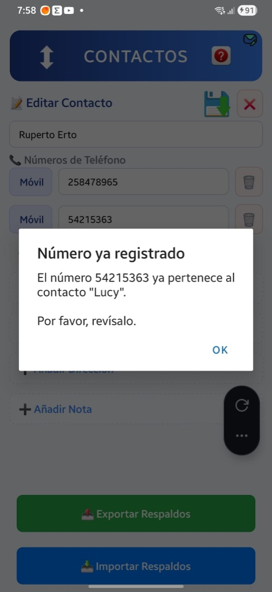

## 🛠️ La Solución: Blindar guardarContactoGlobal

Vamos a modificar tu función global para que, antes de hacer el setListaContactos de un nuevo registro, compare el nombre y los números de teléfono.

Reemplaza tu función guardarContactoGlobal en tu archivo por esta versión mejorada:

---

```jsx
// 💾 FUNCIÓN GLOBAL: Guardar (Sirve tanto para Crear como para Editar)
const guardarContactoGlobal = (contactoProcesado) => {
  if (contactoAEditar) {
    // Si estamos editando reemplazamos el contacto viejo por el nuevo
    const listaModificada = listaContactos.map((c) =>
      c.id === contactoProcesado.id ? contactoProcesado : c,
    );
    setListaContactos(listaModificada);
    setContactoAEditar(null);
  } else {
    // 🧠 FILTRO ANTI-DUPLICADOS PARA NUEVOS CONTACTOS

    // Función auxiliar para limpiar teléfonos (elimina espacios, guiones, etc.)
    const limpiarTextoTelefono = (tel) =>
      tel ? tel.replace(/[^0-9+]/g, "") : "";

    // Extraemos todos los números limpios que tiene el contacto que intentamos guardar
    // (Asumiendo que vienen en un array dentro de contactoProcesado.telefonos)
    const numerosNuevosLimpios = (contactoProcesado.telefonos || [])
      .map((t) => limpiarTextoTelefono(t.numero))
      .filter((num) => num !== "");

    // Buscamos si existe alguien con el mismo nombre EXACTO Y al menos un teléfono idéntico
    const esDuplicado = listaContactos.some((contactoExistente) => {
      const mismoNombre =
        contactoExistente.nombre?.trim().toLowerCase() ===
        contactoProcesado.nombre?.trim().toLowerCase();

      // Extraemos los números del contacto de la lista
      const numerosExistentesLimpios = (contactoExistente.telefonos || []).map(
        (t) => limpiarTextoTelefono(t.numero),
      );

      // Comprobamos si alguno de los números nuevos ya coincide con los existentes
      const tieneMismoTelefono = numerosNuevosLimpios.some((numNuevo) =>
        numerosExistentesLimpios.includes(numNuevo),
      );

      return mismoNombre && tieneMismoTelefono;
    });

    if (esDuplicado) {
      // 🛑 Si es un clon idéntico, frenamos en seco y avisamos al usuario
      Alert.alert(
        "Contacto Duplicado",
        `Ya tienes un contacto guardado con el nombre "${contactoProcesado.nombre}" y el mismo número de teléfono.`,
      );
      return; // Salimos de la función sin guardar nada
    }

    // Si pasa el filtro y es único, lo inyectamos con éxito al inicio
    setListaContactos([contactoProcesado, ...listaContactos]);
  }
  setMostarFormulario(false); // Cerramos el formulario
};
```

---

## 💡 ¿Por qué esta solución es fantástica?

Usa limpieza estricta: Al igual que en la importación, remueve cualquier espacio oculto que pudieras meter sin querer al teclear en el formulario.

Es multiteléfono: Como tu agenda maneja múltiples campos de teléfono por contacto, la función extrae todos los números del nuevo contacto y los compara contra todos los números del contacto existente. Si tan solo uno coincide junto al nombre, saltará la alarma.

Mantiene la edición libre: Si entras a editar a "Lucy" para cambiarle una nota, el filtro no molestará, porque la lógica de control está encerrada exclusivamente en la creación de nuevos usuarios.

Guarda los cambios, abre tu formulario con el botón + e intenta crear a un segundo "Felix" con ese mismo número. ¡Verás cómo el sistema se planta firme y te arroja el aviso en pantalla!

Agregale el some a la funcion para que detecte si el numero ya existe en el felix creado pero no es el pricpipal....pero NO me funcionó

===================
¡Entendido perfectamente. Modifiquemos esa sección para que use some de manera estricta y barra todos los teléfonos que tenga asociados el "Felix" que ya está guardado en tu lista, sin importar si el número está en la primera, segunda o tercera posición (es decir, que no mire solo el principal).

Aquí tienes la función guardarContactoGlobal con la lógica ajustada con some para que rastree todo el historial de números de cada contacto:

---

```jsx
// 💾 FUNCIÓN GLOBAL: Guardar (Sirve tanto para Crear como para Editar)
const guardarContactoGlobal = (contactoProcesado) => {
  if (contactoAEditar) {
    // Si estamos editando reemplazamos el contacto viejo por el nuevo
    const listaModificada = listaContactos.map((c) =>
      c.id === contactoProcesado.id ? contactoProcesado : c,
    );
    setListaContactos(listaModificada);
    setContactoAEditar(null);
  } else {
    // 🧠 FILTRO ANTI-DUPLICADOS RADICAL (Revisa todos los números)

    // Función auxiliar para limpiar teléfonos (elimina espacios, guiones, etc.)
    const limpiarTextoTelefono = (tel) =>
      tel ? tel.replace(/[^0-9+]/g, "") : "";

    // 1. Extraemos los números limpios del formulario actual
    const numerosNuevosLimpios = (contactoProcesado.telefonos || [])
      .map((t) => limpiarTextoTelefono(t.numero))
      .filter((num) => num !== "");

    // 2. Buscamos en la lista si hay coincidencia de Nombre Y de CUALQUIER número
    const esDuplicado = listaContactos.some((contactoExistente) => {
      // Comprobamos el nombre
      const mismoNombre =
        contactoExistente.nombre?.trim().toLowerCase() ===
        contactoProcesado.nombre?.trim().toLowerCase();

      // Extraemos todos los números que ya tiene guardados este contacto existente
      const numerosExistentesLimpios = (contactoExistente.telefonos || [])
        .map((t) => limpiarTextoTelefono(t.numero))
        .filter((num) => num !== "");

      // 🎯 AQUÍ ESTÁ EL 'SOME' CLAVE:
      // Revisa si AL MENOS UNO de los números del formulario coincide con AL MENOS UNO de los del disco
      const coincideAlgunTelefono = numerosNuevosLimpios.some((numNuevo) =>
        numerosExistentesLimpios.some(
          (numExistente) => numExistente === numNuevo,
        ),
      );

      return mismoNombre && coincideAlgunTelefono;
    });

    if (esDuplicado) {
      // 🛑 Si encuentra coincidencia en cualquier nivel, frena el guardado
      Alert.alert(
        "Contacto Duplicado",
        `Ya tienes un contacto guardado con el nombre "${contactoProcesado.nombre}" y uno de esos números de teléfono ya existe en su ficha.`,
      );
      return;
    }

    // Si pasa el filtro, se añade a la lista
    setListaContactos([contactoProcesado, ...listaContactos]);
  }
  setMostarFormulario(false);
};
```

---

🔍 ¿Qué ganamos con este doble some?
Ahora el sistema hace un cruce de matrices completo:

Agarra el array de números que estás intentando meter en el formulario.

Compara uno a uno contra cualquiera de los números que ya posea el contacto con el mismo nombre en la base de datos (numerosExistentesLimpios.some(...)).

Da igual si el número repetido lo pusiste abajo del todo como "Trabajo" o "Fijo", el radar lo detectará inmediatamente y evitará que se duplique la tarjeta visual en tu pantalla. ¡Pruébalo en tu Samsung creando otro Felix con el número secundario y verás el candado en acción!

===================

# El ERROR CONTINUA.

El error continua asi que vas a empezar a revisar nuevamente el condigo teniendo presente:
Con tanto parche y bloque de código es facilísimo marearse y acabar enredado. Lo mejor en estos casos es frenar, limpiar la mesa y empezar de cero con las ideas claras. No vamos a suponer ni inventar nada sobre cómo está tu código. Vamos a ir paso a paso.

El criterio será:

## 🎯 El Criterio de Diseño sobre los contactos y sus numeros:

- Si creas un contacto con un nombre totalmente nuevo, se guarda sin problemas.

- Si creas o editas un contacto con un nombre que ya existe, la aplicación no debe crear una tarjeta repetida. Lo que debe hacer es fusionar:
  - Los números que escribas que ya existían en ese contacto, se ignoran (para no repetirlos dentro de su ficha).
  - Los números que escribas que sean nuevos o distintos, se añaden a su lista de teléfonos.

## 🗂️ ¿Qué archivos necesito ver exactamente?

Para implementar esto de forma quirúrgica y sin adivinar una sola línea, los dos únicos archivos:

- App.js: Necesito ver cómo está declarada tu lista de contactos (el estado listaContactos) y la función completa `guardarContactoGlobal`.

- `ContactoForm.js` (o el archivo donde tengas el formulario):
  - Necesitamos ver la estructura exacta del estado telefonos (cómo inicializas los campos) y la `función presionarGuardar` que lee esos datos.

🧠 El Nuevo Árbol de Decisiones (Criterio Universal)
Al intentar guardar un contacto, el orden lógico para no romper nada debe ser:

Filtro 1 (Seguridad Absoluta): Revisar si cualquiera de los números escritos en el formulario ya existe en otro contacto diferente de la agenda. Si se encuentra, se frena el proceso con una alerta (Alert.alert).

Filtro 2 (Fusión Inteligente): Si supera el Filtro 1 y el nombre ya existe, se fusionan los números nuevos en esa misma ficha.

Filtro 3 (Creación): Si es un nombre nuevo con números únicos, se crea normalmente.

🛠️ Código definitivo para guardarContactoGlobal en App.js
Aquí tienes la función modificada con este control de seguridad global. Reemplaza la función en tu archivo App.js:

```jsx
// 💾 FUNCIÓN GLOBAL: Guardar (Sirve tanto para Crear como para Editar)
const guardarContactoGlobal = (contactoProcesado) => {
  // Función auxiliar para limpiar teléfonos (solo números y el símbolo +)
  const limpiarTextoTelefono = (tel) =>
    tel ? String(tel).replace(/[^0-9+]/g, "") : "";

  // 1. 🧼 LIMPIEZA INTERNA DEL FORMULARIO: Quita repetidos en el propio formulario
  const telefonosUnicosFormulario = [];
  const numerosVistosFormulario = new Set();

  (contactoProcesado.telefonos || []).forEach((tel) => {
    const numLimpio = limpiarTextoTelefono(tel.numero);
    if (numLimpio !== "" && !numerosVistosFormulario.has(numLimpio)) {
      numerosVistosFormulario.add(numLimpio);
      telefonosUnicosFormulario.push(tel);
    }
  });

  contactoProcesado.telefonos = telefonosUnicosFormulario;

  // Extraemos en un array limpio todos los números que el usuario quiere guardar ahora
  const numerosNuevosAGuardar = telefonosUnicosFormulario.map((t) =>
    limpiarTextoTelefono(t.numero),
  );

  if (contactoAEditar) {
    // 📝 MODO EDICIÓN: Validar que los números no existan en OTROS contactos
    const existeEnOtroContacto = listaContactos.some((cExistente) => {
      // Ignoramos el contacto que estamos editando actualmente usando su ID
      if (cExistente.id === contactoProcesado.id) return false;

      const numerosDeOtro = (cExistente.telefonos || []).map((t) =>
        limpiarTextoTelefono(t.numero),
      );
      return numerosNuevosAGuardar.some((num) => numerosDeOtro.includes(num));
    });

    if (existeEnOtroContacto) {
      Alert.alert(
        "Número ya registrado",
        "No se puede guardar: Uno de los números de teléfono ya pertenece a otro contacto de tu agenda.",
      );
      return; // 🛑 Bloqueo en edición
    }

    const listaModificada = listaContactos.map((c) =>
      c.id === contactoProcesado.id ? contactoProcesado : c,
    );
    setListaContactos(listaModificada);
    setContactoAEditar(null);
  } else {
    // 👤 MODO CREACIÓN: Dos comprobaciones (Duplicado en otro contacto o fusión)

    // 🚨 FILTRO DE SEGURIDAD GLOBAL: ¿El número ya es de otra persona?
    const contactoPropietarioDelNumero = listaContactos.find((cExistente) => {
      // Solo buscamos en contactos que tengan un NOMBRE DIFERENTE
      const nombreDiferente =
        cExistente.nombre?.trim().toLowerCase() !==
        contactoProcesado.nombre?.trim().toLowerCase();

      if (!nombreDiferente) return false;

      const numerosExistentes = (cExistente.telefonos || []).map((t) =>
        limpiarTextoTelefono(t.numero),
      );
      return numerosNuevosAGuardar.some((num) =>
        numerosExistentes.includes(num),
      );
    });

    if (contactoPropietarioDelNumero) {
      // 🛑 Frenamos en seco porque el número ya tiene dueño
      Alert.alert(
        "Conflicto de Teléfono",
        `No se puede añadir. Uno de los números ingresados ya está registrado bajo el contacto "${contactoPropietarioDelNumero.nombre}".`,
      );
      return;
    }

    // Buscamos si ya existe un contacto con el mismo nombre exacto para fusionar
    const contactoExistenteIndex = listaContactos.findIndex(
      (c) =>
        c.nombre?.trim().toLowerCase() ===
        contactoProcesado.nombre?.trim().toLowerCase(),
    );

    if (contactoExistenteIndex !== -1) {
      // 🧠 FUSIÓN INTELIGENTE (Mismo nombre, números únicos nuevos)
      const contactoExistente = listaContactos[contactoExistenteIndex];

      const numerosExistentesLimpios = (contactoExistente.telefonos || []).map(
        (t) => limpiarTextoTelefono(t.numero),
      );

      const telefonosNuevosFiltrados = contactoProcesado.telefonos.filter(
        (tNuevo) => {
          const numNuevoLimpio = limpiarTextoTelefono(tNuevo.numero);
          return !numerosExistentesLimpios.includes(numNuevoLimpio);
        },
      );

      const contactoFusionado = {
        ...contactoExistente,
        telefonos: [
          ...(contactoExistente.telefonos || []),
          ...telefonosNuevosFiltrados,
        ],
      };

      const listaFucionada = [...listaContactos];
      listaFucionada[contactoExistenteIndex] = contactoFusionado;

      setListaContactos(listaFucionada);
    } else {
      // 🆕 CONTACTO NUEVO REAL
      setListaContactos([contactoProcesado, ...listaContactos]);
    }
  }

  setMostarFormulario(false);
};
```

# VERSION FINAL QUE NO DUPLICA LOS NUMEROS EN CONTACTOS QUE YA SE HAN CREADO

Para incluir tanto el número exacto que causó el conflicto como el nombre del contacto que ya lo tiene, solo tenemos que capturar ese número en la búsqueda.

Aquí tienes la función guardarContactoGlobal modificada exclusivamente en sus alertas para darte todo el detalle cuando salte el aviso. Reemplázala en tu App.js:

JavaScript
// 💾 FUNCIÓN GLOBAL: Guardar (Sirve tanto para Crear como para Editar)
const guardarContactoGlobal = (contactoProcesado) => {

// Función auxiliar para limpiar teléfonos (solo números y el símbolo +)
const limpiarTextoTelefono = (tel) =>
tel ? String(tel).replace(/[^0-9+]/g, "") : "";

// 1. 🧼 LIMPIEZA INTERNA DEL FORMULARIO: Quita repetidos en el propio formulario
const telefonosUnicosFormulario = [];
const numerosVistosFormulario = new Set();

(contactoProcesado.telefonos || []).forEach((tel) => {
const numLimpio = limpiarTextoTelefono(tel.numero);
if (numLimpio !== "" && !numerosVistosFormulario.has(numLimpio)) {
numerosVistosFormulario.add(numLimpio);
telefonosUnicosFormulario.push(tel);
}
});

contactoProcesado.telefonos = telefonosUnicosFormulario;

// Extraemos en un array limpio todos los números que el usuario quiere guardar ahora
const numerosNuevosAGuardar = telefonosUnicosFormulario.map((t) =>
limpiarTextoTelefono(t.numero)
);

if (contactoAEditar) {
// 📝 MODO EDICIÓN: Validar que los números no existan en OTROS contactos
let numeroConflictivoEdicion = "";

    const contactoPropietarioEdicion = listaContactos.find((cExistente) => {
      if (cExistente.id === contactoProcesado.id) return false;

      const numerosDeOtro = (cExistente.telefonos || []).map((t) =>
        limpiarTextoTelefono(t.numero)
      );

      // Buscamos cuál es el número exacto que coincide
      const coincidencia = numerosNuevosAGuardar.find((num) => numerosDeOtro.includes(num));
      if (coincidencia) {
        numeroConflictivoEdicion = coincidencia;
        return true;
      }
      return false;
    });

    if (contactoPropietarioEdicion) {
      Alert.alert(
        "Número ya registrado",
        `El número [${numeroConflictivoEdicion}] ya pertenece al contacto "${contactoPropietarioEdicion.nombre}".\n\nPor favor, revísalo.`
      );
      return; // 🛑 Bloqueo en edición
    }

    const listaModificada = listaContactos.map((c) =>
      c.id === contactoProcesado.id ? contactoProcesado : c,
    );
    setListaContactos(listaModificada);
    setContactoAEditar(null);

} else {
// 👤 MODO CREACIÓN: Dos comprobaciones (Duplicado en otro contacto o fusión)

    let numeroConflictivoCreacion = "";

    // 🚨 FILTRO DE SEGURIDAD GLOBAL: ¿El número ya es de otra persona?
    const contactoPropietarioDelNumero = listaContactos.find((cExistente) => {
      const nombreDiferente =
        cExistente.nombre?.trim().toLowerCase() !==
        contactoProcesado.nombre?.trim().toLowerCase();

      if (!nombreDiferente) return false;

      const numerosExistentes = (cExistente.telefonos || []).map((t) =>
        limpiarTextoTelefono(t.numero)
      );

      // Buscamos el número exacto que está causando el choque
      const coincidencia = numerosNuevosAGuardar.find((num) => numerosExistentes.includes(num));
      if (coincidencia) {
        numeroConflictivoCreacion = coincidencia;
        return true;
      }
      return false;
    });

    if (contactoPropietarioDelNumero) {
      // 🛑 Mensaje detallado con el número y el dueño actual
      Alert.alert(
        "Conflicto de Teléfono",
        `El número [${numeroConflictivoCreacion}] ya está registrado bajo el contacto "${contactoPropietarioDelNumero.nombre}".\n\nCorrige el número o el nombre para continuar.`
      );
      return;
    }

    // Buscamos si ya existe un contacto con el mismo nombre exacto para fusionar
    const contactoExistenteIndex = listaContactos.findIndex(
      (c) => c.nombre?.trim().toLowerCase() === contactoProcesado.nombre?.trim().toLowerCase()
    );

    if (contactoExistenteIndex !== -1) {
      // 🧠 FUSIÓN INTELIGENTE
      const contactoExistente = listaContactos[contactoExistenteIndex];

      const numerosExistentesLimpios = (contactoExistente.telefonos || []).map((t) =>
        limpiarTextoTelefono(t.numero)
      );

      const telefonosNuevosFiltrados = contactoProcesado.telefonos.filter((tNuevo) => {
        const numNuevoLimpio = limpiarTextoTelefono(tNuevo.numero);
        return !numerosExistentesLimpios.includes(numNuevoLimpio);
      });

      const contactoFusionado = {
        ...contactoExistente,
        telefonos: [...(contactoExistente.telefonos || []), ...telefonosNuevosFiltrados],
      };

      const listaFucionada = [...listaContactos];
      listaFucionada[contactoExistenteIndex] = contactoFusionado;

      setListaContactos(listaFucionada);
    } else {
      // 🆕 CONTACTO NUEVO REAL
      setListaContactos([contactoProcesado, ...listaContactos]);
    }

}

setMostarFormulario(false);
};
🧪 ¿Cómo queda ahora?
Si intentas añadirle a cualquier persona el número 1234567, la alerta ahora te cantará con total claridad:

Conflicto de Teléfono
El número [1234567] ya está registrado bajo el contacto "Pepe".

Corrige el número o el nombre para continuar.

Finalmente quedo asi la funcion de guardarContactosGlobales para evitar duplicados.

```jsx
const guardarContactoGlobal = (contactoProcesado) => {
  // Función auxiliar para limpiar teléfonos (solo números y el símbolo +)
  const limpiarTextoTelefono = (tel) =>
    tel ? String(tel).replace(/[^0-9+]/g, "") : "";

  // 1. 🧼 LIMPIEZA INTERNA DEL FORMULARIO: Quita repetidos en el propio formulario
  const telefonosUnicosFormulario = [];
  const numerosVistosFormulario = new Set();

  (contactoProcesado.telefonos || []).forEach((tel) => {
    const numLimpio = limpiarTextoTelefono(tel.numero);
    if (numLimpio !== "" && !numerosVistosFormulario.has(numLimpio)) {
      numerosVistosFormulario.add(numLimpio);
      telefonosUnicosFormulario.push(tel);
    }
  });

  contactoProcesado.telefonos = telefonosUnicosFormulario;

  // Extraemos en un array limpio todos los números que el usuario quiere guardar ahora
  const numerosNuevosAGuardar = telefonosUnicosFormulario.map((t) =>
    limpiarTextoTelefono(t.numero),
  );

  if (contactoAEditar) {
    // 📝 MODO EDICIÓN: Validar que los números no existan en OTROS contactos
    let numeroConflictivoEdicion = "";

    const contactoPropietarioEdicion = listaContactos.find((cExistente) => {
      if (cExistente.id === contactoProcesado.id) return false;

      const numerosDeOtro = (cExistente.telefonos || []).map((t) =>
        limpiarTextoTelefono(t.numero),
      );

      // Buscamos cuál es el número exacto que coincide
      const coincidencia = numerosNuevosAGuardar.find((num) =>
        numerosDeOtro.includes(num),
      );
      if (coincidencia) {
        numeroConflictivoEdicion = coincidencia;
        return true;
      }
      return false;
    });

    if (contactoPropietarioEdicion) {
      Alert.alert(
        "Número ya registrado",
        `El número ${numeroConflictivoEdicion} ya pertenece al contacto "${contactoPropietarioEdicion.nombre}".\n\nPor favor, revísalo.`,
      );
      return; // 🛑 Bloqueo en edición
    }

    const listaModificada = listaContactos.map((c) =>
      c.id === contactoProcesado.id ? contactoProcesado : c,
    );
    setListaContactos(listaModificada);
    setContactoAEditar(null);
  } else {
    // 👤 MODO CREACIÓN: Dos comprobaciones (Duplicado en otro contacto o fusión)

    let numeroConflictivoCreacion = "";

    // 🚨 FILTRO DE SEGURIDAD GLOBAL: ¿El número ya es de otra persona?
    const contactoPropietarioDelNumero = listaContactos.find((cExistente) => {
      const nombreDiferente =
        cExistente.nombre?.trim().toLowerCase() !==
        contactoProcesado.nombre?.trim().toLowerCase();

      if (!nombreDiferente) return false;

      const numerosExistentes = (cExistente.telefonos || []).map((t) =>
        limpiarTextoTelefono(t.numero),
      );

      // Buscamos el número exacto que está causando el choque
      const coincidencia = numerosNuevosAGuardar.find((num) =>
        numerosExistentes.includes(num),
      );
      if (coincidencia) {
        numeroConflictivoCreacion = coincidencia;
        return true;
      }
      return false;
    });

    if (contactoPropietarioDelNumero) {
      // 🛑 Mensaje detallado con el número y el dueño actual
      Alert.alert(
        "Conflicto de Teléfono",
        `El número [${numeroConflictivoCreacion}] ya está registrado bajo el contacto "${contactoPropietarioDelNumero.nombre}".\n\nCorrige el número o el nombre para continuar.`,
      );
      return;
    }

    // Buscamos si ya existe un contacto con el mismo nombre exacto para fusionar
    const contactoExistenteIndex = listaContactos.findIndex(
      (c) =>
        c.nombre?.trim().toLowerCase() ===
        contactoProcesado.nombre?.trim().toLowerCase(),
    );

    if (contactoExistenteIndex !== -1) {
      // 🧠 FUSIÓN INTELIGENTE
      const contactoExistente = listaContactos[contactoExistenteIndex];

      const numerosExistentesLimpios = (contactoExistente.telefonos || []).map(
        (t) => limpiarTextoTelefono(t.numero),
      );

      const telefonosNuevosFiltrados = contactoProcesado.telefonos.filter(
        (tNuevo) => {
          const numNuevoLimpio = limpiarTextoTelefono(tNuevo.numero);
          return !numerosExistentesLimpios.includes(numNuevoLimpio);
        },
      );

      const contactoFusionado = {
        ...contactoExistente,
        telefonos: [
          ...(contactoExistente.telefonos || []),
          ...telefonosNuevosFiltrados,
        ],
      };

      const listaFucionada = [...listaContactos];
      listaFucionada[contactoExistenteIndex] = contactoFusionado;

      setListaContactos(listaFucionada);
    } else {
      // 🆕 CONTACTO NUEVO REAL
      setListaContactos([contactoProcesado, ...listaContactos]);
    }
  }

  setMostarFormulario(false);
};
```

---

La adicion funciono....si existe un numero de telefono en otro contacto lo indicara:



Ahora que la lógica central de la aplicación sabe exactamente cómo validar, bloquear e identificar conflictos, estás en la posición perfecta para dar el siguiente paso: La Importación de Respaldos.

Cuando ejecutes la importación, el comportamiento ideal debería seguir la misma filosofía que acabamos de programar para que el archivo no te ensucie la lista.

📋 Lo que debemos tener en cuenta para la Importación:
Al importar un archivo masivo (por ejemplo, el JSON de respaldos), el script va a recorrer los contactos uno a uno de forma automática. El comportamiento esperado debería ser:

Nombres nuevos con números únicos: Se añaden directamente a la agenda.

Mismo Nombre: Se fusionan los números nuevos que no se repitan dentro de su ficha (tal como hace ahora el formulario).

Conflicto de número (Mismo número, diferente nombre): Aquí hay que tomar una decisión de diseño. Al ser un proceso automático, no podemos lanzar 50 alertas seguidas en la pantalla si el archivo trae errores. Lo ideal sería que el script de importación ignore el número conflictivo de forma silenciosa (o registre un aviso al final) para que no le robe el número a un contacto legítimo que ya tienes guardado en la app.

🛠️ ¿Qué necesitamos para revisar la importación?
Para dejar este proceso igual de fino y que use las mismas reglas de seguridad que acabamos de crear, pásame el código de tu archivo helper de importación.

src/utils/fileHelper.js (específicamente la función importarContactos).

Pónmela completa por aquí cuando puedas y hacemos que el motor de importación aplique este mismo radar de seguridad de manera masiva. ¡A por ello!

¡Espectacular, Félix! Viendo el código actual de importarContactos, queda clarísimo por qué se te iban a descontrolar las cosas. El importador viejo estaba intentando leer propiedades sueltas como c.telefono o c.telefonoCelular, cuando ya sabemos que en tu aplicación los números viajan en un array de objetos llamado telefonos.

Vamos a adaptar este importador para que use las mismas tres reglas de oro que dejamos niqueladas en tu guardarContactoGlobal.

🧠 ¿Cómo va a actuar el nuevo importador inteligente?
Filtro de Limpieza Inicial: Elimina del contacto que entra cualquier número repetido que traiga en su propio formulario de origen.

Filtro por Nombre Exacto (Fusión): Si el nombre ya existe en la agenda local, agarra sus números del archivo, descarta los que ya estaban guardados y le añade los nuevos a la ficha.

Filtro de Conflicto Cruzado (Dueño del Número): Si el archivo trae un número que ya pertenece a otra persona diferente en tu agenda local, la importación ignora ese número conflictivo de forma silenciosa para proteger la integridad de tus datos actuales.

🛠️ El Código Definitivo para fileHelper.js
Reemplaza tu función importarContactos por esta versión adaptada a tu lógica real. No asume nada, procesa el array telefonos tal y como lo genera tu app:

---

```jsx
// 🎯 CAMBIO 1: Ahora la función recibe "setListaContactos" desde la App.js
export const importarContactos = async (setListaContactos) => {
  try {
    // 1. Abrir el selector de archivos nativo para buscar el archivo JSON
    const resultado = await DocumentPicker.getDocumentAsync({
      type: "application/json",
      copyToCacheDirectory: true,
    });

    if (
      resultado.canceled ||
      !resultado.assets ||
      resultado.assets.length === 0
    ) {
      return;
    }

    const URIArchivo = resultado.assets[0].uri;

    // 2. Leer el contenido del archivo JSON seleccionado
    const contenidoTexto = await FileSystem.readAsStringAsync(URIArchivo, {
      encoding: "utf8",
    });
    const contactosEntrantes = JSON.parse(contenidoTexto);

    if (!Array.isArray(contactosEntrantes)) {
      Alert.alert("Error", "El formato del archivo de respaldos no es válido.");
      return;
    }

    // 3. Leer los contactos que ya existen en el teléfono actual
    const datosLocalesCrudos = await AsyncStorage.getItem(STORAGE_KEY);
    let contactosLocales = datosLocalesCrudos
      ? JSON.parse(datosLocalesCrudos)
      : [];

    let contadorActualizados = 0;
    let contadorInsertados = 0;

    // Función auxiliar para limpiar teléfonos (solo números y +)
    const limpiarTextoTelefono = (tel) =>
      tel ? String(tel).replace(/[^0-9+]/g, "") : "";

    // 4. 🧠 EL MOTOR DE IMPORTACIÓN INTELIGENTE
    contactosEntrantes.forEach((contactoNuevo) => {
      // A. 🧼 Limpieza del contacto entrante (evitar repetidos dentro de su propio array)
      const telefonosUnicosNuevos = [];
      const numerosVistosNuevos = new Set();

      (contactoNuevo.telefonos || []).forEach((tel) => {
        const numLimpio = limpiarTextoTelefono(tel.numero);
        if (numLimpio !== "" && !numerosVistosNuevos.has(numLimpio)) {
          numerosVistosNuevos.add(numLimpio);
          telefonosUnicosNuevos.push({
            ...tel,
            numero: tel.numero.trim(),
          });
        }
      });

      // Si el contacto del archivo no trae teléfonos válidos, saltamos al siguiente
      if (telefonosUnicosNuevos.length === 0) return;

      const numerosNuevosAGuardar = telefonosUnicosNuevos.map((t) =>
        limpiarTextoTelefono(t.numero),
      );

      // B. 🚨 CONTROL DE CONFLICTO: ¿Alguno de estos números ya le pertenece a OTRA persona localmente?
      const perteneceAOtro = contactosLocales.some((cLocal) => {
        const nombreDiferente =
          cLocal.nombre?.trim().toLowerCase() !==
          contactoNuevo.nombre?.trim().toLowerCase();

        if (!nombreDiferente) return false;

        const numerosLocales = (cLocal.telefonos || []).map((t) =>
          limpiarTextoTelefono(t.numero),
        );
        return numerosNuevosAGuardar.some((num) =>
          numerosLocales.includes(num),
        );
      });

      // Si el número ya está registrado a nombre de otra persona diferente, ignoramos el contacto para no corromper la agenda
      if (perteneceAOtro) {
        return;
      }

      // C. 🔍 BUSQUEDA POR NOMBRE: ¿Ya existe este contacto en la agenda?
      const indiceLocalPorNombre = contactosLocales.findIndex(
        (cLocal) =>
          cLocal.nombre?.trim().toLowerCase() ===
          contactoNuevo.nombre?.trim().toLowerCase(),
      );

      if (indiceLocalPorNombre !== -1) {
        // 🧠 ¡FUSIÓN!: El nombre coincide, añadimos solo los teléfonos que no tenga
        const contactoLocalExistente = contactosLocales[indiceLocalPorNombre];

        const numerosLocalesLimpios = (
          contactoLocalExistente.telefonos || []
        ).map((t) => limpiarTextoTelefono(t.numero));

        // Filtramos para dejar solo los números del archivo que la ficha local NO tenga
        const telefonosNuevosFiltrados = telefonosUnicosNuevos.filter(
          (tNuevo) => {
            const numNuevoLimpio = limpiarTextoTelefono(tNuevo.numero);
            return !numerosLocalesLimpios.includes(numNuevoLimpio);
          },
        );

        // Si hay números nuevos que agregar, actualizamos la ficha local
        if (telefonosNuevosFiltrados.length > 0) {
          contactosLocales[indiceLocalPorNombre] = {
            ...contactoLocalExistente,
            telefonos: [
              ...(contactoLocalExistente.telefonos || []),
              ...telefonosNuevosFiltrados,
            ],
          };
          contadorActualizados++;
        }
      } else {
        // 🆕 NUEVO CONTACTO ABSOLUTO: No existe el nombre ni chocan los números
        const nuevoContactoFormateado = {
          ...contactoNuevo,
          id:
            contactoNuevo.id ||
            Date.now().toString() + Math.random().toString(),
          nombre: contactoNuevo.nombre?.trim(),
          telefonos: telefonosUnicosNuevos,
          empresa: contactoNuevo.empresa?.trim() || "",
          correo: contactoNuevo.correo?.trim() || "",
          direccion: contactoNuevo.direccion?.trim() || "",
          nota: contactoNuevo.nota?.trim() || "",
        };

        contactosLocales.push(nuevoContactoFormateado);
        contadorInsertados++;
      }
    });

    // 5. Guardar la lista unificada y limpia de vuelta en el disco duro
    await AsyncStorage.setItem(STORAGE_KEY, JSON.stringify(contactosLocales));

    // 🎯 CAMBIO 2: Pintar la nueva lista unificada en la pantalla de inmediato
    setListaContactos(contactosLocales);

    // 6. Reporte de éxito al usuario
    Alert.alert(
      "Importación Exitosa 🎉",
      `Proceso completado:\n• ${contadorInsertados} contactos nuevos añadidos.\n• ${contadorActualizados} contactos existentes actualizados con nuevos números.`,
    );
  } catch (error) {
    console.error("Error al importar contactos:", error);
    Alert.alert("Error", "No se pudo leer o procesar el archivo de contactos.");
  }
};
```

---

🏁 ¿Qué ganamos con esto?
Ambos lados de tu aplicación (la adición manual en caliente y la importación masiva en frío) están ahora completamente sincronizados bajo el mismo cerebro lógico. No habrá registros repetidos, no se duplicarán números internamente, y tus contactos locales estarán totalmente a salvo de sobreescrituras accidentales procedentes del archivo JSON.
